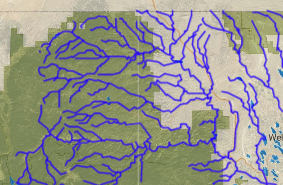

# GeoProcessor / GeoMapProject #

This documentation describes the specification of the GeoMapProject.

* [Introduction](#introduction)
* [Examples](#examples)
* [Specification](#specification)
	+ [GeoMapProject](#geomapproject)
	+ [GeoMap](#geomap)
	+ [GeoLayerViewGroup](#geolayerviewgroup)
	+ [GeoLayerView](#geolayerview)
	+ [GeoLayer](#geolayer)
	+ [GeoLayerSymbol](#geolayersymbol) - in order of complexity:
		- [GeoLayerSymbol Properties for Point Geometry Type](#geolayersymbol-properties-for-point-geometry-type)
		- [GeoLayerSymbol Properties for Line Geometry Type](#geolayersymbol-properties-for-line-geometry-type)
		- [GeoLayerSymbol Properties for Polygon Geometry Type](#geolayersymbol-properties-for-polygon-geometry-type)
		- [GeoLayerSymbol Properties for Single Symbol Classification Type](#geolayersymbol-properties-for-single-symbol-classification-type)
		- [GeoLayerSymbol Properties for Categorized Classification Type](#geolayersymbol-properties-for-categorized-classification-type)
		- [GeoLayerSymbol Properties for Graduated Classification Type](#geolayersymbol-properties-for-graduated-classification-type)
		+ [GeoLayerSymbol Properties for Other Classification Types](#geolayersymbol-properties-for-other-classification-types)
	+ [GeoLayerViewEventHandler](#geolayervieweventhandler)
	+ [Encoded Data](#encoded-data)
		- [Color](#color)
		- [Color Ramp](#color-ramp)
		- [Color Table](#color-table)
		- [DateTime](#datetime)
		- [Extent](#extent)
* [Web Mapping Application Integration](#web-mapping-application-integration)
	+ [Web Application Data Workflow](#web-application-data-workflow)
	+ [Web Application Event Handling](#web-application-event-handling)
	+ [Web Application Deployment](#web-application-deployment)
* [History of Specification](#history-of-specification)

-----------------

## Introduction ##

A GeoMapProject defines configurations for maps, to be displayed in the GeoProcessor, web applications, and other software.
It is conceptually equivalent to QGIS (`qgs`) and ArcGIS (`mxd) map project file. 
However, the GeoProcessor GeoMapProject is a light-weight JSON file that contains relatively minimal configuration information.
GeoProcessor commands available in the ***Map Processing*** commands menu automate creating GeoMapProjects,
so that maps can be recreated and scaled to various locations.

The following diagram illustrates components that comprise a GeoMapProject.

**<p style="text-align: center;">

</p>**

**<p style="text-align: center;">
GeoMapProject Components (<a href="../images/GeoMapProject-diagram.png">see full-size image</a>)
</p>**

It is envisioned that GeoMapProjects will be used to define map configurations for the types
described in the following table, and other types added over time.

**<p style="text-align: center;">
GeoMapProject Types
</p>**

| **GeoMapProject Type** | **Description** |
| -- | -- |
| `Dashboard` | An application that has several maps, typically accessible by menus or other user interface components.  The [Poudre Information Platform](https://github.com/OpenWaterFoundation/owf-app-poudre-dashboard-ng) is an example. The application would have an additional configuration file to indicate how maps are used in the dashboard. |
| `Grid` | A grid (matrix) of maps, for example showing different times.  For example, see the [California Drought visualization](https://www.latimes.com/local/lanow/la-me-g-california-drought-map-htmlstory.html).  Additional layout properties may be needed to define how the grid is laid out.  Because of the resources needed for each map, it may make sense to initially display the maps as a grid of images and then have links to maps similar to a dashboard. |
| `SingleMap` | A single [GeoMap](#geomap) is included in the [GeoMapProject](#geomapproject), for typical "single page web applications" where a single map display dominates the application.  In this case the [GeoMapProject](#geomapproject) `geoMaps` list can onl contain one [GeoMap](#geomap). For example, the [CDSS SNODAS Tools](http://snodas.cdss.state.co.us/app/index.html) is an example of a single map application (in this case it does not use the new GeoMapProject design). |
| `Story` | A sequence of maps that are referenced in a story. For example, see [stories that OWF has created](http://stories.openwaterfoundation.org/). |

A GeoMapProject is created using the
[`CreateGeoMapProject`](../command-ref/CreateGeoMapProject/CreateGeoMapProject) command
and related commands and is written to a file using the 
[`WriteGeoMapProjectToJSON`](../command-ref/WriteGeoMapProjectToJSON/WriteGeoMapProjectToJSON) command.

The contents of the command are consistent with the top-level `GeoMapProject` instance and hierarchy of objects, as follows,
which are written using the standard Python `json` package.

```
GeoMapProject                     # Top-level object containing a list of GeoMap.
   GeoMap [ ]                     # List of GeoMap, each of which can stand alone.
      GeoLayer [ ]                # List of all GeoLayer used in a GeoMap.
      GeoLayerViewGroup [ ]       # List of GeoLayerViewGroup in a GeoMap, used for legend groups.
        GeoLayerView              # A GeoLayerView assigns a GeoSymbol to a GeoLayer, for viewing.
           GeoLayer               # Reference to a layer in GeoLayer list (above).
           GeoSymbol              # Symbol used to visualize the layer.
           EventHandler [ ]       # One or more event handlers to respond to map interactions
```

A GeoMapProject can be used by other software, such as web mapping applications, to display maps.
Consequently, the GeoProcessor can be used to automate map creation,
which can help scale a prototype map to more locations.

Using a map configuration file in an application typically consists of the following software functionality,
in increasing level of complexity:

1. Display the map layers with correct symbology, legend, etc.
The core data in a GeoMap are intended to support this functionality.
2. Allow read-only interaction with map layers.
For example, mouse over or click on features or markers on the map and perform
other actions such as displaying layer properties or related data visualizations.
See the [GeoLayerViewEventHandler](#geolayervieweventhandler) documentation.
3. Allow additional analysis that may add additional attributes to existing layers or add new layers.
This functionality must be coded in the application as either reusable components
or custom application code.
4. Edit data interactively, saving back to the original data layer, a copy,
or some other data management software.
This functionality must be coded in the application as either reusable components
or custom application code.

The GeoProcessor will be enhanced over time to implement additional functionality
for the higher numbered functionality levels,
for example to provide map displays for GeoMap configurations.

## Examples ##

The following are examples of GeoViewProject files.

**<p style="text-align: center;">
GeoMapProject Example JSON Files
</p>**

| **Example** | **Project Type** | **Description** |
| -- | -- | -- |
| [Basic Example](resources/test-CreateGeoMap-out.json) | `Dashboard` | Output of [automated test](https://github.com/OpenWaterFoundation/owf-app-geoprocessor-python-test/tree/master/test/commands/ListFiles) for [`CreateGeoMapProject`](../command-ref/CreateGeoMapProject/CreateGeoMapProject) command. |
| | | More examples will be added in the future, with links to workflows that created the GeoMapProject files. |

## Specification ##

The GeoViewMapProject specification can be understood by reviewing the JSON format for GeoViewProject.
This format is a serialized form of the in-memory Python objects in GeoProcessor software,
although the JSON file elements are slightly different from in-memory object attributes due to naming conventions
(e.g., `GeoLayer.geolayer_id` and `GeoLayer.id` in Python becomes `geoLayerId` in JSON)
and to avoid serializing all data (e.g., GeoLayer in Python contains layer data whereas in JSON the
data exists in separate GeoJSON or other files).

The properties described in the following sections include built-in data members and
open-ended properties dictionary corresponding to `properties` data member for each object type.
The following guidelines are used when creating the specification:

1. Built-in properties are generally those that define the "physical" structure of the data,
without which the data model would not make sense.
In contrast, optional free-format properties provide additional granularity and flexibility in the model
to support variations in map configurations and the tools that use the maps.
The determination of whether a property is built-in or optional is subject to interpretation and opinion,
but hopefully the specification is reasonable.
2. Free-form properties are generally represented as quoted strings and must be parsed by consuming software.
Data types other than strings,
and encoded strings, may be implemented to help minimize errors and facilitate parsing.

**It is expected that the specification will evolve, for example to define the syntax for symbol color ramps.
These details will be addressed as quickly as possible
through changes to this documentation and Python GeoProcessor code
in order to converge on a workable specification.
The goal is to arrive at a stable specification quickly and use in production software on many projects.**

### GeoMapProject ###

The GeoMapProject is the top-level element to describe one or more related maps.

The following are built-in GeoMapProject data members.

**<p style="text-align: center;">
GeoMapProject Built-in Data Elements
</p>**

| **Property**&nbsp;&nbsp;&nbsp;&nbsp;&nbsp;&nbsp;&nbsp;&nbsp;&nbsp;&nbsp;&nbsp;&nbsp;&nbsp;&nbsp;&nbsp;&nbsp;&nbsp;&nbsp; | **Description** | **Default** |
| -- | -- | -- |
| `geoMapProjectId` | Unique GeoMapProject identifier, typically without whitespace, for example: `AbcWebApp`. | None - must be specified. |
| `name` | Short name, suitable for display in applications, for example: `ABC River Basin Water Resources`. | None - must be specified. |
| `description` | A longer description (up to a few sentences), suitable for display on a catalog of maps.  | |
| `geoMaps` | An array (Python list) of [GeoMap](#geomap).  One or more maps can be contained in the GeoMapProject. | |
| `properties` | An open-ended list of elements to provide additional properties (see table below). | |
| `projectType` | The GeoMapProject type, for example `Dashboard`, `Grid`, `SingleMap`, or `Story`. | |

The following are recognized GeoMapProject properties.

**<p style="text-align: center;">
GeoMapProject Properties in `properties` JSON Element
</p>**

| **Property**&nbsp;&nbsp;&nbsp;&nbsp;&nbsp;&nbsp;&nbsp;&nbsp;&nbsp;&nbsp;&nbsp;&nbsp;&nbsp;&nbsp;&nbsp;&nbsp;&nbsp;&nbsp;&nbsp;&nbsp;&nbsp;&nbsp;&nbsp;&nbsp;&nbsp;&nbsp;&nbsp;&nbsp; | **Description** | **Default** |
| -- | -- | -- |
| `author` | Name of author or organization. | |
| `effectiveDateTime` | Effective date/time of the GeoMapProject, before which the project does not apply, using ISO-8601 date/time, for example `2020-07-03T00:00:00`. | Always effective. |
| `enabled` | Indicates whether the map project is enabled, specified as boolean `true` or `false`.  If `false`, application code can ignore the map project or read in but indicate as disabled. | `true` |
| `specificationVersion` | Version of the of the GeoMapProject JSON file specification in format `Major.Minor.Micro`.  **This property may be moved to a built-in property that is auto-generated.** | |
| `specificationFlavor` | Flavor of the specification, used to provide some flexibility to consuming applications.  If specified, only `Generic` and `Leaflet` is currently recognized.  The specification flavor applies to free-form properties, for example to provide properties that are not generic but are used by a specific technology. The flavor for a property is indicated in property tables below, if applicable. **This property may or may not be kept depending on whether the generic properties are supported in common packages.** | `Generic` |
| `expiresDateTime` | Date/time when the project expires, as an ISO-8601 date/time string. | Never expires. |
| `saveDateTime` | Date/time when the project was created. | |
| `version` | GeoMapProject version, used to track edits to the project. | |
| | Additional properties can be added. | |

### GeoMap ###

A GeoMap is a collection of [GeoLayerViewGroup](#geolayerviewgroup) (layer groups as list of [GeoLayerView](#geolayerview)),
organized in logical order and using appropriate symbols.
For convenience, a unique list of [GeoLayer](#geolayer) is maintained as a GeoMap data element
and the specific [GeoLayer](#geolayer) are referred to in [GeoLayerView](#geolayerview).
This provides the opportunity for software applications to read the layers once and share between views,
rather than re-reading the layers multiple times (for example for political boundaries, rivers,
transportation networks, etc.).

The following are built-in GeoMap data members.

**<p style="text-align: center;">
GeoMap Built-in Data Elements
</p>**

| **Property**&nbsp;&nbsp;&nbsp;&nbsp;&nbsp;&nbsp;&nbsp;&nbsp;&nbsp;&nbsp;&nbsp;&nbsp;&nbsp;&nbsp;&nbsp;&nbsp;&nbsp;&nbsp;&nbsp;&nbsp;&nbsp;&nbsp;&nbsp;&nbsp; | **Description** | **Default** |
| -- | -- | -- |
| `crs` | A coordinate reference system (CRS) code to indicate projection of the data, for example `EPSG:4326`.  See the [Spatial Reference Website](https://spatialreference.org/).  | `.` |
| `dataPath` | A list of comma-separated file and URL folders where data layers can be found, relative to the GeoMapProject file, or as absolute paths.  The folders will be searched in order when attempting to find layers.  The [GeoLayer](#geolayer) `sourcePath` property can be set to a path relative to these folders when publishing a map project. | `.` |
| `description` | A longer description (up to a few sentences), suitable for display on a catalog of maps.  | |
| `geoMapId` | Unique [GeoMap](#geomap) identifier, typically without whitespace, for example: `MyMap`. | None - must be specified. |
| `name` | Short name, suitable for display in applications, for example: `Agricultural Data`. | None - must be specified. |
| `geoLayers` | An array (Python list) of [GeoLayer](#geolayer) for all the layers used in the map.  The [GeoLayer](#geolayer) in this list are referred to by `geoLayerId` in other elements such as layers referenced in [GeoLayerView](#geolayerview).| |
| `geoLayerViewGroups` | An array (Python list) of [GeoLayerViewGroup](#geolayerviewgroup).  One or more layer views can be contained in the [GeoMapProject](#geomapproject).  The first group in the list will be displayed at the top of the legend and be rendered last when processing groups.  The last group in the list will be displayed at the bottom of the legend and be rendered first when processing layer groups. | |
| `properties` | An open-ended list of elements to provide additional properties (see table below). | |

The following are recognized GeoMap properties.

**<p style="text-align: center;">
GeoMap Properties in `properties` JSON Element
</p>**

| **Property**&nbsp;&nbsp;&nbsp;&nbsp;&nbsp;&nbsp;&nbsp;&nbsp;&nbsp;&nbsp;&nbsp;&nbsp;&nbsp;&nbsp;&nbsp;&nbsp;&nbsp;&nbsp;&nbsp;&nbsp;&nbsp;&nbsp; | **Description** | **Default** |
| -- | -- | -- |
| `enabled` | Indicates whether the map is enabled, specified as boolean `true` or `false`.  If `false`, application code can ignore the map or read in but indicate as disabled. | `true` |
| `extentInitial` | Initial displayed map extent.  See [Extent](#extent) section. | Typically, display all layer data.|
| `extentMaximum` | Maximum displayed map extent.  See [Extent](#extent) section. | No limit.|
| `extentMinimum` | Minimum displayed map extent.  See [Extent](#extent) section. | No limit.|
| `geoLayerView.`<br>`selectInitial.`<br>`default` | Default for [GeoLayerView](#geolayerview) and [GeoLayerViewGroup](#geolayerviewgroup) `selectedInitial` property value.  This property value should typically be set as follows: <ul><li>`true` - for simple map with few layers because most layers should be selected for display; layer views to **not** display will use `selectedInitial=false`</li><li>`false` - for complex map with many layers because most layers should **not** be selected for display; layer views to display will use `selectedInitial=true`</li></ul>| `true` - all GeoLayerViewGroup and GeoLayerView will be selected for initial display. |

### GeoLayerViewGroup ###

A GeoLayerViewGroup is a list of [GeoLayerView](#geolayerview) and corresponds to a group of layers in a map legend.
A group is often used to group layers of similar contents, such as:

* similar data from different sources or versions
* base maps
* temporal meaning, for example series of layers for different date/times, or multiple layers for a single date/time

Because of the limited role of a group, a GeoLayerViewGroup has limited data values.
The following are built-in GeoLayerViewGroup data members.

**<p style="text-align: center;">
GeoLayerViewGroup Built-in Data Elements
</p>**

| **Property**&nbsp;&nbsp;&nbsp;&nbsp;&nbsp;&nbsp;&nbsp;&nbsp;&nbsp;&nbsp;&nbsp;&nbsp;&nbsp;&nbsp;&nbsp;&nbsp;&nbsp;&nbsp;&nbsp;&nbsp;&nbsp;&nbsp;&nbsp;&nbsp;&nbsp;&nbsp; | **Description** | **Default** |
| -- | -- | -- |
| `description` | A longer description (up to a few sentences), suitable for display on a catalog of views.  | |
| `geoLayerViewGroupId` | Unique GeoLayerViewGroup identifier, typically without whitespace, for example: `IrrigatedLands`. | None - must be specified. |
| `geoLayerViews` | An array (Python list) of [GeoLayerView](#geolayerview) for all the layer views used in the group.  The first layer view in the list will be displayed at the top of the legend (in the group) and be rendered last when processing layer views (in the group).  The last layer view in the list will be displayed at the bottom of the legend (in the group) and be rendered first when processing layer views (in the group). | |
| `name` | Short name, suitable for display in applications, for example: `Irrigated Lands`. | None - must be specified. |
| `properties` | An open-ended list of elements to provide additional properties (see table below). | |

The following are recognized GeoLayerViewGroup properties.

**<p style="text-align: center;">
GeoLayerViewGroup Properties in `properties` JSON Element
</p>**

| **Property**&nbsp;&nbsp;&nbsp;&nbsp;&nbsp;&nbsp;&nbsp;&nbsp;&nbsp;&nbsp;&nbsp;&nbsp;&nbsp;&nbsp;&nbsp;&nbsp;&nbsp;&nbsp;&nbsp;&nbsp;&nbsp;&nbsp; | **Description** | **Default**&nbsp;&nbsp;&nbsp;&nbsp;&nbsp;&nbsp;&nbsp;&nbsp;&nbsp;&nbsp;&nbsp;&nbsp;&nbsp;&nbsp;&nbsp;&nbsp;&nbsp;&nbsp;&nbsp;&nbsp;&nbsp;&nbsp; |
| -- | -- | -- |
| `enabled` | Indicates whether the GeoLayerViewGroup is enabled, specified as boolean `true` or `false`.  If `false`, application code can ignore the group or read in but indicate as disabled. | `true` |
| `isBackground` | Indicates whether the GeoLayerViewGroup contains background layers (`false` or `true`), in which all [GeoLayer](#geolayer) should be background layers. | `false` |
| `selectBehavior` | Indicates how selections for the group should occur:<ul><li>`Any` - zero or more layer views can be selected</li><li>`Single` - zero or one layer view can be selected at a time (selecting a layer view will automatically deselect other layer views in the group).</li><li>`Custom` - a custom tool is implemented to select layer views, envisioned for complex applications</li></ul> | `Any` |
| `selectedInitial` | Indicates whether the GeoLayerViewGroup is selected for display when the map is initially displayed, specified as boolean `true` or `false`. | See GeoMap `geoLayerView.`<br>`selectedInitial.`<br>`default`|

### GeoLayerView ###

A GeoLayerView is a simple object that contains a reference to a [GeoLayer](#geolayer) (using its `geoLayerId`) and [GeoLayerSymbol](#geolayersymbol),
which provides properties used when displaying the layer.

The following are built-in GeoLayerView data members.

**<p style="text-align: center;">
GeoLayerView Built-in Data Elements
</p>**

| **Property**&nbsp;&nbsp;&nbsp;&nbsp;&nbsp;&nbsp;&nbsp;&nbsp;&nbsp;&nbsp;&nbsp;&nbsp;&nbsp;&nbsp;&nbsp;&nbsp;&nbsp;&nbsp; | **Description** | **Default** |
| -- | -- | -- |
| `description` | A longer description (up to a few sentences), suitable for display on a catalog of views.  The value can be the same as the associated [GeoLayer](#geolayer), or provide a different value for display purposes. | |
| `eventHandlers` | A list of [GeoLayerViewEventHandler](#geolayervieweventhandler), which indicate how events on a GeoLayerView should be handled.  | |
| `geoLayerId` | Unique [GeoLayer](#geolayer) identifier associated with the view, matching a value in the [GeoMap](#geomap) `geoLayers` list. | None - must be specified. |
| `geoLayerSymbol` | Symbol properties used to display the layer in the view. See the [GeoLayerSymbol](#geolayersymbol) properties below.|  |
| `geoLayerViewId` | Unique GeoLayerView identifier, typically without whitespace, for example: `IrrigatedLands2010`.  The value can be the same as the associated [GeoLayer](#geolayer), or provide a different value for display purposes.  | None - must be specified. |
| `name` | Short name, suitable for display in applications, for example: `Irrigated Lands, 2010`.  The value can be the same as the associated [GeoLayer](#geolayer), or provide a different value for display purposes. | None - must be specified. |
| `properties` | An open-ended list of elements to provide additional properties (see table below). | |

The following are recognized GeoLayerView properties.

**<p style="text-align: center;">
GeoLayerView Properties in `properties` JSON Element
</p>**

| **Property**&nbsp;&nbsp;&nbsp;&nbsp;&nbsp;&nbsp;&nbsp;&nbsp;&nbsp;&nbsp;&nbsp;&nbsp;&nbsp;&nbsp;&nbsp;&nbsp;&nbsp;&nbsp;&nbsp;&nbsp;&nbsp;&nbsp; | **Description** | **Default**&nbsp;&nbsp;&nbsp;&nbsp;&nbsp;&nbsp;&nbsp;&nbsp;&nbsp;&nbsp;&nbsp;&nbsp;&nbsp;&nbsp;&nbsp;&nbsp;&nbsp;&nbsp;&nbsp;&nbsp;&nbsp;&nbsp; |
| -- | -- | -- |
| `enabled` | Indicates whether the GeoLayerView is enabled, specified as boolean `true` or `false`.  If `false`, application code can ignore the layer view or read in but indicate as disabled. | `true` |
| `refreshInterval` | The time interval to automatically refresh the layer and redraw the map, used because data in the layer will have changed and do not want to force the user to reload the application or page.  The format should be specified similar to `15Minute` or `12Hour`.  The behavior should be as follows:<ul><li>if the interval is less than an hour, then the initial refresh will occur at the `0` minute of the hour and at `refreshInterval` thereafter</li><li>if the interval is >= an hour but less than a day, then the initial refresh will occur at 0 hour of the day and at `refreshInterval` seconds thereafter</li><li>if the required interval is >= `1Day`, select an hour interval such as `8Hour` or `12Hour` to achieve the desired result</ul>  The refresh interval should be specified as a value that will result in predictable update times, such as every 15 minutes or every 12 hours so that refresh interval for different `GeoLayerView` are synchronized.  Additional properties may be enabled in the future to provide more flexibility. | `0` (no refresh) |
| `selectedInitial` | Indicates whether the GeoLayerViewGroup is selected for display when the map is initially displayed, specified as boolean `true` or `false`. | See GeoMap `geoLayerView.`<br>`selectedInitial.`<br>`default`|

### GeoLayer ###

A GeoLayer corresponds to a vector or raster spatial data file, such as a GeoJSON file, shapefile, KML, raster file (TIF, etc), or other format.
Each GeoLayer in a [GeoMap](#geomap) is listed in the `geoLayers` list of the [GeoMap](#geomap).
Each [GeoLayerView](#geolayerview) in a [GeoMap](#geomap) refers to the [GeoMap](#geomap) using its `geoLayerId` value.

The following are built-in GeoLayer data members.

**<p style="text-align: center;">
GeoLayer Built-in Data Elements
</p>**

| **Property**&nbsp;&nbsp;&nbsp;&nbsp;&nbsp;&nbsp;&nbsp;&nbsp;&nbsp;&nbsp;&nbsp;&nbsp;&nbsp;&nbsp;&nbsp;&nbsp;&nbsp;&nbsp; | **Description** | **Default** |
| -- | -- | -- |
| `crs` | A coordinate reference system (CRS) code to indicate projection of the data in the layer, for example `EPSG:4326`.  See the [Spatial Reference Website](https://spatialreference.org/).  | None - must be specified. |
| `description` | A longer description (up to a few sentences), suitable for display on a catalog of layers.  | |
| `geoLayerId` | Unique GeoLayer identifier, typically without whitespace, for example: `IrrigatedLands2010`. | None - must be specified. |
| `geometryType` | Geometry type in format similar to `WKT:Polygon`, which is used to determine which [GeoLayerSymbol](#geolayersymbol) properties are relevant.  See the [WKT Documentation](https://en.wikipedia.org/wiki/Well-known_text_representation_of_geometry). | None - must be specified. |
| `history` | A list of strings indicating how the layer was processed by the GeoProcessor, useful to troubleshoot processing issues. | |
| `layerType` | Layer type: <ul><li>`Raster` - a raster layer</li><li>`Vector` - a vector layer</li></ul>The layer type is useful to help applications know how to process the layer. | None - must be specified. |
| `name` | Short name, suitable for display in applications, for example: `Irrigated Lands, 2010`. | None - must be specified. |
| `properties` | An open-ended list of elements to provide additional properties (see table below). | |
| `sourcePath` | The path to the source layer data as a file or URL path.  Although it can be a full path (for example when retrieving data from remote servers), it is usually specified relative to a folder in the [GeoMap](#geomap) `dataPath` folders when publishing a self-contained website.  This provides flexibility in storing and accessing layers in applications.  If the layer was written during processing, then the output file path is used.  Otherwise, the layer input file path is used. | None - must be specified. |

The following are recognized GeoLayer properties.

**<p style="text-align: center;">
GeoLayer Properties in `properties` JSON Element
</p>**

| **Property**&nbsp;&nbsp;&nbsp;&nbsp;&nbsp;&nbsp;&nbsp;&nbsp;&nbsp;&nbsp;&nbsp;&nbsp;&nbsp;&nbsp;&nbsp;&nbsp;&nbsp;&nbsp;&nbsp;&nbsp;&nbsp;&nbsp; | **Description** | **Default** |
| -- | -- | -- |
| `attribution` | Simple text or HTML content that will be used to provide attribution for the layer. | |
| `isBackground` | Indicates whether the layer is a background layer (`false` or `true`), in which case it should typically be part of a [GeoLayerViewGroup](#geolayerviewgroup) that contains only background layers. | `false` |

### GeoLayerSymbol ###

A GeoLayerSymbol stores properties used to display a layer, depending on the classification type for data.
Symbol property names and values have been determined from experience and by reviewing common web mapping
libraries, including
[Leaflet](https://leafletjs.com/reference-1.6.0.html),
[Google Maps](https://developers.google.com/maps/documentation/javascript/tutorial),
and [ Esri JavaScript API](https://developers.arcgis.com/javascript/3/jsapi/),
with important properties compared below for context.

| **Symbol Property** | **GeoProcessor** | **Leaflet** | **Google Maps** | **Esri JavaScript API** |
| -- | -- | -- | -- | -- |
| Outline/stroke color | `color` | `color` | `strokeColor` | color |
| Outline/stroke opacity | `opacity` | `opacity` | `strokeOpacity` | |
| Outline/stroke line width | `weight`, pixels | `weight`, pixels | `strokeWeight`, pixels | `width` for lines, pixels |
| Fill color | `fillColor` | `fillColor` | `fillColor` | Fill symbol, color |
| Fill opacity | `fillOpacity` | `fillOpacity` | `fillOpacity` | |
| Marker (image) | `symbolImage` | [`Icon`](https://leafletjs.com/reference-1.6.0.html#icon) object |  | |
| Symbol type (non-image) | `symbolType` | Built in [`CircleMarker`](https://leafletjs.com/reference-1.6.0.html#circlemarker), other shapes how? | | |
| Symbol size | `symbolSize`, pixels | Built in [`CircleMarker`](https://leafletjs.com/reference-1.6.0.html#circlemarker) radius, pixels | | |

The following symbol classification types are recognized:

* `Categorized` - each unique value for a specific layer attribute is visualized with specific properties
* `Graduated` - a specific layer attribute's value is visualized using a graduated color ramp or assigned colors
* `SingleSymbol` - layer features are drawn using the same symbol

Consequently, the properties for the symbol vary depending on the symbol classification type, as described in the following tables.
The layer geometry type also indicates which properties are used. 

* Properties by geometry type:
	+ [GeoLayerSymbol Properties for Point Geometry Type](#geolayersymbol-properties-for-point-geometry-type)
	+ [GeoLayerSymbol Properties for Line Geometry Type](#geolayersymbol-properties-for-line-geometry-type)
	+ [GeoLayerSymbol Properties for Polygon Geometry Type](#geolayersymbol-properties-for-polygon-geometry-type)
* Properties by classification type (in order of complexity):
	+ [GeoLayerSymbol Properties for Single Symbol Classification Type](#geolayersymbol-properties-for-single-symbol-classification-type)
	+ [GeoLayerSymbol Properties for Categorized Classification Type](#geolayersymbol-properties-for-categorized-classification-type)
	+ [GeoLayerSymbol Properties for Graduated Classification Type](#geolayersymbol-properties-for-graduated-classification-type)
	+ [GeoLayerSymbol Properties for Other Classification Types](#geolayersymbol-properties-for-other-classification-types)

See also:

* [Leaflet symbol properties](https://leafletjs.com/reference-1.6.0.html#path)
* [QGIS: Basic Vector Styling](https://www.qgistutorials.com/en/docs/basic_vector_styling.html)
* [GeoView Project, used with TSTool software](http://opencdss.state.co.us/tstool/latest/doc-user/appendix-geoview/geoview/#geoview-configuration-the-geoview-project-file)

**<p style="text-align: center;">
GeoLayerSymbol Built-in Data Elements
</p>**

| **Property**&nbsp;&nbsp;&nbsp;&nbsp;&nbsp;&nbsp;&nbsp;&nbsp;&nbsp;&nbsp;&nbsp;&nbsp;&nbsp;&nbsp;&nbsp;&nbsp;&nbsp;&nbsp;&nbsp;&nbsp;&nbsp;&nbsp;&nbsp;&nbsp; | **Description** | **Default**&nbsp;&nbsp;&nbsp;&nbsp;&nbsp;&nbsp;&nbsp;&nbsp;&nbsp;&nbsp;&nbsp;&nbsp;&nbsp;&nbsp; |
| -- | -- | -- |
| `name` | Symbol name, for example to allow re-use of standard symbol definitions, for example:  `WaterBodies`. | |
| `description` | A longer description (up to a few sentences), suitable for display on a catalog of symbols.  | |
| `classificationType` | The symbol classification type, which is used to determine other properties that are relevant:<ul><li>`SingleSymbol` - same symbol is used for all features</li><li>`Categorized` - unique (typically integer or string) attribute values are drawn similarly, using `classificationAttribute` to indicate the attribute (see below).</li><li>`Graduated` - a (typically numeric) attribute value is used to look up color from a color ramp or table, using `classificationAttribute` to indicate the attribute (see below).</li></ul> | `SingleSymbol` |

#### GeoLayerSymbol Properties for Point Geometry Type ####

The following GeoLayerSymbol properties can be used with [GeoLayer](#geolayer) `geometryType=Point`.
Use one of the following approaches:

* `symbolImage` - specify an image file and related properties (`symbolSize`)
* `symbolShape` - specify a symbol shape (vector shape) and related properties (`symbolSize` and most rendering properties)

The following properties are used directly for `classificationType=SingleSymbol`.
See the property tables for each classification type for details.

**<p style="text-align: center;">
Point Geometry Type GeoLayerSymbol Properties in `properties` JSON Element
</p>**

| **Property**&nbsp;&nbsp;&nbsp;&nbsp;&nbsp;&nbsp;&nbsp;&nbsp;&nbsp;&nbsp;&nbsp;&nbsp;&nbsp;&nbsp;&nbsp;&nbsp;&nbsp;&nbsp;&nbsp;&nbsp;&nbsp;&nbsp; | **Description** | **Default** |
| -- | -- | -- |
| `color` | Outline color for the point symbol, hexadecimal color is preferred (see [Colors](#colors)).  | **need to evaluate if default color guidelines should be provided**|
| `fillColor` | Fill color for the symbol, hexadecimal color is preferred (see [Colors](#colors)). | `fillColor` |
| `fillOpacity` | Opacity of the `fillColor` (`1.0` for solid, `0.0` for transparent). | `0.2` (recommended) |
| `opacity` | Opacity of the `color` (`1.0` for solid, 0.0 for transparent). | `1.0` |
| `symbolImage` | Path to image file to use for the symbol, in `png` format (**need to list other supported formats**). | |
| `symbolSVG` | Path to SVG file to use for the symbol (**not sure if this is possile or handle through `symbolShape` and built-in code)**. | |
| `symbolShape` | Symbol shape (simple or complex vector shape):<ul><li>`Circle`</li></ul> (**need to enable more symbol types**) | `Circle` |
| `symbolSize` | Size (width) of the symbol in `sizeUnits`, used with image and shape symbols. | `6` (**need to evaluate**) |
| `sizeUnits` | Units of `symbolSize`: `pixels` | `pixels` |
| `weight` | Width of symbol outline, pixels, `0` to not draw outline. | `3` (recommended) |

#### GeoLayerSymbol Properties for Line Geometry Type ####

The following GeoLayerSymbol properties can be used with [GeoLayer](#geolayer) `geometryType=WKT:LineString`.

The following properties are used directly for `classificationType=SingleSymbol`.
See the property tables for each classification type for details.

**<p style="text-align: center;">
Line Geometry Type GeoLayerSymbol Properties in `properties` JSON Element
</p>**

| **Property**&nbsp;&nbsp;&nbsp;&nbsp;&nbsp;&nbsp;&nbsp;&nbsp;&nbsp;&nbsp;&nbsp;&nbsp;&nbsp;&nbsp;&nbsp;&nbsp;&nbsp;&nbsp;&nbsp;&nbsp;&nbsp;&nbsp; | **Description** | **Default** |
| -- | -- | -- |
| `color` | Color for the line, hexadecimal color is preferred (see [Colors](#colors)). | **need to evaluate if default color guidelines should be provided**|
| `opacity` | Opacity of the line `color` (`1.0` for solid, `0.0` for transparent). | `1.0` |
| `weight` | Width of line, pixels. | `3` (recommended) |

#### GeoLayerSymbol Properties for Polygon Geometry Type ####

The following GeoLayerSymbol properties can be used with [GeoLayer](#geolayer) `geometryType=WKT:Polygon`.

The following properties are used directly for `classificationType=SingleSymbol`.
See the property tables for each classification type for details.

**<p style="text-align: center;">
Polygon Geometry Type  GeoLayerSymbol Properties in `properties` JSON Element
</p>**

| **Property**&nbsp;&nbsp;&nbsp;&nbsp;&nbsp;&nbsp;&nbsp;&nbsp;&nbsp;&nbsp;&nbsp;&nbsp;&nbsp;&nbsp;&nbsp;&nbsp;&nbsp;&nbsp;&nbsp;&nbsp;&nbsp;&nbsp; | **Description** | **Default** |
| -- | -- | -- |
| `color` | Outline color for polygons, hexadecimal color is preferred (see [Colors](#colors))`. | **need to evaluate if default color guidelines should be provided**|
| `fillColor` | Fill color for polygons, hexadecimal color is preferred (see [Colors](#colors)). | `fillColor` |
| `fillOpacity` | Opacity of the `fillColor` (`1.0` for solid, `0.0` for transparent). | `0.2` (recommended) |
| `opacity` | Opacity of the `color` (`1.0` for solid, `0.0` for transparent). | `1.0` |
| `weight` | Width of polygon outline, pixels, `0` to not draw outline. | `3` (recommended) |

#### GeoLayerSymbol Properties for Single Symbol Classification Type ####

The single symbol classification is the simplest classification because it results
in all features being drawn with the same symbol and no attribute analysis.
The following examples illustrate single symbol classification for different geometry types:

**<p style="text-align: center;">
SingleSymbol Classification Examples
</p>**

| **Layer Geometry Type** | **Example** |
| -- | -- |
| Point (stream stations) |  |
| Line (streams) |  |
| Polygon (ditch service areas) |  |

The following GeoLayerSymbol properties can be used with GeoLayerSymbol `classificationType=SingleSymbol`
and indicate how to determine color from layer data values.

**<p style="text-align: center;">
SingleSymbol GeoLayerSymbol Properties in `properties` JSON Element
</p>**

| **Property**&nbsp;&nbsp;&nbsp;&nbsp;&nbsp;&nbsp;&nbsp;&nbsp;&nbsp;&nbsp;&nbsp;&nbsp;&nbsp;&nbsp;&nbsp;&nbsp;&nbsp;&nbsp;&nbsp;&nbsp;&nbsp;&nbsp; | **Description** | **Default** |
| -- | -- | -- |
| | See the properties for the appropriate geometry type, which apply to `classificationType=SingleSymbol`.  No `classificationAttribute` is needed because an attribute value is not examined. | |
| | | |

#### GeoLayerSymbol Properties for Categorized Classification Type ####

The categorized classification is used with a layer attribute that has unique values,
for example for integer, string, and boolean types.
Because a different color can be used for each unique attribute value,
this classification is easiest to use and understand when the attribute has a reasonably small number of unique values.
Otherwise, a graduated classification may be better suited for specifying color and other symbol properties.
The following examples illustrate categorized symbol classification for different geometry types:

**<p style="text-align: center;">
Categorized Classification Examples
</p>**

| **Layer Geometry Type** | **Example** |
| -- | -- |
| Point (stream station conditions) | **Need to generate image** |
| Line (stream conditions) | **Need to generate image** |
| Polygon (water districts) |  |

The following GeoLayerSymbol properties can be used with GeoLayerSymbol `classificationType=Categorized`
and indicate how to determine color and other properties from layer data values.

**<p style="text-align: center;">
Categorized GeoLayerSymbol Properties in `properties` JSON Element
</p>**

| **Property**&nbsp;&nbsp;&nbsp;&nbsp;&nbsp;&nbsp;&nbsp;&nbsp;&nbsp;&nbsp;&nbsp;&nbsp;&nbsp;&nbsp;&nbsp;&nbsp;&nbsp;&nbsp;&nbsp;&nbsp;&nbsp;&nbsp;&nbsp;&nbsp;&nbsp;&nbsp;&nbsp;&nbsp;&nbsp;&nbsp;&nbsp;&nbsp;&nbsp;&nbsp; | **Description** | **Default** |
| -- | -- | -- |
| `classificationAttribute`<br>**required** | The layer attribute to use for classification. | None - must be specified. |
| `classificationFile` | Path to the classification file, which lists symbol properties for each category.  See below for format. | If not specified, a sequence of colors is used to for outline and fill for each category. |
| `classificationTable` | **Support for storing tables in GeoMapProject file may be added.** | |

The file used with `classificationFile` property lists the symbol property for each category.
A comma-separated-value file is used where the column headings correspond to the properties (**could also allow JSON**), for example:

```
# Style file for irrigated lands categorized classification (using crop type for symbol)
value,color,opacity,fillColor,fillOpacity,weight,label
"Corn",#FFFF00,1.0,#FFFF00,0.2,3,"Corn"
```

#### GeoLayerSymbol Properties for Graduated Classification Type ####

The graduated classification is typically used with a numerical layer attribute that spans a range of values,
or with a layer attribute that has a large number of unique values
(for example for integer and string types) that would result in a large number of colors if category classification is used.
Ranges of values must be specified
and colors within the range may be constant, or gradually change using a "color ramp".
Currently, only a single color within a range is supported.
The following examples illustrate graduated symbol classification for different geometry types:

**<p style="text-align: center;">
Graduated Classification Examples
</p>**

| **Layer Geometry Type** | **Example** |
| -- | -- |
| Point (stream station conditions) | **Need to generate image** |
| Line (stream conditions) | **Need to generate image** |
| Polygon (water districts) | **Need to generate image** |

The following GeoLayerSymbol properties can be used with GeoLayerSymbol `classificationType=Graduated`
and indicate how to determine color from layer data values.
The colors and other properties for graduated classification should be specified in one of the following ways:

* `classificationFile` - use a file that defines classification breaks in the data value and corresponding color
* `classificationRamp` - use a standard ramp to transition colors and other properties between values - **need to define this - category symbols are more important for development**

See also:

* [QGIS: Inconsistent intervals for similar labels in graduated classification](https://github.com/qgis/QGIS/issues/29852) - points out consistancy issues with graduated classification breaks
* [Esri: ArcGIS API for JavaScript](https://developers.arcgis.com/javascript/3/jshelp/inside_renderers.html) - indicates that breaks are >= minimum and < maximum value in a category, using `-Infinity` and `Infinity` to bound

**<p style="text-align: center;">
Graduated GeoLayerSymbol Properties in `properties` JSON Element
</p>**

| **Property**&nbsp;&nbsp;&nbsp;&nbsp;&nbsp;&nbsp;&nbsp;&nbsp;&nbsp;&nbsp;&nbsp;&nbsp;&nbsp;&nbsp;&nbsp;&nbsp;&nbsp;&nbsp;&nbsp;&nbsp;&nbsp;&nbsp;&nbsp;&nbsp;&nbsp;&nbsp;&nbsp;&nbsp;&nbsp;&nbsp;&nbsp;&nbsp;&nbsp;&nbsp; | **Description** | **Default** |
| -- | -- | -- |
| `classificationAttribute`<br>**required** | The layer attribute to use for classification. | None - must be specified. |
| `classificationFile` | Path to the classification file, which lists symbol properties for each graduated value range.  See below for format. | If not specified, a sequence of colors is used to for outline and fill for each category. |
| `classificationRamp` | **Need to define this.** | |

The file used with `classificationFile` property lists the symbol property for each graduation break.
A comma-separated-value file is used where the column headings correspond to the properties (**could also allow JSON**), for example:

```
# Classification file for municipal boundaries categorized classification (using population for symbol)
valueMin,valueMax,color,opacity,fillColor,fillOpacity,weight
-Infinity,2000,#FFFF00,1.0,#FFFF00,0.2,3
2000,5000,#FFFF00,1.0,#FFFF00,0.2,3
5000,25000,#FFFF00,1.0,#FFFF00,0.2,3
25000,50000,#FFFF00,1.0,#FFFF00,0.2,3
50000,250000,#FFFF00,1.0,#FFFF00,0.2,3
250000,500000,#FFFF00,1.0,#FFFF00,0.2,3
500000,Infinity,#FFFF00,1.0,#FFFF00,0.2,3
```

The value indicates which row (range) of the style file will be used, as follows,
in order to ensure that the value falls into one range:

* the value is >= `valueMin`
* the value is < `valueMax`

#### GeoLayerSymbol Properties for Other Classification Types ####

Additional classification types or enhancement to the above classification types
 may be enabled in the future, for example:

* automatic color generation
* color table based on deciles, quartiles, or other breaks
* classification that weights multiple attributes

### GeoLayerViewEventHandler ###

The [GeoLayerView](#geolayerview) part of the GeoMapProject configuration can contain event handling information,
as added by the [`SetGeoLayerViewEventHandler`](../command-ref/SetGeoLayerViewEventHandler/SetGeoLayerViewEventHandler.md) command.
The goal is to include general configuration information that can inform an application's behavior
and minimize the amount of hard-coding or custom configuration of the application.

For example, general web application components can be developed to read a GeoMapProject and implement
basic event handling and features such as:

Event handler information can also be used to define custom application behavior that goes beyond
default functionality, where the event handler properties must be further interpreted in the application.
The GeoProcessor does not place restrictions on how event types or properties are defined,
but a consistent convention should be used.

The following are built-in GeoLayerViewEventHandler data members.

**<p style="text-align: center;">
GeoLayerViewEventHandler Built-in Data Elements
</p>**

| **Property**&nbsp;&nbsp;&nbsp;&nbsp;&nbsp;&nbsp;&nbsp;&nbsp;&nbsp;&nbsp;&nbsp;&nbsp;&nbsp;&nbsp;&nbsp;&nbsp;&nbsp;&nbsp; | **Description** | **Default**&nbsp;&nbsp;&nbsp;&nbsp;&nbsp;&nbsp;&nbsp;&nbsp;&nbsp;&nbsp;&nbsp;&nbsp;&nbsp;&nbsp;&nbsp;&nbsp;&nbsp;&nbsp;&nbsp;&nbsp; |
| -- | -- | -- |
| `eventType` | An event type string, for example `MouseOver` or `MouseClicked`, which indicates an event type that should be handled by applications.  The implementing application software should match event types for the technology being used with this event type and then use associated properties to perform functionality in the application.  For example, a property may indicate a template display name to use when a map layer feature is moused over or clicked on. | None - must be specified. |
| `name` | Short name, suitable to identify an event handler, which makes the map configuration more readable. | |
| `description` | A longer description (up to a few sentences), which makes the map configuration more readable.  | |
| `properties` | An open-ended list of elements to provide additional properties (see table below). | |

The following are recognized GeoLayerViewEventHandler properties.

**<p style="text-align: center;">
GeoLayerViewEventHandler Properties in `properties` JSON Element
</p>**

| **Property**&nbsp;&nbsp;&nbsp;&nbsp;&nbsp;&nbsp;&nbsp;&nbsp;&nbsp;&nbsp;&nbsp;&nbsp;&nbsp;&nbsp;&nbsp;&nbsp;&nbsp;&nbsp;&nbsp;&nbsp;&nbsp;&nbsp; | **Description** | **Default** |
| -- | -- | -- |
| | Currently no properties are defined.  Conventions need to be established. | |


## Encoded Data ##

Encoded data objects are typically self-contained data objects that lend themselves to representation in a standard text format.
Rather than attempting to break the encoded data into a complex definition in JSON,
the objects are encoded as a string that can be represented as a JSON string value.
Standard application code can then be implemented to decode the text representation for use in the application.

There are often multiple representations for such objects due to multiple standards,
implementations in software, and practical solutions.
Consequently, for this specification, an optional `specification`: specifier may be used at the
beginning of encoded value to provide guidance on the encoding format,
where the word `specification` will vary depending on the specification.
For example `WKT:` is used when the following value is a well known text geometry value.

Software that consumes map project files must then have logic to handle the different encodings,
indicate support in documentation, and implement suitable warnings and error handling when an encoding is not supported,

### Color ###

A color value may be used in various ways, for example for foreground, background, fill, outline, text, etc.

The following table describes recognized color encodings.
Several common formats are used as defaults and should be handled by software.
For example, a string starting with `#` can easily be detected as hex code string.

**Need to describe how to describe opacity/transparency, alpha channel, etc.**

**<p style="text-align: center;">
Color Encoding Specifications
</p>**

| **Encoding Specification** | **Description** | **Example** |
| -- | -- | -- |
| **default** | Red/green/blue text triplet with numerical values 0-255: `r,g,b`. | For red: `255,0,0` |
| **default** | Red/green/blue hex triplet: `#rrggbb`. | For red: `xff0000` |
| **default** | Named colors (see table below).  **This color representatio is less safe because color names may not be standardized and recognized in all software tools.** | For red: `red` |

The following table lists recognized named colors (**need to link to web resource rather than relisting
here - not sure how consistent named colors are so maybe pick a few and rely on RGB and hex for others**):

**<p style="text-align: center;">
Named Color Property Values
</p>**

| **Named Color** | **RGB Equivalent** | **Hex Equivalent** | 
| -- | -- | -- |
| `white` | `255,255,255` | `xffffff` |

### Color Ramp ###

A color ramp is spectrum of colors that (generally) varies from one extreme (e.g., red) to another (e.g., blue).
A color ramp is typically used with graduated classification type.
A color ramp uses a color table but simplifies the specification by specifying by color ramp name.

**Need to describe how to define in JSON.**

The following color ramps are recognized ([see Java GRColorTable class used in TSTool](https://github.com/OpenCDSS/cdss-lib-common-java/blob/master/src/RTi/GR/GRColorTable.java)):

| **Color Ramp Name** | **Description** |
| -- | -- |
| -- | Need to define. |

### Color Table ###

A color table defines colors that should be used for specific input values or ranges.
A color table is typically used with graduated or category classification type.
A color table is specified using value limits and associated color.
Quite often, a color table corresponds to a standard data representation,
for example temperature, rain, snow, or other scale.

**Need to describe how to define in JSON.  Do units need to be considered such as specifying English and SI units for range breaks?**

### DateTime ###

Date/time strings are typically saved in JSON as simple strings.
This may be sufficient or it may be desirable to indicate that the value should be parsed as an actual date or date/time object in application code.
The following is an idea that may be implemented at some point but is currently just an idea.
Currently, standard date/time formats and application code that can handle is assumed.
Some technologies provide special features to handle date/times when serializing/deserializing and simple strings are sufficient.

A "cast" or "type" syntax may be implemented, such as:

```
"effectiveTime": "DateTime('2020-04-01')"
```

If necessary, the specification type can also be used, for example:

```
"effectiveTime": "DateTime('ISO-8601:2020-04-01')"
```

### Extent ###

An extent is a region on a map, typically used for a display extent.
For example, a map has an initial extent to be shown when the map is first displayed.
The extent is typically defined as an unprojected (geographic) "rectangular" area.
Software must then determine how best to display the extent considering:

* projection to the map's CRS, so that the full extent will be displayed without cutting off
* perhaps buffering the extent so that the extent does not abut the edge of visible display - for example add 5% buffer

Where possible, software should allow for extent coordinates being specified in any order, for example for `MinMax` and `WKT` encodings.
The following extent encodings are recognized.

**<p style="text-align: center;">
Extent Encoding Specifications
</p>**

| **Encoding Specification** | **Description** | **Example** |
| -- | -- | -- |
| **default** | `MinMax` without the specification string. | `-105,40,-104,41` |
| `MinMax:` | Define the extent as minimum and maximum coordinates of a bounding box (`XMin,YMin,XMax,YMax`), in geographic coordinates. | `MinMax:-105,40,-104,41` |
| `WKT:` | Define the extent as a [well known text geometry](https://en.wikipedia.org/wiki/Well-known_text_representation_of_geometry), using geographic coordinates. | Rectangle defined as a WKT polygon:  `WKT:POLYGON((0 0, 10 0, 10 10, 0 10))` |
| `ZoomLevel:` | Define the extent as a zoom level, which is common for web applications, using format `Longitude,Latitude,ZoomLevel` and geographic coordinates.  The zoom level depends on the application and may be required to be an integer. For example, see:  <ul><li> [Leaflet zoom levels](https://leafletjs.com/examples/zoom-levels/)</li><li>[Google Maps zoom levels](https://developers.google.com/maps/documentation/javascript/interaction)</ul>| `ZoomLevel:-105.084419,40.585258,5` |

## Web Mapping Application Integration ##

A primary purpose of a GeoMapProject is to define maps for a web application.
Creating a web application involves the following major design considerations:

1. How to organize data for the application, including map layers and supporting data such as time series.
2. How to handle events in the application, for example to click on a feature in a map and display related data.
3. How to deploy the application, for example to handle multiple software versions, target location,
and effective time (snapshots) of the data in the application.

The following sections provide a information to help guide implementation design.

### Web Application Data Workflow ###

The overall workflow for implementing a web application must consider how data are handled, including:

* how will the application identify data objects?
* how will the application find data in files and web services?
* how will data be prepared initially and updated over time?
* how will users access the original data, should they decide to download and do their own analysis?

The following figure illustrates a general workflow for a web applicaiton,
using software tools developed by the Open Water Foundation.

**<p style="text-align: center;">

</p>**

**<p style="text-align: center;">
Web Mapping Application Workflow Summary (<a href="../images/web-application-workflow.png">see full-size image</a>)
</p>**

In this design, it is assumed that source data (as indicated by
the ***Source Data*** area in the upper-left corner of the diagram)
is generally available from public sources such as downloadable files and public web services.
Files may be directly usable in a web application, such as GeoJSON map layers,
or may require additional processing.
Significant computational and/or human effort may also be needed in some cases to processing input data,
for example if a model needs to be run and its output post-processed into useful forms.

Rather than manually process data, it is helpful to automate processing so that
processing can be repeated when needed,
as represented in the ***Workflow*** portion of the above diagram (lower left corner).
Automated processes can be documented and quality control can be implemented.
The Open Water Foundation typically uses the TSTool software for time series,
and is developing the GeoProcessor software for spatial data processing.
See the [OWF software website](http://software.openwaterfoundation.org/) for more information.
Other tools can of course be used to process data, depending on requirements and staff skills.
TSTool and GeoProcessor use "command files" to define workflow processing,
and such files can be maintained in a repository to track changes in workflow logic over time.
The results of running the command files are written to folders that can be used by the web application.
For example, for an Angular application, the `assets/` folder can contain the data files used by the application.
These files should be ignored in version control repositories because they may be large files
and can be regenerated when needed.
The above diagram indicates this transfer of data from the workflow-focused area on the left
to the application data area on the right.
This approach allows "heavy" processing to be done by TSTool, GeoProcessor, and other tools,
rather than writing complex code in a web application.
It is also possible that source data are directly available that do not require processing;
however, operational constraints such as web service performance and throttling
may limit how much data can be effectively retrieved from source data to support a web application.

The web application, as indicated by ***Application*** on the right side of the above diagram,
is typically developed and tested on a local computer and then deployed to the cloud,
for example as a public static website.
The application can also be deployed using versions to allow for additional testing and roll-out.
This approach allows cloud infrastructure such as Amazon Web Services (AWS),
Google Cloud Platform (GDP), and Microsoft Azure to do the heavy lifting of serving
web application software and data files to web browsers and other tools.
The design of each web application must consider many factors and depends on the features of the
software tools that are used..
The GeoMapProject is intended to help with application development by indicating how
map data are organized, provide properties for displaying data,
and describing basic event handling hooks so that mapping applications can provide interactive features.
It is difficult to write software that can generically handle any configuration and
therefore custom application code may be needed.
The next section describes how event handling is supported by GeoMapProject configurations.

### Web Application Event Handling ###

A GeoMapProject configuration file optionally contains [GeoLayerViewEventHandler](#geolayervieweventhandler) data.
The GeoMapProject specification is not intended to describe software functionality in detail,
given that such functionality will vary based on software technologies that are used.
Instead, the event handler specification is intended to help indicate which data support
events (such as mouse click on a feature) and provide general guidance on the action that should occur.
Properties can be defined to help the application respond accordingly.
The following diagram illustrates the basic workflow for event handling.

**<p style="text-align: center;">

</p>**

**<p style="text-align: center;">
Web Application Event Handling Summary (<a href="../images/web-application-event-handling.png">see full-size image</a>)
</p>**

The application data files include GeoMapProject configuration files,
which contain [GeoLayerViewEventHandler](#geolayervieweventhandler) data (right side of the above figure).

The event handler data are used by the application to know that it should be listing for events
and also how to respond to events.
For example, an event handler associate with a [GeoLayerView](#geolayerview) for a point layer might indicate
that clicking on a feature should display a graph for that feature using a named template.
Or, a popup may be displayed that lets the user select which graph type or other visualization to display
from a list of choices.
The template can be created in application files and can be accessed when the event is triggered.
Additional event handler properties, or information in the template,
can help indicate how to access other data.
For example, an attribute in the map layer may contain the station identifier,
which is then used to find a data file and is inserted in a graph template to label the station in a graph's title.
It is typical that basic integration can be implemented in a straightforward manner;
however, it is often the case that data require
specific handling and more effort, for example to reformat identifiers, handle missing values, etc.

Examples and guidelines for how to integrate GeoMapProject configurations with applications will evolve over time.
The Open Water Foundation is developing a number of web applications and expects that
a general web mapping application will be made available that can be used with configuration as input,
with no additional programming.

### Web Application Deployment ###

Deploying a web application consists of copying the application software, webpage content, and supporting data to a web location. 
Domain Name Service (DNS) records can be configured to allow accessing the website using a "nice" URL,
which improves the user experience.

The Open Water Foundation typically deploys web applications as public static websites, which require only cloud storage
and minimal configuration.
Deployment does require considering a number of factors that impact the URL that will be used to access the application.
The following table summarizes some of these considerations.

**<p style="text-align: center;">
Web Application Deployment URL Considerations
</p>**

| **Issue** | **Recommendation** |
| -- | -- |
| Different versions of the application may need to be available. | Use the version in the URL, for example `http://app.somedomain.org/latest/` and `http://app.somedomain.org/0.7.0.dev/`. Each version will have a corresponding folder in cloud storage. |
| Application is specific to a location with different configurations, for example a state. | Use the location in the URL, for example `http://app.somedomain.org/co/` and if version is used `http://app.somedomain.org/co/latest`.  Each location will have a corressponding folder in cloud storage. In this example the location is used before the version because it is assumed that the version is updated on a different schedule for each location.  There may be significant variations in data for each location, requiring different workflows.  A similar approach could be taken for deployments for specific clients/customers. |
| Multiple applications may be served for the same domain. | For example, rather than creating separate DNS subdomains for an oranization, the following URL patterns might be used:  `http://apps.somedomain.org/app1/latest` or `http://apps.somedomain.org/app1/co/latest`.  In this case, the cloud storage may have a folder for `apps` under which multiple applications are deployed.  The disadvantages to this approach are that URLs are longer and management of deployed files may be more difficult. |

Cloud storage is generally cheap and therefore a web application can be deployed to as many URLs and web storage folders as needed.
On the other hand, if the application is written in a way that allows selection of a location (such as a state) within the application,
then a single copy of the application can be deployed,
In this approach, updating the software for one location will impact all locations, which has benefits and disadvantages.

The deployment strategy that is ultimately chosen should support the business model and support strategy for application users.

## History of Specification ##

The following table lists the history of the GeoMapProject specification.

**<p style="text-align: center;">
Built-in Data Elements
</p>**

| **Version** | **Changes**
| -- | -- |
| 0.1.0 | Initial version being developed by the Open Water Foundation (in process), being developed by coordinating GeoProcessor and web application development. |
