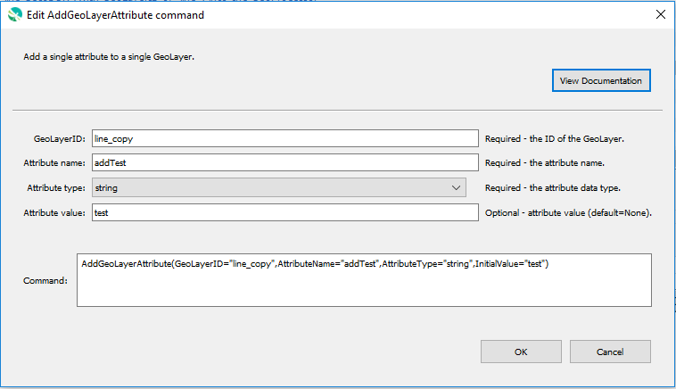

# GeoProcessor / Command / AddGeoLayerAttribute #

* [Overview](#overview)
* [Command Editor](#command-editor)
* [Command Syntax](#command-syntax)
* [Examples](#examples)
* [Troubleshooting](#troubleshooting)
* [See Also](#see-also)

-------------------------

## Overview ##

The `AddGeoLayerAttribute` command adds a single attribute to a single GeoLayer.

* The attribute name and attribute type are specified.
* By default, the attribute values of the added attribute are empty. 
* The new attribute name cannot be the same as an existing attribute name within the GeoLayer. 
* It is highly recommended that the new attribute name is 10 characters or less.
  See [Esri Shapefile limitations](../../spatial-data-format-ref/EsriShapefile/EsriShapefile.md#limitations).

## Command Editor ##

The following dialog is used to edit the command and illustrates the command syntax.

**<p style="text-align: center;">

</p>**

**<p style="text-align: center;">
`AddGeoLayerAttribute` Command Editor (<a href="../AddGeoLayerAttribute.png">see full-size image</a>)
</p>**

## Command Syntax ##

The command syntax is as follows:

```text
AddGeoLayerAttribute(Parameter="Value",...)
```
**<p style="text-align: center;">
Command Parameters
</p>**

| **Parameter**&nbsp;&nbsp;&nbsp;&nbsp;&nbsp;&nbsp;&nbsp;&nbsp;&nbsp;&nbsp;&nbsp;&nbsp;&nbsp;&nbsp;&nbsp;&nbsp;&nbsp;&nbsp;&nbsp;&nbsp;&nbsp;&nbsp;&nbsp;&nbsp;&nbsp;&nbsp; | **Description** | **Default**&nbsp;&nbsp;&nbsp;&nbsp;&nbsp;&nbsp;&nbsp;&nbsp;&nbsp;&nbsp;&nbsp;&nbsp;&nbsp;&nbsp;&nbsp;&nbsp;&nbsp;&nbsp; |
| --------------|-----------------|----------------- |
| `GeoLayerID` <br> **required** | The ID of the GeoLayer to have an attribute added. [`${Property}` syntax](../../introduction/introduction.md#geoprocessor-properties-property) is recognized.| None - must be specified. |
| `AttributeName` <br> **required** | The attribute name. Highly recommended to be 10 or less characters. Case-specific.| None - must be specified. |
| `AttributeType` <br> **required** | The attribute data type. Must be one of the following options:<ul><li>`date` - The attribute values will be date values (e.g. `YYYY-MM-DD` format is recommended).</li><li>`double` - The attribute values will be real numbers (e.g.`100.01`, `0.00089`, `-54.0`).</li><li>`int` - The attribute values will be integers (e.g. `100`, `0`, `-54`).</li><li>`string` - The attribute values will be text (e.g. `blue`, `Colorado`, `helicopter`).</li></ul> | None - must be specified. |
|`InitialValue` |Attribute value. [`${Property}` syntax](../../introduction/introduction.md#geoprocessor-properties-property) is recognized.<br><br> All features are populated with the same value. This parameter is designed to aid in command testing. Populates the added attribute with a value for each feature.  `NULL` attribute values result in no attribute in the output GeoJSON file.  To test that the command works, a value must be entered for the added attribute for each feature so that the output GeoJSON can be compared with expected results.| None. The attribute value for each feature is set to `None`.|

## Examples ##

See the [automated tests](https://github.com/OpenWaterFoundation/owf-app-geoprocessor-python-test/tree/master/test/commands/AddGeoLayerAttribute).

The following GeoLayer data is used in the example.
The example assumes that the `ExampleGeoLayer` GeoLayer has already been read into the
GeoProcessor with the [ReadGeoLayerFromGeoJSON](../ReadGeoLayerFromGeoJSON/ReadGeoLayerFromGeoJSON.md) command.

**<p style="text-align: left;">
Example GeoLayer Data
</p>**

|GeoLayerID|
| ---- |
|ExampleGeoLayer|

**<p style="text-align: left;">
ExampleGeoLayer's Attribute Table
</p>**

|id|school|mascot|students|faculty|
|----|----|-----|-----|-----|
|1|Hill|Bulldogs|546|42|
|2|Bright|Gators|304|24|
|3|Gunn|Colts|567|43|

### Example 1: Add Attributes to a GeoLayer###

```
AddGeoLayerAttribute(GeoLayerID="ExampleGeoLayer", AttributeName="est_date", AttributeType="date")
AddGeoLayerAttribute(GeoLayerID="ExampleGeoLayer", AttributeName="principal", AttributeType="string")
```

After running the commands, the ExampleGeoLayer has the following attribute table.

|id|school|mascot|students|faculty|est_date|principal|
|----|----|-----|-----|-----|---|----|
|1|Hill|Bulldogs|546|42|
|2|Bright|Gators|304|24|
|3|Gunn|Colts|567|43|

## Troubleshooting ##

## See Also ##

* GeoLayer attributes are added using the [`QGIS QGSVectorDataProvider Class`](https://qgis.org/api/classQgsVectorDataProvider.html).
* [RemoveGeoLayerAttributes](../RemoveGeoLayerAttributes/RemoveGeoLayerAttributes.md) command
