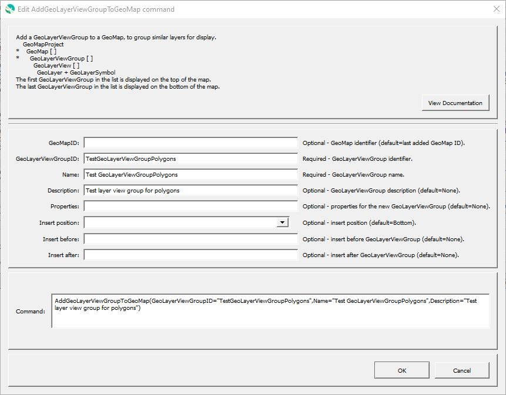

# GeoProcessor / Command / AddGeoLayerViewGroupToGeoMap #

*   [Overview](#overview)
*   [Command Editor](#command-editor)
*   [Command Syntax](#command-syntax)
*   [Examples](#examples)
*   [Troubleshooting](#troubleshooting)
*   [See Also](#see-also)

-------------------------

## Overview ##

The `AddGeoLayerViewGroupToGeoMap` command adds a new GeoLayerViewGroup to an existing GeoMap.
A GeoLayerViewGroup contains a list of GeoLayerView and corresponds to a group level in map legend.
A GeoLayerView is an internal object that contains a GeoLayer (spatial data layer) and a GeoSymbol (visualization properties for layer).

*   See the [`CreateGeoMap`](../CreateGeoMap/CreateGeoMap.md) documentation for guidance on creating maps.
*   See the [GeoMapProject](../../appendix-geomapproject/geomapproject.md) documentation for background and GeoMapProject file format specification.

## Command Editor ##

The following dialog is used to edit the command and illustrates the command syntax.

**<p style="text-align: center;">

</p>**

**<p style="text-align: center;">
`AddGeoLayerViewGroupToGeoMap` Command Editor (<a href="../AddGeoLayerViewGroupToGeoMap.png">see full-size image</a>)
</p>**

## Command Syntax ##

The command syntax is as follows:

```text
AddGeoLyerViewGroupToGeoMap(Parameter="Value",...)
```
**<p style="text-align: center;">
Command Parameters
</p>**

| **Parameter**&nbsp;&nbsp;&nbsp;&nbsp;&nbsp;&nbsp;&nbsp;&nbsp;&nbsp;&nbsp;&nbsp;&nbsp;&nbsp;&nbsp;&nbsp;&nbsp;&nbsp;&nbsp;&nbsp;&nbsp;&nbsp;&nbsp;&nbsp;&nbsp;&nbsp;&nbsp; | **Description** | **Default**&nbsp;&nbsp;&nbsp;&nbsp;&nbsp;&nbsp;&nbsp;&nbsp;&nbsp;&nbsp;&nbsp;&nbsp;&nbsp;&nbsp;&nbsp;&nbsp;&nbsp;&nbsp; |
| --------------|-----------------|----------------- |
| `GeoMapID` | The ID of the GeoMap. | The ID of the last added GeoMap. |
| `GeoLayerViewGroupID` <br> **required** | The ID of the new GeoLayerViewGroup. | None - must be specified. |
| `Name` | Name of the new GeoLayerViewGroup, used to label the group in the map legend. | None - must be specified. |
| `Description` | Description for the new GeoLayerViewGroup. | |
| `Properties` | Properties for the GeoLayerViewGroup using syntax `Property1:Value1,Property2,'Value 2'`.  Single quotes are used around values when the value contains special characters such as comma and spaces.  See the [GeoMapProject](../../appendix-geomapproject/geomapproject.md) documentation a list of properties. |  |
| `InsertPosition` | The position to insert the GeoLayerViewGroup:<ul><li>`Top` - top of the list (will be drawn on top).</li><li>`Bottom` - bottom of the list (will be drawn on the bottom).</li></ul> **The groups will be rendered in the opposite order of the list. The last group added to the map will be rendered first.** | `Bottom` | 
| `InsertBefore` | The GeoLayerViewGroupID to insert before. **The groups will be rendered in the opposite order of the list. The last group added to the map will be rendered first.** | See `InsertPosition` default. |
| `InsertAfter` | The GeoLayerViewGroupID to insert after. **The groups will be rendered in the opposite order of the list. The last group added to the map will be rendered first.** | See `InsertPosition` default. |

## Examples ##

See the [automated tests](https://github.com/OpenWaterFoundation/owf-app-geoprocessor-python-test/tree/main/test/commands/AddGeoLayerViewGroupToGeoMap).

## Troubleshooting ##

## See Also ##

*   [`AddGeoLayerViewToGeoMap`](../AddGeoLayerViewToGeoMap/AddGeoLayerViewToGeoMap.md) command
*   [`AddGeoMapToGeoMapProject`](../AddGeoMapToGeoMapProject/AddGeoMapToGeoMapProject.md) command
*   [`CreateGeoMap`](../CreateGeoMap/CreateGeoMap.md) command
*   [`CreateGeoMapProject`](../CreateGeoMapProject/CreateGeoMapProject.md) command
*   [`SetGeoLayerViewCategorizedSymbol`](../SetGeoLayerViewCategorizedSymbol/SetGeoLayerViewCategorizedSymbol.md) command
*   [`SetGeoLayerViewGraduatedSymbol`](../SetGeoLayerViewGraduatedSymbol/SetGeoLayerViewGraduatedSymbol.md) command
*   [`SetGeoLayerViewSingleSymbol`](../SetGeoLayerViewSingleSymbol/SetGeoLayerViewSingleSymbol.md) command
*   [`WriteGeoMapProjectToJSON`](../WriteGeoMapProjectToJSON/WriteGeoMapProjectToJSON.md) command
