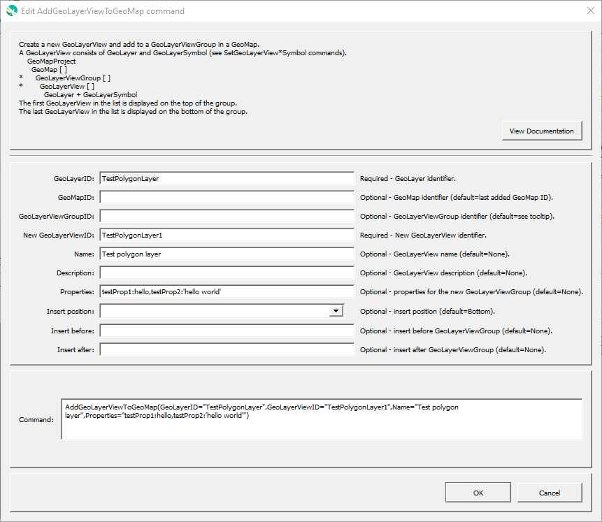

# GeoProcessor / Command / AddGeoLayerViewToGeoMap #

* [Overview](#overview)
* [Command Editor](#command-editor)
* [Command Syntax](#command-syntax)
* [Examples](#examples)
* [Troubleshooting](#troubleshooting)
* [See Also](#see-also)

-------------------------

## Overview ##

The `AddGeoLayerViewToGeoMap` command adds a new GeoLayerView to an existing GeoMap and GeoLayerViewGroup.
A GeoLayerView is an internal object that contains a GeoLayer (spatial data layer) and a GeoSymbol (visualization properties for layer).

* See the [`CreateGeoMap`](../CreateGeoMap/CreateGeoMap.md) documentation for guidance on creating maps.
* See the [GeoMapProject](../../appendix-geomapproject/geomapproject.md) documentation for background and GeoMapProject file format specification.

## Command Editor ##

The following dialog is used to edit the command and illustrates the command syntax.

**<p style="text-align: center;">

</p>**

**<p style="text-align: center;">
`AddGeoLayerViewToGeoMap` Command Editor (<a href="../AddGeoLayerViewToGeoMap.png">see full-size image</a>)
</p>**

## Command Syntax ##

The command syntax is as follows:

```text
AddGeoLyerViewToGeoMap(Parameter="Value",...)
```
**<p style="text-align: center;">
Command Parameters
</p>**

| **Parameter**&nbsp;&nbsp;&nbsp;&nbsp;&nbsp;&nbsp;&nbsp;&nbsp;&nbsp;&nbsp;&nbsp;&nbsp;&nbsp;&nbsp;&nbsp;&nbsp;&nbsp;&nbsp;&nbsp;&nbsp;&nbsp;&nbsp;&nbsp;&nbsp;&nbsp;&nbsp; | **Description** | **Default**&nbsp;&nbsp;&nbsp;&nbsp;&nbsp;&nbsp;&nbsp;&nbsp;&nbsp;&nbsp;&nbsp;&nbsp;&nbsp;&nbsp;&nbsp;&nbsp;&nbsp;&nbsp; |
| --------------|-----------------|----------------- |
| `GeoLayerID` <br> **required** | The ID of the existing GeoLayer. | None - must be specified. |
| `GeoMapID` | The ID of the existing GeoMap. | The ID of the last added GeoMap. |
| `GeoLayerViewGroupID` | The ID of the existing GeoLayerViewGroup. | The ID of the last added GeoLayerViewGroup. |
| `GeoLayerViewID` <br> **required** | The ID of the new GeoLayerView. | None - must be specified. |
| `Name` | Name of the new GeoLayerView, used to label the layer in the map legend. | None - must be specified. |
| `Description` | Description for the new GeoLayerView. | |
| `Properties` | Additional properties to assign to the GeoLayerView, using format: `prop1:value1,prop2:'string with space'`.  Can use `${Property}` notation.  | No additional properties are assigned. |
| `InsertPosition` | The position to insert the GeoLayerView within the GeoLayerViewGroup:<ul><li>`Top` - top of the list (will be drawn on top).</li><li>`Bottom` - bottom of the list (will be drawn on the bottom).</li></ul>  **The layers will be rendered in the opposite order of the list. The last layers added to the group will be rendered first.** | `Bottom` | 
| `InsertBefore` | The GeoLayerViewID to insert before. **The layers will be rendered in the opposite order of the list. The last layers added to the group will be rendered first.** | See the `InsertPosition` default. |
| `InsertAfter` | The GeoLayerViewID to insert after. **The layers will be rendered in the opposite order of the list. The last layers added to the group will be rendered first.** | See the `InsertPosition` default. |

## Examples ##

See the [automated tests](https://github.com/OpenWaterFoundation/owf-app-geoprocessor-python-test/tree/master/test/commands/AddGeoLayerViewToGeoMap).

## Troubleshooting ##

## See Also ##

* [`AddGeoLayerViewGroupToGeoMap`](../AddGeoLayerViewToGeoMap/AddGeoLayerViewToGeoMap.md) command
* [`AddGeoMapToGeoMapProject`](../AddGeoMapToGeoMapProject/AddGeoMapToGeoMapProject.md) command
* [`CreateGeoMap`](../CreateGeoMap/CreateGeoMap.md) command
* [`CreateGeoMapProject`](../CreateGeoMapProject/CreateGeoMapProject.md) command
* [`SetGeoLayerViewCategorizedSymbol`](../SetGeoLayerViewCategorizedSymbol/SetGeoLayerViewCategorizedSymbol.md) command
* [`SetGeoLayerViewGraduatedSymbol`](../SetGeoLayerViewGraduatedSymbol/SetGeoLayerViewGraduatedSymbol.md) command
* [`SetGeoLayerViewSingleSymbol`](../SetGeoLayerViewSingleSymbol/SetGeoLayerViewSingleSymbol.md) command
* [`WriteGeoMapProjectToJSON`](../WriteGeoMapProjectToJSON/WriteGeoMapProjectToJSON.md) command
