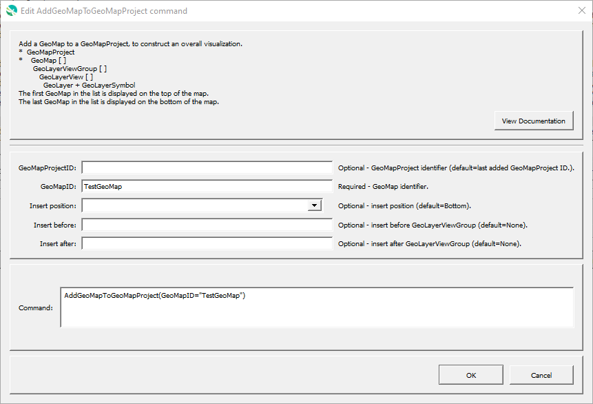

# GeoProcessor / Command / AddGeoMapToGeoMapProject #

* [Overview](#overview)
* [Command Editor](#command-editor)
* [Command Syntax](#command-syntax)
* [Examples](#examples)
* [Troubleshooting](#troubleshooting)
* [See Also](#see-also)

-------------------------

## Overview ##

The `AddGeoMapToGeoMapProject` command adds an existing GeoMap to an existing GeoMapProject.

* See the [`CreateGeoMap`](../CreateGeoMap/CreateGeoMap.md) documentation for guidance on creating maps.
* See the [GeoMapProject](../../appendix-geomapproject/geomapproject.md) documentation for background and GeoMapProject file format specification.

## Command Editor ##

The following dialog is used to edit the command and illustrates the command syntax.

**<p style="text-align: center;">

</p>**

**<p style="text-align: center;">
`AddGeoMapToGeoMapProject` Command Editor (<a href="../AddGeoMapToGeoMapProject.png">see full-size image</a>)
</p>**

## Command Syntax ##

The command syntax is as follows:

```text
AddGeoLyerViewGroupToGeoMap(Parameter="Value",...)
```
**<p style="text-align: center;">
Command Parameters
</p>**

| **Parameter**&nbsp;&nbsp;&nbsp;&nbsp;&nbsp;&nbsp;&nbsp;&nbsp;&nbsp;&nbsp;&nbsp;&nbsp;&nbsp;&nbsp;&nbsp;&nbsp;&nbsp;&nbsp;&nbsp;&nbsp;&nbsp;&nbsp;&nbsp;&nbsp;&nbsp;&nbsp; | **Description** | **Default**&nbsp;&nbsp;&nbsp;&nbsp;&nbsp;&nbsp;&nbsp;&nbsp;&nbsp;&nbsp;&nbsp;&nbsp;&nbsp;&nbsp;&nbsp;&nbsp;&nbsp;&nbsp; |
| --------------|-----------------|----------------- |
| `GeoMapProjectID` <br> **required** | The ID of the new GeoMapProjectID. | None - must be specified. |
| `GeoMapID` <br> **required** | The ID of the GeoMap. | None - must be specified. |
| `InsertPosition` | The position to insert the GeoMap:<ul><li>`Top` - top of the list (will be drawn on top).</li><li>`Bottom` - bottom of the list (will be drawn on the bottom).</li></ul> | `Bottom` | 
| `InsertBefore` | The GeoMapID to insert before. | |
| `InsertAfter` | The GeoMapID to insert after. | |

## Examples ##

See the [automated tests](https://github.com/OpenWaterFoundation/owf-app-geoprocessor-python-test/tree/master/test/commands/AddGeoMapToGeoMapProject).

## Troubleshooting ##

## See Also ##

* [`AddGeoLayerViewGroupToGeoMap`](../AddGeoLayerViewGroupToGeoMap/AddGeoLayerViewGroupToGeoMap.md) command
* [`AddGeoLayerViewToGeoMap`](../AddGeoLayerViewToGeoMap/AddGeoLayerViewToGeoMap.md) command
* [`CreateGeoMap`](../CreateGeoMap/CreateGeoMap.md) command
* [`CreateGeoMapProject`](../CreateGeoMapProject/CreateGeoMapProject.md) command
* [`SetGeoLayerViewCategorizedSymbol`](../SetGeoLayerViewCategorizedSymbol/SetGeoLayerViewCategorizedSymbol.md) command
* [`SetGeoLayerViewGraduatedSymbol`](../SetGeoLayerViewGraduatedSymbol/SetGeoLayerViewGraduatedSymbol.md) command
* [`SetGeoLayerViewSingleSymbol`](../SetGeoLayerViewSingleSymbol/SetGeoLayerViewSingleSymbol.md) command
* [`WriteGeoMapProjectToJSON`](../WriteGeoMapProjectToJSON/WriteGeoMapProjectToJSON.md) command
