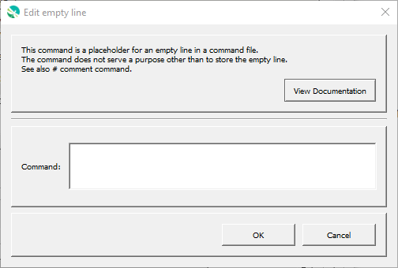

# GeoProcessor / Command / Blank #

*   [Overview](#overview)
*   [Command Editor](#command-editor)
*   [Command Syntax](#command-syntax)
*   [Examples](#examples)
*   [Troubleshooting](#troubleshooting)
*   [See Also](#see-also)

-------------------------

## Overview ##

The `Blank` is a placeholder for empty lines.

## Command Editor ##

The following dialog is used to edit the command and illustrates the command syntax.

**

**

**

Empty Line Command Editor (<a href="../Blank.png">see full-size image</a>)

**

## Command Syntax ##

Blank lines in command files are converted to `Blank` commands.

## Examples ##

See the [automated tests](https://github.com/OpenWaterFoundation/owf-app-geoprocessor-python-test/tree/main/test/commands/Blank).

## Troubleshooting ##

## See Also ##

*   [UnknownCommand](../UnknownCommand/UnknownCommand.md) command - unknown commands that are not empty lines
