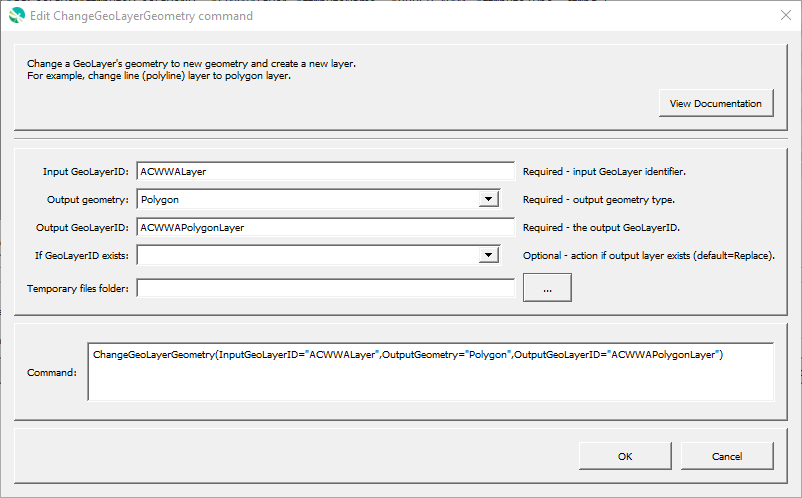

# GeoProcessor / Command / ChangeGeoLayerGeometry #

*   [Overview](#overview)
*   [Command Editor](#command-editor)
*   [Command Syntax](#command-syntax)
*   [Examples](#examples)
*   [Troubleshooting](#troubleshooting)
*   [See Also](#see-also)

-------------------------

## Overview ##

The `ChangeGeoLayerGeometry` creates a new GeoLayer with new geometry.
For example, a line (polyline) layer can be converted to a polygon layer.

## Command Editor ##

The following dialog is used to edit the command and illustrates the command syntax.

**<p style="text-align: center;">

</p>**

**<p style="text-align: center;">
`ChangeGeoLayerGeometry` Command Editor (<a href="../ChangeGeoLayerGeometry.png">see full-size image</a>)
</p>**

## Command Syntax ##

The command syntax is as follows:

```text
ChangeGeoLayerGeometry(Parameter="Value",...)
```
**<p style="text-align: center;">
Command Parameters
</p>**

| **Parameter**&nbsp;&nbsp;&nbsp;&nbsp;&nbsp;&nbsp;&nbsp;&nbsp;&nbsp;&nbsp;&nbsp;&nbsp;&nbsp;&nbsp;&nbsp;&nbsp;&nbsp;&nbsp;&nbsp;&nbsp;&nbsp;&nbsp;&nbsp;&nbsp;&nbsp;&nbsp; | **Description** | **Default**&nbsp;&nbsp;&nbsp;&nbsp;&nbsp;&nbsp;&nbsp;&nbsp;&nbsp;&nbsp;&nbsp;&nbsp;&nbsp;&nbsp;&nbsp;&nbsp;&nbsp;&nbsp; |
| --------------|-----------------|----------------- |
| `GeoLayerID`<br>**required** | The ID of the input GeoLayer. | None - must be specified. |
| `OutputGeometry` | Geometry for the output using Well Known Text (WKT) types:<ul><li>`Point`</li><li>`LineString`</li><li>`Polygon>`</li></ul>. | `NewGeoLayerID` |
| `OutputGeoLayerID`<br>**required** | The ID of the new GeoLayer. | None - must be specified. |
| `Name` | **Proposed** - Name of the output GeoLayer. | `OutputGeoLayerID` |
| `Description` |**Proposed** - Description for the output GeoLayer. | |
| `IfGeoLayerIDExists` | The action that occurs if the `OutputGeoLayerID` already exists within the GeoProcessor:<ul><li>`Replace` - The existing GeoLayer within the GeoProcessor is replaced with the new GeoLayer. No warning is logged.</li><li>`ReplaceAndWarn` - The existing GeoLayer within the GeoProcessor is replaced with the new GeoLayer. A warning is logged.</li><li>`Warn` - The new GeoLayer is not created. A warning is logged.</li><li>`Fail` - The new GeoLayer is not created. A fail message is logged.</li></ul> | `Replace` | 

## Examples ##

See the [automated tests](https://github.com/OpenWaterFoundation/owf-app-geoprocessor-python-test/tree/main/test/commands/ChangeGeoLayerGeometry).

## Troubleshooting ##

## See Also ##

*   This command uses the QGIS [`qgis:linestopolygons`](https://docs.qgis.org/latest/en/docs/user_manual/processing_algs/qgis/vectorgeometry.html#lines-to-polygons) processing algorithm
*   [`CreateGeoLayerFromGeometry`](../CreateGeoLayerFromGeometry/CreateGeoLayerFromGeometry.md) command
