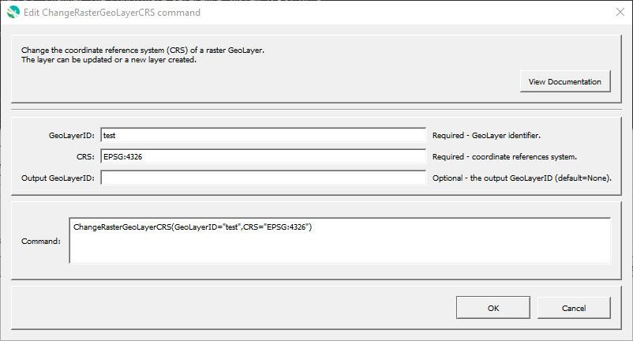

# GeoProcessor / Command / ChangeRasterGeoLayerCRS #

*   [Overview](#overview)
*   [Command Editor](#command-editor)
*   [Command Syntax](#command-syntax)
*   [Examples](#examples)
*   [Troubleshooting](#troubleshooting)
*   [See Also](#see-also)

-------------------------

## Overview ##

The `ChangeRasterGeoLayerCRS` command changes the Coordinate Reference System (CRS) of a
raster [GeoLayer](../../introduction/introduction.md#geolayer),
optionally creating a new GeoLayer.
This command should be used if the CRS cannot be specified as needed when reading or creating the GeoLayer.

## Command Editor ##

The following dialog is used to edit the command and illustrates the command syntax.

**<p style="text-align: center;">

</p>**

**<p style="text-align: center;">
`ChangeRasterGeoLayerCRS` Command Editor (<a href="../ChangeRasterGeoLayerCRS.png">see full-size image</a>)
</p>**

## Command Syntax ##

The command syntax is as follows:

```text
ChangeRasterGeoLayerCRS(Parameter="Value",...)
```
**<p style="text-align: center;">
Command Parameters
</p>**

|**Parameter**&nbsp;&nbsp;&nbsp;&nbsp;&nbsp;&nbsp;&nbsp;&nbsp;&nbsp;&nbsp;&nbsp;&nbsp;&nbsp;&nbsp;&nbsp;&nbsp;&nbsp;&nbsp;&nbsp;&nbsp;&nbsp; | **Description** | **Default**&nbsp;&nbsp;&nbsp;&nbsp;&nbsp;&nbsp;&nbsp;&nbsp;&nbsp;&nbsp; |
| --------------|-----------------|----------------- |
| `GeoLayerID` <br>**required**| The identifier of the input GeoLayer. [`${Property}` syntax](../../introduction/introduction.md#geoprocessor-properties-property) is recognized.| None - must be specified. |
| `CRS` | The new [coordinate reference system](https://en.wikipedia.org/wiki/Spatial_reference_system). [EPSG or ESRI code format](http://spatialreference.org/ref/epsg/) required (e.g. [`EPSG:4326`](http://spatialreference.org/ref/epsg/4326/), [`EPSG:26913`](http://spatialreference.org/ref/epsg/nad83-utm-zone-13n/), [`ESRI:102003`](http://spatialreference.org/ref/esri/usa-contiguous-albers-equal-area-conic/)). | CRS of the GeoLayer. |
| `OutputGeoLayerID` | The identifier of the output GeoLayer. [`${Property}` syntax](../../introduction/introduction.md#geoprocessor-properties-property) is recognized.| Original GeoLayer will be updated.  |

## Examples ##

See the [automated tests](https://github.com/OpenWaterFoundation/owf-app-geoprocessor-python-test/tree/main/test/commands/ChangeRasterGeoLayerCRS).

## Troubleshooting ##

## See Also ##

*   This command uses the QGIS [`gdal:warpreproject`](https://docs.qgis.org/latest/en/docs/user_manual/processing_algs/gdal/rasterprojections.html#warp-reproject) processing algorithm
*   [`WriteRasterGeoLayerToFile`](../WriteRasterGeoLayerToFile/WriteRasterGeoLayerToFile.md) command
