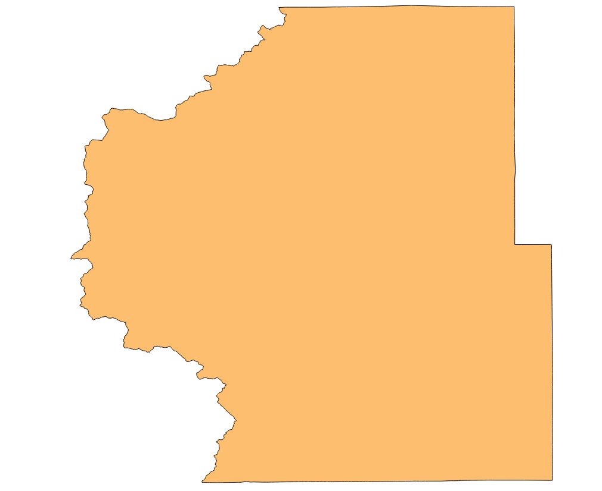

# Learn GeoProcessor / Command / ClipGeoLayer #

* [Overview](#overview)
* [Command Editor](#command-editor)
* [Command Syntax](#command-syntax)
* [Examples](#examples)
* [Troubleshooting](#troubleshooting)
* [See Also](#see-also)

-------------------------

## Overview ##

The `ClipGeoLayer` command clips an input [GeoLayer](../../introduction#geolayer) by a second GeoLayer, the clipping GeoLayer. The output is a new GeoLayer containing the features within the input GeoLayer that intersect the features of the clipping GeoLayer. The attribute fields and values are retained from the input GeoLayer. The output GeoLayer will retain the coordinate reference system of the input GeoLayer. 

## Command Editor ##

The following dialog is used to edit the command and illustrates the command syntax.

**Need to implement UI.**

## Command Syntax ##

The command syntax is as follows:

```text
ClipGeoLayer(Parameter="Value",...)
```
**<p style="text-align: center;">
Command Parameters
</p>**

|**Parameter**&nbsp;&nbsp;&nbsp;&nbsp;&nbsp;&nbsp;&nbsp;&nbsp;&nbsp;&nbsp;&nbsp;&nbsp;&nbsp;&nbsp;&nbsp;&nbsp;&nbsp;&nbsp;&nbsp;&nbsp;| **Description** | **Default**&nbsp;&nbsp;&nbsp;&nbsp;&nbsp;&nbsp;&nbsp;&nbsp;&nbsp;&nbsp; |
| --------------|-----------------|----------------- |
| `InputGeoLayerID` <br>  **_required_**| The ID of the input GeoLayer.| None - must be specified. |
| `ClippingGeoLayerID` <br> **_required_**| The ID of the clipping GeoLayer. The clipping GeoLayer must be contain polygon geometry.| None - must be specified. |
| `OutputGeoLayerID` <br> *optional*| A GeoLayer identifier for the output GeoLayer. Refer to [documentation](../../best-practices/geolayer-identifiers.md) for best practices on naming GeoLayer identifiers.| `InputGeoLayerID` \_clippedBy\_ `ClippingGeoLayerID`|
|`IfGeoLayerIDExists`<br> *optional*|The action that occurs if the `OutputGeoLayerID` already exists within the GeoProcessor. <br><br> `Replace` : The existing GeoLayer within the GeoProcessor will be overwritten with the new GeoLayer. No warning will be logged.<br><br> `Warn` : The existing GeoLayer within the GeoProcessor will be overwritten with the new GeoLayer. A warning will be logged. <br><br> `Fail` : The new GeoLayer will not be read. A fail message will be logged. | `Replace` | 


## Examples ##

See the [automated tests](https://github.com/OpenWaterFoundation/owf-app-geoprocessor-python-test/tree/master/test/commands/ClipGeoLayer).

For the following examples, the contents of a mock GeoProcessor are listed below.

**<p style="text-align: left;">
GeoProcessor
</p>**

|GeoLayerID&nbsp;&nbsp;&nbsp;&nbsp;&nbsp;&nbsp;&nbsp;&nbsp;&nbsp;&nbsp;&nbsp;&nbsp;&nbsp;&nbsp;&nbsp;&nbsp;&nbsp;&nbsp;&nbsp;&nbsp;&nbsp;&nbsp;&nbsp;&nbsp;&nbsp;&nbsp;&nbsp;&nbsp;&nbsp;&nbsp;&nbsp;&nbsp;&nbsp;|Description|Image|
| ---- |  ----- | ----|
| `floodplains-FEMA-CO-4326` |Colorado floodplains provided by the Federal Emergency Management Agency (FEMA). Projected in WGS84 (EPSG:4326).||
| `cntyBndry-CDPHE-Park-4326`	| Park County Boundary provided by the Colorado Department of Public Health and Environment (CDPHE). Projected in WGS84 (EPSG:4326).||

### Example 1: Clip a GeoLayer###

```
ClipGeoLayer(InputGeoLayerID = "floodplains-FEMA-CO-4326", ClippingGeoLayerID = "cntyBndry-CDPHE-Park-4326")
```

After running the command line, the following GeoLayer IDs will be registered within the GeoProcessor. 

|GeoLayerID|Description|Image|
| ---- |  ----- | ---- |
| `floodplains-FEMA-CO-4326` |Colorado floodplains provided by FEMA. Projected in WGS84 (EPSG:4326).||
| `cntyBndry-CDPHE-Park-4326`	| Park County Boundary provided by CDPHE. Projected in WGS84 (EPSG:4326).||
| `floodplains-FEMA-CO-4326_clippedBy_cntyBndry-CDPHE-Park-4326`| Park County floodplains provided by FEMA. Projected in WGS84 (EPSG:4326).||

Below is an image of the input and output products of the ClipGeoLayer command. The top image shows the `Colorado floodplains layer` (input GeoLayer) with the outline of the `Park County Boundary layer` (clipping GeoLayer). The bottom image shows the `Park County floodplains layer` (output GeoLayer) with the outline of the `Park County Boundary layer`. 


### Example 2: Assign a Unique GeoLayer ID###

In Example 1, the ClipGeoLayer command correctly clipped the Colorado floodplain layer to the Park country boundary layer. The default output GeoLayerID, however, is quite long and does not follow the [GeoLayer ID best practices](../../best-practices/geolayer-identifiers). In this example, the same ClipGeoLayer command will be run but the option `OutputGeoLayerID` parameter will be used.  

```
ClipGeoLayer(InputGeoLayerID = "floodplains-FEMA-CO-4326", ClippingGeoLayerID = "cntyBndry-CDPHE-Park-4326", OutputGeoLayerID = "floodplains-FEMA-Park-4326")
```

After running the command line, the following GeoLayer IDs will be registered within the GeoProcessor. 

|GeoLayerID|Description|Image|
| ---- |  ----- | ---- |
| `floodplains-FEMA-CO-4326` |Colorado floodplains provided by FEMA. Projected in WGS84 (EPSG:4326).||
| `cntyBndry-CDPHE-Park-4326`	| Park County Boundary provided by CDPHE. Projected in WGS84 (EPSG:4326).||
| `floodplains-FEMA-Park-4326`| Park County floodplains provided by FEMA. Projected in WGS84 (EPSG:4326).||

## Troubleshooting ##

- For accurate results, the input GeoLayer and the clipping GeoLayer should be in the same coordinate reference system.
- For accurate results, the clipping GeoLayer should contain polygon geometries.

## See Also ##

- The ClipGeoLayers command uses the QGIS processing algorithm [`qgis:clip`](https://docs.qgis.org/2.14/en/docs/user_manual/processing_algs/qgis/vector_overlay_tools.html#clip). 