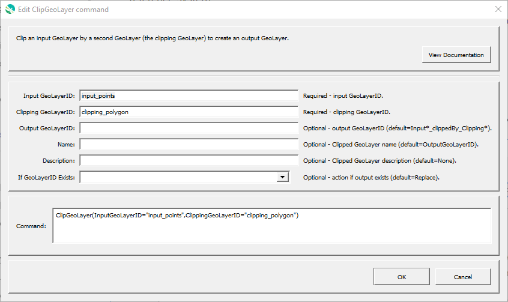

# GeoProcessor / Command / ClipGeoLayer #

* [Overview](#overview)
* [Command Editor](#command-editor)
* [Command Syntax](#command-syntax)
* [Examples](#examples)
* [Troubleshooting](#troubleshooting)
* [See Also](#see-also)

-------------------------

## Overview ##

The `ClipGeoLayer` command clips an input [GeoLayer](../../introduction/introduction.md#geolayer) by a second GeoLayer, the clipping GeoLayer. 

* The output is a new GeoLayer containing the features within the input GeoLayer that intersect the features of the clipping GeoLayer. 
* The output GeoLayer retains the attribute fields and values of the input GeoLayer. 
* The output GeoLayer retains the coordinate reference system of the input GeoLayer. 
* The input GeoLayer and the clipping GeoLayer must be projected in the same coordinate reference system. 
* The input GeoLayer can have *one or more* features with *any* geometry (point, line or polygon).
* The clipping GeoLayer can have *one or more* features but those features must be *polygons*.

## Command Editor ##

The following dialog is used to edit the command and illustrates the command syntax.

**<p style="text-align: center;">

</p>**

**<p style="text-align: center;">
`ClipGeoLayer` Command Editor (<a href="../ClipGeoLayer.png">see full-size image</a>)
</p>**

## Command Syntax ##

The command syntax is as follows:

```text
ClipGeoLayer(Parameter="Value",...)
```
**<p style="text-align: center;">
Command Parameters
</p>**

|**Parameter**&nbsp;&nbsp;&nbsp;&nbsp;&nbsp;&nbsp;&nbsp;&nbsp;&nbsp;&nbsp;&nbsp;&nbsp;&nbsp;&nbsp;&nbsp;&nbsp;&nbsp;&nbsp;&nbsp;&nbsp;&nbsp;&nbsp;| **Description** | **Default**&nbsp;&nbsp;&nbsp;&nbsp;&nbsp;&nbsp;&nbsp;&nbsp;&nbsp;&nbsp; |
| --------------|-----------------|----------------- |
| `InputGeoLayerID` <br>  **required**| The ID of the input GeoLayer.| None - must be specified. |
| `ClippingGeoLayerID` <br> **required**| The ID of the clipping GeoLayer. The clipping GeoLayer must be contain polygon geometry.| None - must be specified. |
| `OutputGeoLayerID` | A GeoLayer identifier for the output GeoLayer. Refer to [documentation](../../best-practices/geolayer-identifiers.md) for best practices on naming GeoLayer identifiers.| `InputGeoLayerID` `_clippedBy_` `ClippingGeoLayerID`|
| `Name` | Name of the output GeoLayer. | `OutputGeoLayerID` |
| `Description` | Description for the output GeoLayer. | |
|`IfGeoLayerIDExists`|The action that occurs if the `OutputGeoLayerID` already exists within the GeoProcessor:<ul><li>`Replace` - The existing GeoLayer within the GeoProcessor is relaced with the new GeoLayer. No warning is logged.</li><li>`ReplaceAndWarn` - The existing GeoLayer within the GeoProcessor is replaced with the new GeoLayer. A warning is logged.</li><li>`Warn` - The ClipGeoLayer command does not run. A warning is logged.</li><li>`Fail` - The ClipGeoLayer command does not run. A fail message is logged.</li></ul> | `Replace` | 

## Examples ##

See the [automated tests](https://github.com/OpenWaterFoundation/owf-app-geoprocessor-python-test/tree/master/test/commands/ClipGeoLayer).

The following GeoLayer data are used in the examples.
The examples assume that the `floodplains-FEMA-CO-4326` and `countyBoundary-CDOT-Park-4326` GeoLayers have
already been read into the GeoProcessor with the [`ReadGeoLayerFromGeoJSON`](../ReadGeoLayerFromGeoJSON/ReadGeoLayerFromGeoJSON.md) command.

**<p style="text-align: center;">
Example GeoLayer Data
</p>**

|GeoLayer ID&nbsp;&nbsp;&nbsp;&nbsp;&nbsp;&nbsp;&nbsp;&nbsp;&nbsp;&nbsp;&nbsp;&nbsp;&nbsp;&nbsp;&nbsp;&nbsp;&nbsp;&nbsp;&nbsp;&nbsp;&nbsp;&nbsp;&nbsp;&nbsp;&nbsp;&nbsp;&nbsp;&nbsp;&nbsp;&nbsp;&nbsp;&nbsp;&nbsp;|Description|Image|
| ---- |  ----- | ----|
| `floodplains-FEMA-CO-4326` |Colorado floodplains provided by the Federal Emergency Management Agency (FEMA). Projected in WGS84 (EPSG:4326).||
| `countyBoundary-CDOT-Park-4326`	| Park County Boundary provided by the Colorado Department of Transportation (CDOT). Projected in WGS84 (EPSG:4326).||

### Example 1: Clip a GeoLayer###

```
ClipGeoLayer(InputGeoLayerID = "floodplains-FEMA-CO-4326", ClippingGeoLayerID = "countyBoundary-CDOT-Park-4326")
```

After running the command, the following GeoLayer IDs are registered within the GeoProcessor. 

|GeoLayer ID|Description|Image|
| ---- |  ----- | ---- |
| `floodplains-FEMA-CO-4326` |The input GeoLayer. Colorado floodplains provided by FEMA. Projected in WGS84 (EPSG:4326).||
| `countyBoundary-CDOT-Park-4326`	|The clipping GeoLayer. Park County Boundary provided by CDOT. Projected in WGS84 (EPSG:4326).||
| `floodplains-FEMA-CO-4326_clippedBy_countyBoundary-CDOT-Park-4326`|The output (clipped) GeoLayer. Park County floodplains provided by FEMA. Projected in WGS84 (EPSG:4326).||

Below is an image of the input and output products of the `ClipGeoLayer` command. 

* The top image shows the `Colorado floodplains layer` (input GeoLayer) with the outline of the `Park County Boundary layer` (clipping GeoLayer). 

* The bottom image shows the `Park County floodplains layer` (output clipped GeoLayer) with the outline of the `Park County Boundary layer`. 

**<p style="text-align: center;">

</p>**

### Example 2: Assign a Unique GeoLayer ID to the Output###

In Example 1, the ClipGeoLayer command clipped the Colorado floodplain layer to the Park country boundary layer. The default output GeoLayerID, however, is quite long and does not follow the [GeoLayer ID best practices](../../best-practices/geolayer-identifiers.md). In this example, the same ClipGeoLayer command user the `OutputGeoLayerID` parameter to specify the GeoLayer ID for hte new output GeoLayer.  

```
ClipGeoLayer(InputGeoLayerID = "floodplains-FEMA-CO-4326", ClippingGeoLayerID = "countyBoundary-CDOT-Park-4326", OutputGeoLayerID = "floodplains-FEMA-Park-4326")
```

After running the command, the following GeoLayer IDs are registered within the GeoProcessor. 

|GeoLayer ID|Description|Image|
| ---- |  ----- | ---- |
| `floodplains-FEMA-CO-4326` |The input GeoLayer. Colorado floodplains provided by FEMA. Projected in WGS84 (EPSG:4326).||
| `countyBoundary-CDOT-Park-4326` |The clipping GeoLayer. Park County Boundary provided by CDOT. Projected in WGS84 (EPSG:4326).||
| `floodplains-FEMA-Park-4326`|The output (clipped) GeoLayer. Park County floodplains provided by FEMA. Projected in WGS84 (EPSG:4326).||

## Troubleshooting ##

* There is a bug within QGIS version `2.18.1` that causes an error.  **This should not be an issue with the current version of QGIS and GeoProcessor.**
	+ The clip process will only work for one feature.
	All other features within the input GeoLayer will not be included in the output GeoLayer.
	+ More information is available at
	[Stack Exchange - Why general.runalg("qgis:linestopolygons"...) work only over first feature?](https://gis.stackexchange.com/questions/219857/why-general-runalgqgislinestopolygons-work-only-over-first-feature).

## See Also ##

* This command uses the QGIS [`qgis:clip`](https://docs.qgis.org/3.16/en/docs/user_manual/processing_algs/qgis/vectoroverlay.html#clip) processing algorithm
