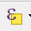

# TODO egiles 2018/01/24 THIS DOCUMENTATION IS NOT COMPLETE 

# ClipGeoLayer User Documentation Data

|Data|Description|How to Recreate|Source|
|----|------|-----|----|
|`countyBoundary-CDOT-Park-4326.geojson`|Single-feature polygon of Colorado Park County boundary. Projected in WGS84.|See [County Data](#county-data) section.|CDOT on [Colorado Information Marketplace](https://data.colorado.gov/Transportation/Counties-in-Colorado/67vn-ijga)|
|`floodplains-FEMA-CO-4326`|Multi-feature polygon of Colorado floodplain boundaries. Projected in WGS84. The data file is not in the data folder because it is a very large file and should not be saved in the repository.|See [Floodplain Data](#floodplain-data) section.|[FEMA Flood Map Service Center](https://msc.fema.gov/portal/advanceSearch#searchresultsanchor)|

## County Data

|  |  |
|---|---|
|1| Navigate to [the `Counties in Colorado` dataset at Colorado Information Marketplace site](https://data.colorado.gov/Transportation/Counties-in-Colorado/67vn-ijga).|
|2|Click the blue `Export` button. Under the `Export` pane, click `Download as GeoJSON`.|
|3|The GeoJSON will be downloaded into your local `Downloads` folder.|
|4|Open QGIS Desktop.|
|5|Drag and drop the downloaded `Counties in Colorado.geojson` from your `Downloads` folder to QGIS Desktop.|
|6|Click the `Select by expression` button. See `Appendix A` for an image of the button.|
|7| The `Select by expression` window will appear.|
|8| Double-click inside the `Expression` window. Type `"county"='PARK'`. Click the `Close` button.|
|9| Park county should not be highlighted in yellow.|
|10|Right-click on the layer in the `Layers Panel` and click `Save As...`|
|11|The `Save vector layer as...` window will appear. Make sure that the `Format` selection is on `GeoJSON`. Give the layer a filename next to the `File name` box (it is easy to click `Browse` to find a safe location). Make sure that the `CRS` is on `(EPSG:4326, WGS84)`. *Check the box next to `Save only selected features`. Click `OK`.|

## Floodplain Data

|  |  |
|---|---|
|1| Navigate to [the `FEMA Flood Map Service Center` site](https://msc.fema.gov/portal/advanceSearch#searchresultsanchor).|
|2|Under the `Jurisdiction` > `State` option. Select `Colorado`. Select any `County` and any `Community`. Click `Search`.|
|3|Under the `Search Results`, click `Effective Products` > `NFHL Data-State`.|
|4|Click the `Download` button. The data file will be downloaded to your local `Downloads` folder.|
|5|

# Appendix A

## `Select by expression` button
