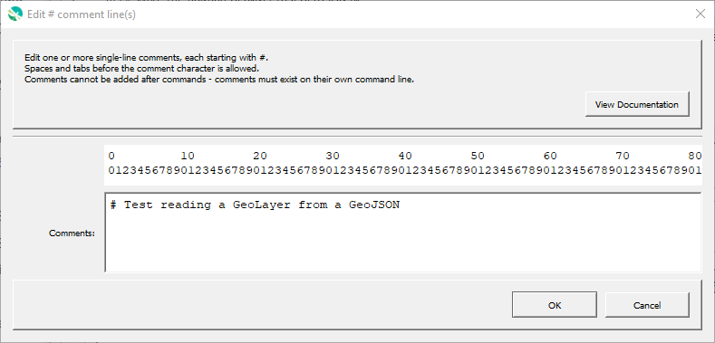

# GeoProcessor / Command / Comment `#` #

* [Overview](#overview)
* [Command Editor](#command-editor)
* [Command Syntax](#command-syntax)
* [Examples](#examples)
* [Troubleshooting](#troubleshooting)
* [See Also](#see-also)

-------------------------

## Overview ##

Single-line comments start with `#`.
Spaces and tabs before the comment character are allowed.
Comments cannot be added on the same line after commands - each comment must exist on their own command line.
Commands can be converted to and from `#` comments by selecting commands, right-clicking, and selecting
***Convert selected commands to # comments*** and ***Convert selected commands from # comments*** from the popup menu.

See also the 
[CommentBlockStart - `/*`](../CommentBlockStart/CommentBlockStart.md) and
[CommentBlockEnd - `*/`](../CommentBlockEnd/CommentBlockEnd.md) comment block commands,
which can be used to comment multiple lines.
The [`Exit`](../Exit/Exit.md) command can also be used to exist a command file in the middle of commands.
The [`If`](../If/If.md) command can be used to group commands that should be run only in certain situations.

Comments can also contain annotations to provide information to the software.
These annotations are similar to those found in programming languages.
The following table lists supported annotations:

**<p style="text-align: center;">
Comment Annotations
</p>**

| **Annotation**&nbsp;&nbsp;&nbsp;&nbsp;&nbsp;&nbsp;&nbsp;&nbsp;&nbsp;&nbsp;&nbsp;&nbsp;&nbsp;&nbsp;&nbsp;&nbsp;&nbsp;&nbsp;&nbsp;&nbsp;&nbsp;&nbsp;&nbsp;&nbsp;&nbsp;&nbsp;&nbsp;&nbsp;&nbsp;&nbsp; | **Used By**&nbsp;&nbsp;&nbsp;&nbsp;&nbsp;&nbsp;&nbsp;&nbsp;&nbsp;&nbsp;&nbsp;&nbsp;&nbsp;&nbsp;&nbsp;&nbsp;&nbsp;&nbsp;&nbsp;&nbsp;&nbsp;&nbsp;&nbsp;&nbsp;&nbsp;&nbsp;&nbsp;&nbsp;&nbsp;&nbsp;&nbsp;&nbsp;&nbsp;&nbsp;&nbsp;&nbsp;&nbsp;&nbsp;&nbsp;&nbsp;&nbsp;&nbsp;&nbsp;&nbsp;&nbsp;&nbsp;&nbsp;&nbsp;&nbsp;&nbsp;&nbsp;&nbsp;&nbsp;&nbsp;&nbsp;&nbsp;&nbsp;&nbsp;&nbsp;&nbsp; | **Description** |
| -- | -- | -- |
| `@docExample` | Documentation creators | Indicates that the command file is used in the command reference or other documentation.  Search for the string to determine which test command file to run when preparing the documentation. |
| `@enabled False` | GeoProcessor command processor | Used to disable a command file.  For example, use this annotation in a test command file when the test is not ready to use in full software release. |
| `@expectedStatus Failure`<br>`@expectedStatus Warning` | [`RunCommands`](../RunCommands/RunCommands.md) command | Used to help the test framework know if an error or warning is expected, in which case a test can pass even if the command status is not "success". |
| `@os Windows`<br>`@os UNIX` | The [`CreateRegressionTestCommandFile`](../CreateRegressionTestCommandFile/CreateRegressionTestCommandFile.md) command | Used to filter test command files for the operating system.  Linux is included in UNIX. **Not yet implemented.** |
| `@readOnly` | GeoProcessor main interface and command editors. | Indicate that the command file should not be saved, without additional confirmation.  **Not yet implemented.** |
| `@template` | GeoProcessor main interface. | Indicate that the command file is a template command file.  **Not yet implemented.** |

## Command Editor ##

The following dialog is used to edit the command and illustrates the command syntax.

**<p style="text-align: center;">

</p>**

**<p style="text-align: center;">
Empty Comment Command Editor (<a href="../Comment.png">see full-size image</a>)
</p>**

## Command Syntax ##

The command syntax is as follows:

```text
# A comment
# Another comment
     # An indented comment.
```

## Examples ##

See the [automated tests](https://github.com/OpenWaterFoundation/owf-app-geoprocessor-python-test/tree/master/test/commands/Comment).

## Troubleshooting ##

## See Also ##

* [CommentBlockStart - `/*`](../CommentBlockStart/CommentBlockStart.md) command
* [CommentBlockEnd - `*/`](../CommentBlockEnd/CommentBlockEnd.md) command
* [`CreateRegressionTestCommandFile`](../CreateRegressionTestCommandFile/CreateRegressionTestCommandFile.md) command
* [`Exit`](../Exit/Exit.md) command
* [`If`](../If/If.md) command
* [`RunCommands`](../RunCommands/RunCommands.md) command
