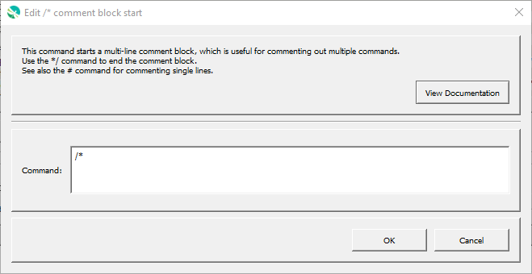

# GeoProcessor / Command / Comment Block Start `/*` #

* [Overview](#overview)
* [Command Editor](#command-editor)
* [Command Syntax](#command-syntax)
* [Examples](#examples)
* [Troubleshooting](#troubleshooting)
* [See Also](#see-also)

-------------------------

## Overview ##

Multiple-line comments start with `/*`.
Spaces and tabs at the start of the comment line are OK.
Additional text after the comment indicator is allowed.

## Command Editor ##

The following dialog is used to edit the command and illustrates the command syntax.

**<p style="text-align: center;">

</p>**

**<p style="text-align: center;">
Comment Block Start Command Editor (<a href="../CommentBlockStart.png">see full-size image</a>)
</p>**

## Command Syntax ##

The command syntax is as follows:

```text
ACommand(...)
AnotherCommand(...)
/*
ACommentedCommand(...)
AnotherCommentedCommand(...)
*/
```

The commands between `/*` and `*/` lines will be recognized as commands but will not be run.

## Examples ##

See the [automated tests](https://github.com/OpenWaterFoundation/owf-app-geoprocessor-python-test/tree/master/test/commands/CommentBlockStart).

## Troubleshooting ##

## See Also ##

* [Comment - `#`](../Comment/Comment.md) command
* [CommentBlockEnd - `*/`](../CommentBlockEnd/CommentBlockEnd.md) command
