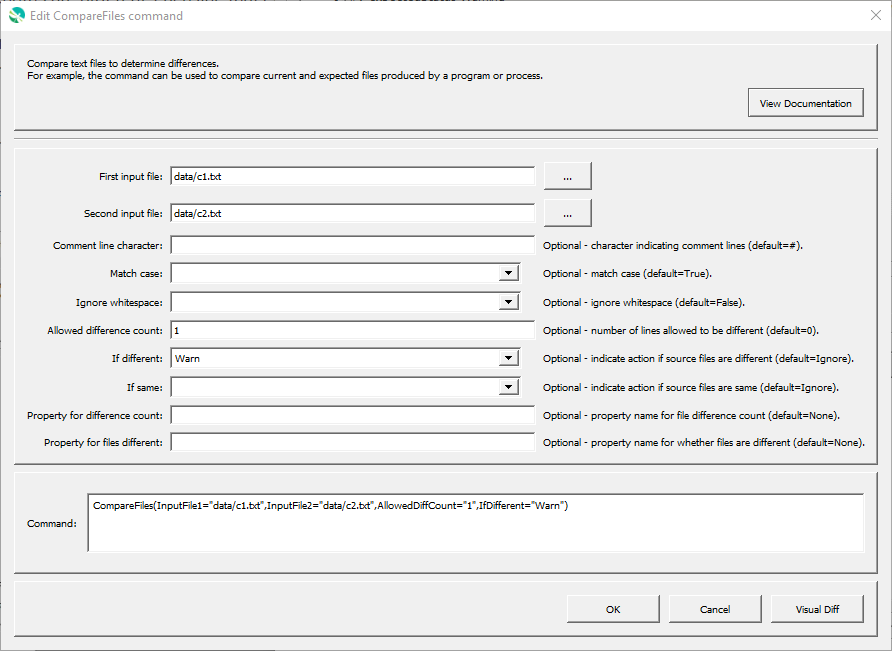

# GeoProcessor / Command / CompareFiles #

* [Overview](#overview)
* [Command Editor](#command-editor)
* [Command Syntax](#command-syntax)
* [Examples](#examples)
* [Troubleshooting](#troubleshooting)

-------------------------

## Overview ##

The `CompareFiles` command compares text files to determine differences. For example, the
command can be used to compare old and new files produced by a software process. This command is
suitable for comparing files that are similar, but is not suitable for comparing files that are very different,
although it may be enhanced in the future to provide more sophisticated comparison features.
Each line in the file is compared. By default, lines beginning with `#` are treated as comment lines and are
ignored (see `CommentLineChar` to specify the comment indicator). Therefore, only non-comment
lines are compared. Comment lines in the middle of the file are simply discarded. Differences and
simple statistics are printed to the log file. A warning can be generated if a difference is detected or if no
differences are detected.

## Command Editor ##

The following dialog is used to edit the command and illustrates the command syntax.



**<p style="text-align: center;">
`CompareFiles` Command Editor (<a href="../CompareFiles.png">see full-size image</a>)
</p>**

## Command Syntax ##

The command syntax is as follows:

```text
CompareFiles(Parameter="Value",...)
```
**<p style="text-align: center;">
Command Parameters
</p>**

| **Parameter**&nbsp;&nbsp;&nbsp;&nbsp;&nbsp;&nbsp;&nbsp;&nbsp;&nbsp;&nbsp;&nbsp;&nbsp;&nbsp;&nbsp;&nbsp;&nbsp;&nbsp; | **Description** | **Default**&nbsp;&nbsp;&nbsp;&nbsp;&nbsp;&nbsp;&nbsp;&nbsp;&nbsp;&nbsp; |
| --------------|-----------------|----------------- |
| `InputFile1` | The name of the first file to read for comparison.  Can be specified using `${Property}`. | None - must be specified. |
| `InputFile2` | The name of the second file to read for comparison.  Can be specified using `${Property}`. | None - must be specified. |
| `CommentLineChar` | The character(s) that if found at the start of a line indicate comment lines. Comment lines are ignored in the comparison because they typically may include information such as date/time that changes even if the remainder of the file contents is the same. | `#` |
| `MatchCase` | If `True`, lines must match exactly.  If `False`, case is ignored for the comparison. | `True` |
| `IgnoreWhitespace` | If `True`, then each line is trimmed to remove leading and trailing whitespace characters (spaces, tabs, etc.) before doing the comparison.  If `False`, then whitespace is retained for the comparison. | `False` |
| `AllowedDiffCount` | The number of lines allowed to be different, when checking for differences.  This is useful, for example, when a non-comment line contains the date/time when the file was generated, and other dynamic data. | `0` |
| `IfDifferent` | Indicate the action if the source files are different:  `Ignore` (ignore differences and do not warn), `Warn` (generate a warning message), `Fail` (generate a failure message) | `Ignore` |
| `IfSame` | Indicate the action if the source files are the same:  `Ignore` (ignore if same and do not warn), `Warn` (generate a warning message), `Fail` (generate a failure message) | `Ignore` |

## Examples ##

See the [automated tests](https://github.com/OpenWaterFoundation/owf-app-geoprocessor-python-test/tree/master/test/commands/CompareFiles).

## Troubleshooting ##
