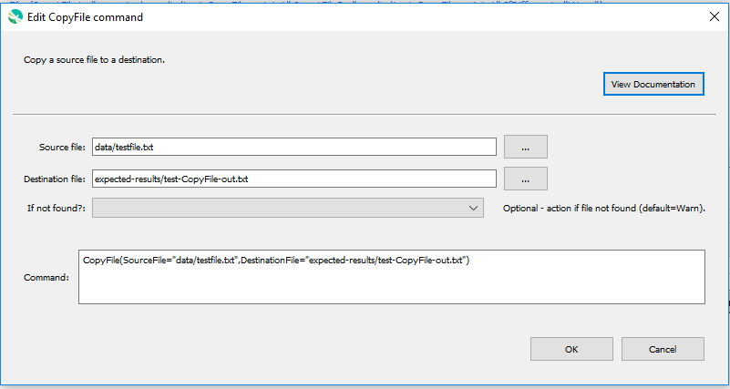

# GeoProcessor / Command / CopyFile #

*   [Overview](#overview)
*   [Command Editor](#command-editor)
*   [Command Syntax](#command-syntax)
*   [Examples](#examples)
*   [Troubleshooting](#troubleshooting)
*   [See Also](#see-also)

-------------------------

## Overview ##

The `CopyFile` command copies a source file to a destination.

## Command Editor ##

The following dialog is used to edit the command and illustrates the command syntax.

**<p style="text-align: center;">

</p>**

**<p style="text-align: center;">
`CopyFile` Command Editor (<a href="../CopyFile.png">see full-size image</a>)
</p>**

## Command Syntax ##

The command syntax is as follows:

```text
CopyFile(Parameter="Value",...)
```
**<p style="text-align: center;">
Command Parameters
</p>**

| **Parameter**&nbsp;&nbsp;&nbsp;&nbsp;&nbsp;&nbsp;&nbsp;&nbsp;&nbsp;&nbsp;&nbsp;&nbsp;&nbsp;&nbsp;&nbsp;&nbsp;&nbsp;&nbsp;&nbsp;&nbsp;&nbsp;&nbsp;&nbsp;&nbsp;&nbsp;&nbsp; | **Description** | **Default**&nbsp;&nbsp;&nbsp;&nbsp;&nbsp;&nbsp;&nbsp;&nbsp;&nbsp;&nbsp; |
| --------------|-----------------|----------------- |
| `SourceFile`<br>**required** | The name of the source file to delete.  Can be specified using `${Property}`. | None - must be specified. |
| `DestinationFile`<br>**required** | The name of the destination file.  Can be specified using `${Property}`. | None - must be specified. |
| `IfSourceFileNotFound` | Indicate an action if the source file is not found:  `Ignore` (ignore the missing file and do not warn), `Warn` (generate a warning message), `Fail` (generate a failure message) | `Warn` |

## Examples ##

See the [automated tests](https://github.com/OpenWaterFoundation/owf-app-geoprocessor-python-test/tree/main/test/commands/CopyFile).

## Troubleshooting ##

## See Also ##

*   [RemoveFile](../RemoveFile/RemoveFile.md) command
