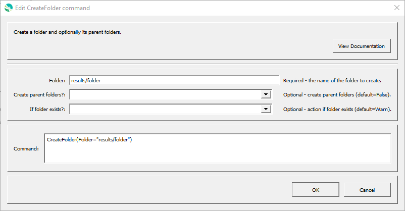

# GeoProcessor / Command / CreateFolder #

*   [Overview](#overview)
*   [Command Editor](#command-editor)
*   [Command Syntax](#command-syntax)
*   [Examples](#examples)
*   [Troubleshooting](#troubleshooting)
*   [See Also](#see-also)

-------------------------

## Overview ##

The `CreateFolder` command creates a folder.

## Command Editor ##

The following dialog is used to edit the command and illustrates the command syntax.

**<p style="text-align: center;">

</p>**

**<p style="text-align: center;">
`CreateFolder` Command Editor (<a href="../CreateFolder.png">see full-size image</a>)
</p>**

## Command Syntax ##

The command syntax is as follows:

```text
CreateFolder(Parameter="Value",...)
```

**<p style="text-align: center;">
Command Parameters
</p>**

| **Parameter**&nbsp;&nbsp;&nbsp;&nbsp;&nbsp;&nbsp;&nbsp;&nbsp;&nbsp;&nbsp;&nbsp;&nbsp;&nbsp;&nbsp;&nbsp;&nbsp;&nbsp;&nbsp;&nbsp;&nbsp;&nbsp;&nbsp;&nbsp;&nbsp;&nbsp;&nbsp; | **Description** | **Default**&nbsp;&nbsp;&nbsp;&nbsp;&nbsp;&nbsp;&nbsp;&nbsp;&nbsp;&nbsp; |
| --------------|-----------------|----------------- |
| `Folder`<br>**required** | Path to folder to create.  Can be specified using `${Property}`. | None - must be specified. |
| `CreateParentFolders` | Indicate whether to create parent folders:<ul><li>`False`</li><li>`True`</li></ul> | `False` |
| `IfFolderExists` | Indicate an action if the folder exists:<ul><li>`Ignore` - ignore the existing folder and do not warn</li><li>`Warn` - generate a warning message</li><li>`Fail` - generate a failure message</li><ul> | `Warn` |

## Examples ##

See the [automated tests](https://github.com/OpenWaterFoundation/owf-app-geoprocessor-python-test/tree/main/test/commands/CreateFolder).

## Troubleshooting ##

## See Also ##

*   [CopyFile](../CopyFile/CopyFile.md) command
*   [RemoveFile](../RemoveFile/RemoveFile.md) command
