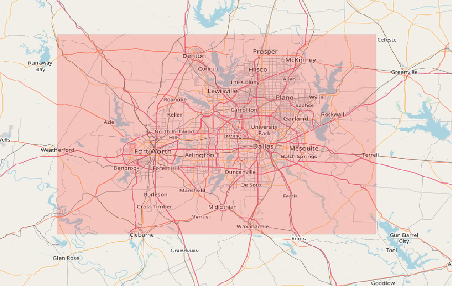

# Learn GeoProcessor / Command / CreateGeoLayer #

* [Overview](#overview)
* [Command Editor](#command-editor)
* [Command Syntax](#command-syntax)
* [Examples](#examples)
* [Troubleshooting](#troubleshooting)
* [See Also](#see-also)

-------------------------

## Overview ##

The `CreateGeoLayer` creates a new GeoLayer. 

* This command is used to create a new GeoLayer on the fly. For example, a bounding box can be created from coordinates. The new GeoLayer can then be used to clip another GeoLayer to the desired bounding box.
* The feature geometry is specified. 
	* Can create single-feature or multi-feature layers. 
	* Can create `POINT`, `LINE` or `POLYGON` geometry types. 
	* Can use [`Well-Known Text`](https://en.wikipedia.org/wiki/Well-known_text), [`Well-Known Binary`](https://en.wikipedia.org/wiki/Well-known_text#Well-known_binary) or [`Bounding Box coordinates`](https://wiki.openstreetmap.org/wiki/Bounding_Box) to specify the geometry coordinates. 
* The [coordinate reference system](https://en.wikipedia.org/wiki/Spatial_reference_system) is specified.

## Command Editor ##

The following dialog is used to edit the command and illustrates the command syntax.

**Need to implement UI.**

## Command Syntax ##

The command syntax is as follows:

```text
CreateGeoLayer(Parameter="Value",...)
```
**<p style="text-align: center;">
Command Parameters
</p>**

| **Parameter**&nbsp;&nbsp;&nbsp;&nbsp;&nbsp;&nbsp;&nbsp;&nbsp;&nbsp;&nbsp;&nbsp;&nbsp;&nbsp;&nbsp;&nbsp;&nbsp;&nbsp;&nbsp;&nbsp;&nbsp;&nbsp;&nbsp;&nbsp;&nbsp;&nbsp;&nbsp; | **Description** | **Default**&nbsp;&nbsp;&nbsp;&nbsp;&nbsp;&nbsp;&nbsp;&nbsp;&nbsp;&nbsp;&nbsp;&nbsp;&nbsp;&nbsp;&nbsp;&nbsp;&nbsp;&nbsp; |
| --------------|-----------------|----------------- |
| `GeoLayerID` <br> **_required_** | The ID of the new GeoLayer. | None - must be specified. |
| `GeometryFormat` <br> **_required_** |The format of the `GeometryInput`. Choose from one of the options below. <br><br> `WKT`: [Well-Known Text](https://en.wikipedia.org/wiki/Well-known_text) is text representing vector geometry. <br><br> `WKB`:[Well-Known Binary](https://en.wikipedia.org/wiki/Well-known_text#Well-known_binary) is hexadecimal text representing vector geometry. <br><br> `BoundingBox`: [Bounding Box Coordinates](https://wiki.openstreetmap.org/wiki/Bounding_Box) are a list of 4 coordinates representing the maximum and minimum latitude and longitude of a `POLYGON` vector.| None - must be specified. |
| `GeometryInput` <br> **_required_** |The geometry data for the new GeoLayer. <br><br> The units are the same as the units of the coordinate reference system (`CRS`).  <br> <br>  If `GeometryFormat` is `WKT`...<br> use the syntax provided in the [reference](https://en.wikipedia.org/wiki/Well-known_text#Well-known_binary).  <br><br> If `GeometryFormat` is `WKB`...<br> use the syntax provided in the [reference](https://en.wikipedia.org/wiki/Well-known_text#Well-known_binary). <br><br> If `GeometryFormat` is `BoundingBox`... <br> specify the coordinates in the following order. <br> &nbsp;&nbsp;&nbsp;&nbsp;the left bound (minimum longitude) <br> &nbsp;&nbsp;&nbsp;&nbsp;the bottom bound (minimum latitude) <br> &nbsp;&nbsp;&nbsp;&nbsp;the right bound (maximum longitude) <br> &nbsp;&nbsp;&nbsp;&nbsp;the top (maximum latitude) bound <br> Separate each coordinate with a comma.| None - must be specified. |
|`CRS` <br> **_required_** | The [coordinate reference system](https://en.wikipedia.org/wiki/Spatial_reference_system) of the new GeoLayer. [EPSG or ESRI code format](http://spatialreference.org/ref/epsg/) required (e.g. [`EPSG:4326`](http://spatialreference.org/ref/epsg/4326/), [`EPSG:26913`](http://spatialreference.org/ref/epsg/nad83-utm-zone-13n/), [`ESRI:102003`](http://spatialreference.org/ref/esri/usa-contiguous-albers-equal-area-conic/)). |None - must be specified. |
|`IfGeoLayerIDExists`<br> *optional*|The action that occurs if the `GeoLayerID` already exists within the GeoProcessor. <br><br> `Replace` : The existing GeoLayer within the GeoProcessor is overwritten with the new GeoLayer. No warning is logged.<br><br> `ReplaceAndWarn`: The existing GeoLayer within the GeoProcessor is overwritten with the new GeoLayer. A warning is logged. <br><br> `Warn` : The new GeoLayer is not created. A warning is logged. <br><br> `Fail` : The new GeoLayer is not created. A fail message is logged. | `Replace` | 


## Examples ##

See the [automated tests](https://github.com/OpenWaterFoundation/owf-app-geoprocessor-python-test/tree/master/test/commands/CreateGeoLayer).


### Example 1: Create a Bounding Box GeoLayer - WGS84 ###

```
CreateGeoLayer(GeoLayerID="BoundingBoxExample", GeometryFormat="BoundingBox", GeometryInput = "-97.8, 32.35, -96.25, 33.32", CRS="EPSG:4326")
```

After running the command, the following GeoLayer is registered within the GeoProcessor.


|GeoLayer ID| CRS | Geometry Type | Units|
|- | - | - | - |
|BoundingBoxExample|WGS84 EPSG:4326|`POLYGON`|Decimal Degrees|

|BoundingBoxExample: displayed in red (transparent)|
|-|
|

### Example 2: Create a Bounding Box GeoLayer - NAD83 Zone 14N ###

```
CreateGeoLayer(GeoLayerID="BoundingBoxExample", GeometryFormat="BoundingBox", GeometryInput = "3573598.19, 630371.46, 3690139.42, 756001.46", CRS=" EPSG:26914")
```

After running the command, the following GeoLayer is registered within the GeoProcessor.


|GeoLayer ID| CRS | Geometry Type | Units |
|- | - | - | -|
|BoundingBoxExample|NAD83 UTM Zone 14N EPSG:26914|`POLYGON`|Meters|

|BoundingBoxExample: displayed in red (transparent)|
|-|
|


## Troubleshooting ##


## See Also ##
