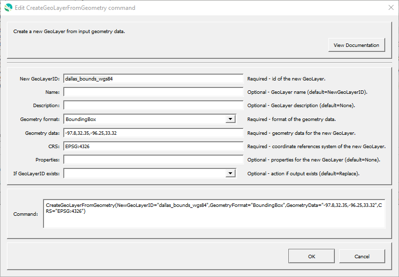

# GeoProcessor / Command / CreateGeoLayerFromGeometry #

* [Overview](#overview)
* [Command Editor](#command-editor)
* [Command Syntax](#command-syntax)
* [Examples](#examples)
* [Troubleshooting](#troubleshooting)
* [See Also](#see-also)

-------------------------

## Overview ##

The `CreateGeoLayerFromGeometry` creates a new GeoLayer from input geometry data. 

* This command is used to create a new GeoLayer on the fly.
For example, a bounding box can be created from coordinates.
The new GeoLayer can then be used to clip another GeoLayer to the desired bounding box.
* The feature geometry is specified. 
	+ Can create a layer with one or more features.  
	+ Can create `POINT`, `LINE` or `POLYGON` geometry types. 
	+ Can use [`Well-Known Text`](https://en.wikipedia.org/wiki/Well-known_text),
	[`Well-Known Binary`](https://en.wikipedia.org/wiki/Well-known_text#Well-known_binary) or
	[`Bounding Box coordinates`](https://wiki.openstreetmap.org/wiki/Bounding_Box) to specify the geometry coordinates. 
* The [coordinate reference system](https://en.wikipedia.org/wiki/Spatial_reference_system) is specified.

## Command Editor ##

The following dialog is used to edit the command and illustrates the command syntax.

**<p style="text-align: center;">

</p>**

**<p style="text-align: center;">
`CreateGeoLayerFromGeometry` Command Editor (<a href="../CreateGeoLayerFromGeometry.png">see full-size image</a>)
</p>**

## Command Syntax ##

The command syntax is as follows:

```text
CreateGeoLayerFromGeometry(Parameter="Value",...)
```
**<p style="text-align: center;">
Command Parameters
</p>**

| **Parameter**&nbsp;&nbsp;&nbsp;&nbsp;&nbsp;&nbsp;&nbsp;&nbsp;&nbsp;&nbsp;&nbsp;&nbsp;&nbsp;&nbsp;&nbsp;&nbsp;&nbsp;&nbsp;&nbsp;&nbsp;&nbsp;&nbsp;&nbsp;&nbsp;&nbsp;&nbsp; | **Description** | **Default**&nbsp;&nbsp;&nbsp;&nbsp;&nbsp;&nbsp;&nbsp;&nbsp;&nbsp;&nbsp;&nbsp;&nbsp;&nbsp;&nbsp;&nbsp;&nbsp;&nbsp;&nbsp; |
| --------------|-----------------|----------------- |
| `NewGeoLayerID`<br>**required** | The ID of the new GeoLayer. | None - must be specified. |
| `Name` | Name of the output GeoLayer. | `NewGeoLayerID` |
| `Description` | Description for the output GeoLayer. | |
| `GeometryFormat`<br>**required** | The format of the `GeometryData`. Choose from one of the options below:<ul><li>`WKT` - [Well-Known Text](https://en.wikipedia.org/wiki/Well-known_text) is text representing vector geometry.</li><li>`BoundingBox`- [Bounding Box Coordinates](https://wiki.openstreetmap.org/wiki/Bounding_Box) are a list of 4 coordinates representing the minimum and maximum latitude and longitude of a `POLYGON` vector.</li><li>`WKB` - [Well-Known Binary](https://en.wikipedia.org/wiki/Well-known_text#Well-known_binary) is hexadecimal text representing vector geometry.</li></ul> | None - must be specified. |
| `GeometryData`<br>**required** | The geometry data for the new GeoLayer. The units are the same as the units of the coordinate reference system (`CRS`).<ul><li>`GeometryFormat` is `WKT`, use the syntax provided in the [reference](https://en.wikipedia.org/wiki/Well-known_text#Well-known_binary).</li><li>If `GeometryFormat` is `BoundingBox`, specify the coordinates as comma-separated values in the following order:<ul><li>the left bound (minimum longitude)</li><li>the bottom bound (minimum latitude)</li><li>the right bound (maximum longitude)</li><li>the top (maximum latitude) bound</li></ul></li>If `GeometryFormat` is `WKB`, use the syntax provided in the [reference](https://en.wikipedia.org/wiki/Well-known_text#Well-known_binary).</li></ul>| None - must be specified.  |
| `CRS` <br> **required** | The [coordinate reference system](https://en.wikipedia.org/wiki/Spatial_reference_system) of the new GeoLayer. [EPSG or ESRI code format](http://spatialreference.org/ref/epsg/) required (e.g. [`EPSG:4326`](http://spatialreference.org/ref/epsg/4326/), [`EPSG:26913`](http://spatialreference.org/ref/epsg/nad83-utm-zone-13n/), [`ESRI:102003`](http://spatialreference.org/ref/esri/usa-contiguous-albers-equal-area-conic/)). |None - must be specified. |
| `Properties` | Additional properties to assign to the GeoLayer, using format: `prop1:value1,prop2:'string with space'`.  Can use `${Property}` notation.  | No additional properties are assigned. |
| `IfGeoLayerIDExists` | The action that occurs if the `NewGeoLayerID` already exists within the GeoProcessor:<ul><li>`Replace` - The existing GeoLayer within the GeoProcessor is replaced with the new GeoLayer. No warning is logged.</li><li>`ReplaceAndWarn` - The existing GeoLayer within the GeoProcessor is replaced with the new GeoLayer. A warning is logged.</li><li>`Warn` - The new GeoLayer is not created. A warning is logged.</li><li>`Fail` - The new GeoLayer is not created. A fail message is logged.</li></ul> | `Replace` | 

## Examples ##

See the [automated tests](https://github.com/OpenWaterFoundation/owf-app-geoprocessor-python-test/tree/master/test/commands/CreateGeoLayerFromGeometry).

### Example 1: Create a Bounding Box GeoLayer - WGS84 ###

```
CreateGeoLayerFromGeometry(NewGeoLayerID="BoundingBoxExample", GeometryFormat="BoundingBox", GeometryData = "-97.8, 32.35, -96.25, 33.32", CRS="EPSG:4326")
```

After running the command, the following GeoLayer is registered within the GeoProcessor.

|GeoLayer ID| CRS | Geometry Type |Geometry Units|
|- | - | - | - |
|BoundingBoxExample|WGS84 EPSG:4326|`POLYGON`|Decimal Degrees|

|BoundingBoxExample: displayed in red (transparent)|
|-|
|

### Example 2: Create a Bounding Box GeoLayer - NAD83 Zone 14N ###

```
CreateGeoLayerFromGeometry(NewGeoLayerID="BoundingBoxExample",GeometryFormat="BoundingBox",GeometryData = "611903, 3580541, 757772, 3688789", CRS="EPSG:26914")
```

After running the command, the following GeoLayer is registered within the GeoProcessor.

|GeoLayer ID| CRS | Geometry Type |Geometry Units |
|- | - | - | -|
|BoundingBoxExample|NAD83 UTM Zone 14N EPSG:26914|`POLYGON`|Meters|

|BoundingBoxExample: displayed in red (transparent)|
|-|
|

## Troubleshooting ##

## See Also ##

* [`ChangeGeoLayerGeometry`](../ChangeGeoLayerGeometry/ChangeGeoLayerGeometry.md)
