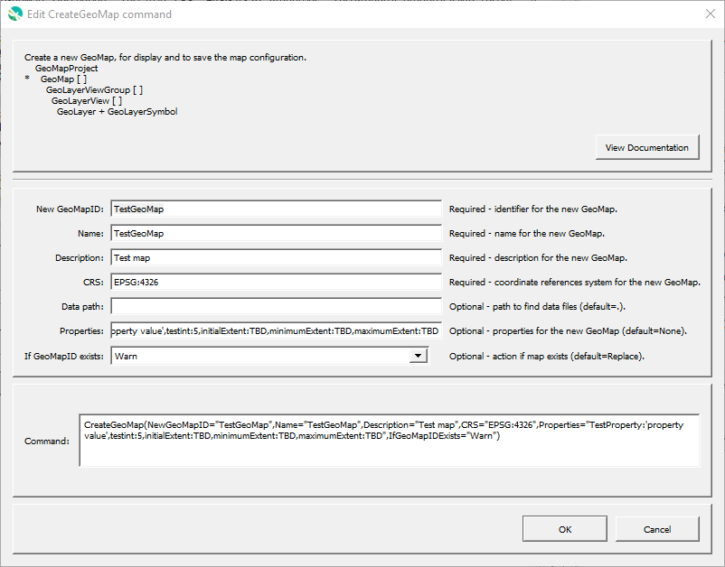

# GeoProcessor / Command / CreateGeoMap #

* [Overview](#overview)
* [Command Editor](#command-editor)
* [Command Syntax](#command-syntax)
* [Examples](#examples)
* [Troubleshooting](#troubleshooting)
* [See Also](#see-also)

-------------------------

## Overview ##

The `CreateGeoMap` command creates a new GeoMap, which represents a map containing groups of layers.
One or more GeoMaps can be included in a GeoMapProject, which is a general map specification,
and can be saved as a file to describe a map configuration.
See the [GeoMapProject](../../appendix-geomapproject/geomapproject.md) documentation for background and file format specification.

A GeoMap is typically created by calling the following commands in sequence:

* Create a GeoMap:
	+ `CreateGeoMap` - this command
* Add layer views groups with lists of layers, used to group layers in map legend:
	+ [`AddGeoLayerViewGroupToGeoMap`](../AddGeoLayerViewGroupToGeoMap/AddGeoLayerViewGroupToGeoMap.md) - adds a group
	+ [`AddGeoLayerViewToGeoMap`](../AddGeoLayerViewToGeoMap/AddGeoLayerViewToGeoMap.md) - adds a layer to map and group
	+ Configure the symbol for each layer, using appropriate command:
		- [`SetGeoLayerViewCategorizedSymbol`](../SetGeoLayerViewCategorizedSymbol/SetGeoLayerViewCategorizedSymbol.md) - categorized symbol
		- [`SetGeoLayerViewGraduatedSymbol`](../SetGeoLayerViewGraduatedSymbol/SetGeoLayerViewGraduatedSymbol.md) - graduate symbol
		- [`SetGeoLayerViewSingleSymbol`](../SetGeoLayerViewSingleSymbol/SetGeoLayerViewSingleSymbol.md) - single symbol
* Create a GeoMapProject and add GeoMap(s) to it:
	+ [`CreateGeoMapProject`](../CreateGeoMapProject/CreateGeoMapProject.md) - create a GeoMapProject
	* [`AddGeoMapToGeoMapProject`](../AddGeoMapToGeoMapProject/AddGeoMapToGeoMapProject.md) - add a GeoMap to a GeoMapProject
	* [`WriteGeoMapProjectToJSON`](../WriteGeoMapProjectToJSON/WriteGeoMapProjectToJSON.md) - save project for use with web application, etc.

## Command Editor ##

The following dialog is used to edit the command and illustrates the command syntax.

**<p style="text-align: center;">

</p>**

**<p style="text-align: center;">
`CreateGeoMap` Command Editor (<a href="../CreateGeoMap.png">see full-size image</a>)
</p>**

## Command Syntax ##

The command syntax is as follows:

```text
CreateGeoMap(Parameter="Value",...)
```
**<p style="text-align: center;">
Command Parameters
</p>**

| **Parameter**&nbsp;&nbsp;&nbsp;&nbsp;&nbsp;&nbsp;&nbsp;&nbsp;&nbsp;&nbsp;&nbsp;&nbsp;&nbsp;&nbsp;&nbsp;&nbsp;&nbsp;&nbsp;&nbsp;&nbsp;&nbsp;&nbsp;&nbsp;&nbsp;&nbsp;&nbsp; | **Description** | **Default**&nbsp;&nbsp;&nbsp;&nbsp;&nbsp;&nbsp;&nbsp;&nbsp;&nbsp;&nbsp;&nbsp;&nbsp;&nbsp;&nbsp;&nbsp;&nbsp;&nbsp;&nbsp; |
| --------------|-----------------|----------------- |
| `NewGeoMapID` <br> **required** | The ID of the new GeoMap. | None - must be specified. |
| `Name` | Name of the new GeoMap. | None - must be specified. |
| `Description` | Description for the new GeoMap. | None - must be specified. |
|`CRS` <br> **required** | The [coordinate reference system](https://en.wikipedia.org/wiki/Spatial_reference_system) of the new GeoMap. [EPSG or ESRI code format](http://spatialreference.org/ref/epsg/) required (e.g. [`EPSG:4326`](http://spatialreference.org/ref/epsg/4326/), [`EPSG:26913`](http://spatialreference.org/ref/epsg/nad83-utm-zone-13n/), [`ESRI:102003`](http://spatialreference.org/ref/esri/usa-contiguous-albers-equal-area-conic/)). |None - must be specified. |
| `DataPath` | A comma-separated list of file system or URL folders containing data for layers.  The folders should be relative to the location of the GeoMapProject file. | `.` |
|`IfGeoMapIDExists`|The action that occurs if the `NewGeoMapID` already exists within the GeoProcessor:<ul><li>`Replace` - The existing GeoMap within the GeoProcessor is replaced with the new GeoMap. No warning is logged.</li><li>`ReplaceAndWarn` - The existing GeoMap within the GeoProcessor is replaced with the new GeoMap. A warning is logged.</li><li>`Warn` - The new GeoMap is not created. A warning is logged.</li><li>`Fail` - The new GeoMap is not created. A fail message is logged.</li></ul> | `Replace` | 

## Examples ##

See the [automated tests](https://github.com/OpenWaterFoundation/owf-app-geoprocessor-python-test/tree/master/test/commands/CreateGeoMap).

## Troubleshooting ##

## See Also ##

* [`AddGeoLayerViewToGeoMap`](../AddGeoLayerViewToGeoMap/AddGeoLayerViewToGeoMap.md) command
* [`AddGeoLayerViewGroupToGeoMap`](../AddGeoLayerViewGroupToGeoMap/AddGeoLayerViewGroupToGeoMap.md) command
* [`AddGeoMapToGeoMapProject`](../AddGeoMapToGeoMapProject/AddGeoMapToGeoMapProject.md) command
* [`CreateGeoMapProject`](../CreateGeoMapProject/CreateGeoMapProject.md) command
* [`SetGeoLayerViewCategorizedSymbol`](../SetGeoLayerViewCategorizedSymbol/SetGeoLayerViewCategorizedSymbol.md) command
* [`SetGeoLayerViewGraduatedSymbol`](../SetGeoLayerViewGraduatedSymbol/SetGeoLayerViewGraduatedSymbol.md) command
* [`SetGeoLayerViewSingleSymbol`](../SetGeoLayerViewSingleSymbol/SetGeoLayerViewSingleSymbol.md) command
* [`WriteGeoMapProjectToJSON`](../WriteGeoMapProjectToJSON/WriteGeoMapProjectToJSON.md) command
