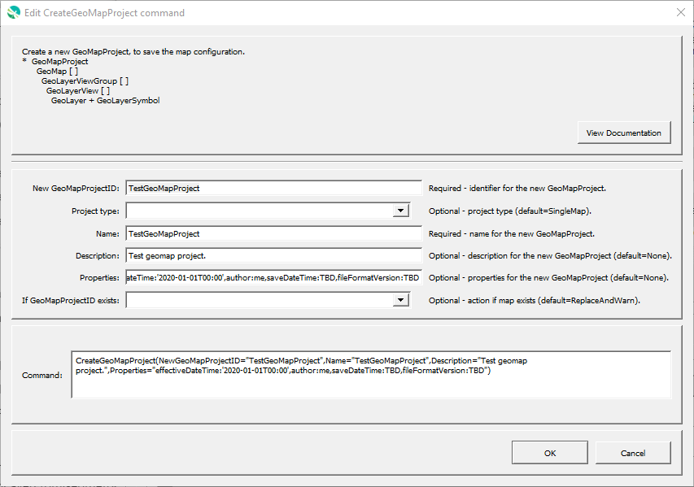

# GeoProcessor / Command / CreateGeoMapProject #

* [Overview](#overview)
* [Command Editor](#command-editor)
* [Command Syntax](#command-syntax)
* [Examples](#examples)
* [Troubleshooting](#troubleshooting)
* [See Also](#see-also)

-------------------------

## Overview ##

The `CreateGeoMapProject` command creates a new GeoMapProject, which contains one or more maps, with each map containing groups of layers.
A GeoMapProject is a general map specification,
and can be saved as a file to describe a map configuration.

* See the [CreateGeoMap](../CreateGeoMap/CreateGeoMap.md) command documentation for guidance on creating maps
* See the [GeoMapProject](../../appendix-geomapproject/geomapproject.md) documentation for background and file format specification.

## Command Editor ##

The following dialog is used to edit the command and illustrates the command syntax.

**<p style="text-align: center;">

</p>**

**<p style="text-align: center;">
`CreateGeoMapProject` Command Editor (<a href="../CreateGeoMapProject.png">see full-size image</a>)
</p>**

## Command Syntax ##

The command syntax is as follows:

```text
CreateGeoMapProject(Parameter="Value",...)
```
**<p style="text-align: center;">
Command Parameters
</p>**

| **Parameter**&nbsp;&nbsp;&nbsp;&nbsp;&nbsp;&nbsp;&nbsp;&nbsp;&nbsp;&nbsp;&nbsp;&nbsp;&nbsp;&nbsp;&nbsp;&nbsp;&nbsp;&nbsp;&nbsp;&nbsp;&nbsp;&nbsp;&nbsp;&nbsp;&nbsp;&nbsp;&nbsp;&nbsp;&nbsp;&nbsp;&nbsp;&nbsp; | **Description** | **Default**&nbsp;&nbsp;&nbsp;&nbsp;&nbsp;&nbsp;&nbsp;&nbsp;&nbsp;&nbsp;&nbsp;&nbsp;&nbsp;&nbsp;&nbsp;&nbsp;&nbsp;&nbsp; |
| --------------|-----------------|----------------- |
| `NewGeoMapProjectID` <br> **required** | The ID of the new GeoMapProject. | None - must be specified. |
| `Name` | Name of the new GeoMapProject. | None - must be specified. |
| `Description` | Description for the new GeoMapProject. | None - must be specified. |
| `Properties` | Properties for the GeoMapProject using syntax `Property1:Value1,Property2,'Value 2'`.  Single quotes are used around values when the value contains special characters such as comma and spaces.  See the [GeoMapProject](../../appendix-geomapproject/geomapproject.md) documentation a list of properties. |  |
| `IfGeoMapProjectIDExists` |The action that occurs if the `NewGeoMapProjectID` already exists within the GeoProcessor:<ul><li>`Replace` - The existing GeoMapProject within the GeoProcessor is replaced with the new GeoMapProject. No warning is logged.</li><li>`ReplaceAndWarn` - The existing GeoMapProject within the GeoProcessor is replaced with the new GeoMapProject. A warning is logged.</li><li>`Warn` - The new GeoMapProject is not created. A warning is logged.</li><li>`Fail` - The new GeoMapProject is not created. A fail message is logged.</li></ul> | `Replace` | 

## Examples ##

See the [automated tests](https://github.com/OpenWaterFoundation/owf-app-geoprocessor-python-test/tree/master/test/commands/CreateGeoMapProject).

## Troubleshooting ##

## See Also ##

* [`AddGeoLayerViewToGeoMap`](../AddGeoLayerViewToGeoMap/AddGeoLayerViewToGeoMap.md) command
* [`AddGeoLayerViewGroupToGeoMap`](../AddGeoLayerViewGroupToGeoMap/AddGeoLayerViewGroupToGeoMap.md) command
* [`AddGeoMapToGeoMapProject`](../AddGeoMapToGeoMapProject/AddGeoMapToGeoMapProject.md) command
* [`CreateGeoMap`](../CreateGeoMap/CreateGeoMap.md) command
* [`SetGeoLayerViewCategorizedSymbol`](../SetGeoLayerViewCategorizedSymbol/SetGeoLayerViewCategorizedSymbol.md) command
* [`SetGeoLayerViewGraduatedSymbol`](../SetGeoLayerViewGraduatedSymbol/SetGeoLayerViewGraduatedSymbol.md) command
* [`SetGeoLayerViewSingleSymbol`](../SetGeoLayerViewSingleSymbol/SetGeoLayerViewSingleSymbol.md) command
* [`WriteGeoMapProjectToJSON`](../WriteGeoMapProjectToJSON/WriteGeoMapProjectToJSON.md) command
