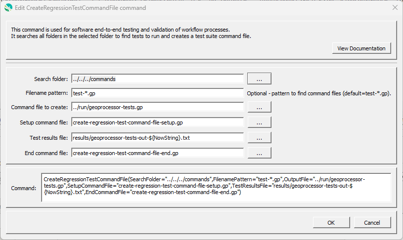

# GeoProcessor / Command / CreateRegressionTestCommandFile #

*   [Overview](#overview)
*   [Command Editor](#command-editor)
*   [Command Syntax](#command-syntax)
*   [Examples](#examples)
*   [Troubleshooting](#troubleshooting)
*   [See Also](#see-also)

-------------------------

## Overview ##

The `CreateRegressionTestCommandFile` command is used for software testing and validation of workflow processes.
The command creates a command file that includes a
[`StartRegressionTestResultsReport`](../StartRegressionTestResultsReport/StartRegressionTestResultsReport.md) and multiple
[`RunCommands`](../RunCommands/RunCommands.md) commands.
A starting search folder is provided and all files that match the given pattern (by convention `test-*.gp`)
are assumed to be command files that can be run to test the software.

The resulting command file (see the `OutputFile` parameter) is a test suite comprised of all the individual tests and can be used
to verify software before release.
The goal is to have all tests pass before software is released and not retain broken tests in the test repository.

The following table lists tags (annotations) that can be placed in `#` comments in command files to provide information for testing, for example:

**<p style="text-align: center;">
Property File Formats
</p>**

| **Comment Tag**&nbsp;&nbsp;&nbsp;&nbsp;&nbsp;&nbsp;&nbsp;&nbsp;&nbsp;&nbsp;&nbsp;&nbsp;&nbsp;&nbsp;&nbsp;&nbsp;&nbsp;&nbsp;&nbsp;&nbsp;&nbsp;&nbsp;&nbsp;&nbsp;&nbsp;&nbsp;&nbsp;&nbsp;&nbsp;&nbsp;&nbsp;&nbsp;&nbsp;&nbsp;&nbsp;&nbsp;&nbsp;&nbsp;&nbsp;&nbsp;&nbsp;&nbsp;&nbsp;&nbsp;&nbsp;&nbsp;&nbsp;&nbsp;&nbsp; | **Description** |
|-----------------------|-----------------|
| `#@enabled False`           | The `RunCommands` command will by default run the command file that is provided.  However, if the `@enabled False` tag is specified in a comment in the command file, `RunCommands` will skip the command file.  This is useful to disable a test that needs additional work. |
| `#@expectedStatus Failure`<br>`#@expectedStatus Warning`       | The `RunCommands` command `ExpectedStatus` parameter is by default `Success`.  However, a different status can be specified if it is expected that a command file will result in Warning or Failure and still be a successful test.  For example, if a command is obsolete and should generate a failure, the expected status can be specified as `Failure` and the test will pass.  Another example is to test that the software properly treats a missing file as a failure. |

## Command Editor ##

The following dialog is used to edit the command and illustrates the command syntax.

**<p style="text-align: center;">

</p>**

**<p style="text-align: center;">
`CreateRegressionTestCommandFile` Command Editor (<a href="../CreateRegressionTestCommandFile.png">see full-size image</a>)
</p>**

## Command Syntax ##

The command syntax is as follows:

```text
CreateRegressionTestCommandFile(Parameter="Value",...)
```
**<p style="text-align: center;">
Command Parameters
</p>**

| **Parameter**&nbsp;&nbsp;&nbsp;&nbsp;&nbsp;&nbsp;&nbsp;&nbsp;&nbsp;&nbsp;&nbsp;&nbsp;&nbsp;&nbsp;&nbsp;&nbsp;&nbsp;&nbsp;&nbsp;&nbsp;&nbsp;&nbsp;&nbsp;&nbsp;&nbsp;&nbsp; | **Description** | **Default**&nbsp;&nbsp;&nbsp;&nbsp;&nbsp;&nbsp;&nbsp;&nbsp;&nbsp;&nbsp; |
| --------------|-----------------|----------------- |
| `SearchFolder`<br>**required** | The folder to search for regression test command files.  All subfolders will also be searched.  Can use `${Property}`. | None - must be specified. |
| `FilenamePattern` | Pattern to find GeoProcessor command files, using `*` wildcards. | `test-*.gp` |
| `OutputFile`<br>**required** | The command file to write, which will contain [`RunCommands`](../RunCommands/RunCommands.md) commands for each test to run, and other supporting setup and end commands.  Can use `${Property}`. | None - must be specified. |
| `SetupCommandFile` | A command file to insert into the front of the `OutputFile` to set up the tests. | |
| `TestResultsFile`<br> | The name of the file to create containing test results. A relative path to the folder for `OutputFile` should be specified. The file will be used for the [`StartRegresionTestResultsReport(OutputFile=...)`](../StartRegressionTestResultsReport/StartRegressionTestResultsReport.md) command that is inserted in the command file that is created. A file with `nonum` in the name will also be created with spaces in the command test column, which allows comparison of results files to identify changes. | No output is created. |
| `EndCommandFile` | An command file to insert at the end of the `OutputFile` to control output of test results. | |

## Examples ##

*   See the [GeoProcessor test suites](https://github.com/OpenWaterFoundation/owf-app-geoprocessor-python-test/tree/main/test/suites/).

## Troubleshooting ##

## See Also ##

*   [`RunCommands`](../RunCommands/RunCommands.md) command
*   [`StartRegressionTestResultsReport`](../StartRegressionTestResultsReport/StartRegressionTestResultsReport.md) command
*   [`WriteCommandSummaryToFile`](../WriteCommandSummaryToFile/WriteCommandSummaryToFile.md) command
