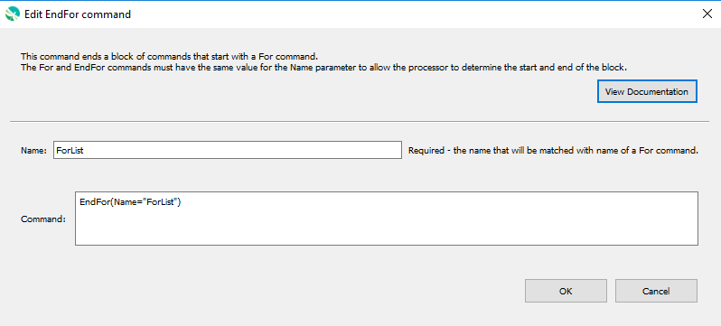

# GeoProcessor / Command / EndFor #

* [Overview](#overview)
* [Command Editor](#command-editor)
* [Command Syntax](#command-syntax)
* [Examples](#examples)
* [Troubleshooting](#troubleshooting)
* [See Also](#see-also)

-------------------------

## Overview ##

The `EndFor` command ends a block of commands that start with a `For` command. The `For`
and `EndFor` commands must have the same value for the `Name` parameter to allow the processor to
determine the start and end of the block.

## Command Editor ##

The following dialog is used to edit the command and illustrates the command syntax.



**<p style="text-align: center;">
`EndFor` Command Editor (<a href="../EndFor.png">see full-size image</a>)
</p>**

## Command Syntax ##

The command syntax is as follows:

```text
EndFor(Parameter="Value",...)
```
**<p style="text-align: center;">
Command Parameters
</p>**

| **Parameter**&nbsp;&nbsp;&nbsp;&nbsp;&nbsp;&nbsp;&nbsp;&nbsp;&nbsp;&nbsp;&nbsp;&nbsp;&nbsp;&nbsp;&nbsp;&nbsp;&nbsp;&nbsp;&nbsp;&nbsp;&nbsp; | **Description** | **Default**&nbsp;&nbsp;&nbsp;&nbsp;&nbsp;&nbsp;&nbsp;&nbsp;&nbsp;&nbsp;&nbsp;&nbsp;&nbsp;&nbsp;&nbsp;&nbsp;&nbsp; |
| --------------|-----------------|----------------- |
| `Name` | The name that will be matched with the name of an `For` command to indicate the block of commands in the loop. | None - must be specified. |


## Examples ##

See the [automated tests](https://github.com/OpenWaterFoundation/owf-app-geoprocessor-python-test/tree/master/test/commands/EndFor).

## Troubleshooting ##

## See Also ##

* [For](../For/For.md) command
