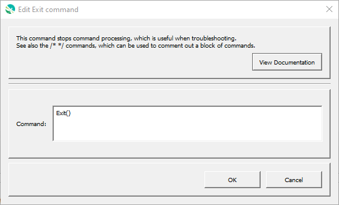

# GeoProcessor / Command / Exit #

* [Overview](#overview)
* [Command Editor](#command-editor)
* [Command Syntax](#command-syntax)
* [Examples](#examples)
* [Troubleshooting](#troubleshooting)
* [See Also](#see-also)

-------------------------

## Overview ##

The `Exit` command can be inserted anywhere in a command file and causes the processing of commands to stop at that line.
An `Exit` command within an
[`If`](../If/If.md) command block will only be executed if the `If` condition is true.
This is useful for temporarily processing a subset of a long list of commands.
Multi-line 
([`/*`](../CommentBlockStart/CommentBlockStart.md) and
[`*/`](../CommentBlockEnd/CommentBlockEnd.md))
comments can also be used to temporarily disable one or more commands.
It may also useful to add an `Exit` command at the end of the file so that it is easy to insert commands above this
command when the end line is selected (rather than having to deselect all commands when editing).

In the future the command may be enhanced to have parameters that more explicitly control processing shut-down.

Note that the GeoProcessor progress bar will stop short of 100%, indicating that only a subset of commands has been run.

## Command Editor ##

The following dialog is used to edit the command and illustrates the command syntax.

**<p style="text-align: center;">

</p>**

**<p style="text-align: center;">
`Exit` Command Editor (<a href="../Exit.png">see full-size image</a>)
</p>**

## Command Syntax ##

The command syntax is as follows:

```text
Exit()
```
**<p style="text-align: center;">
Command Parameters
</p>**

| **Parameter** | **Description** | **Default** |
| --------------|-----------------|----------------- |
| | There are currently no command parameters. | |

## Examples ##

See the [automated tests](https://github.com/OpenWaterFoundation/owf-app-geoprocessor-python-test/tree/master/test/commands/Exit).

## Troubleshooting ##

## See Also ##

* [CommentBlockStart - `/*`](../CommentBlockStart/CommentBlockStart.md) command
* [CommentBlockEnd - `*/`](../CommentBlockEnd/CommentBlockEnd.md) command
* [`If`](../If/If.md) command

