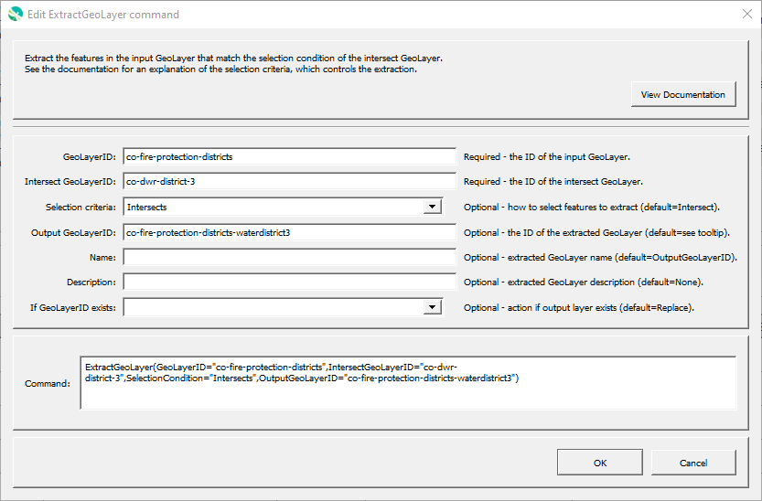

# GeoProcessor / Command / ExtractGeoLayer #

*   [Overview](#overview)
*   [Command Editor](#command-editor)
*   [Command Syntax](#command-syntax)
*   [Examples](#examples)
*   [Troubleshooting](#troubleshooting)
*   [See Also](#see-also)

-------------------------

## Overview ##

The `ExtractGeoLayer` command extracts features from the input GeoLayer and the intersect GeoLayer.
This retains the full geometry whereas the
[`ClipGeoLayer`](../ClipGeoLayer/ClipGeoLayer.md) and
[`IntersectGeoLayer`](../IntersectGeoLayer/IntersectGeoLayer.md)
commands only output the geometry portion that is common to the two layers.

See the [QGIS Extract by Location](https://docs.qgis.org/latest/en/docs/user_manual/processing_algs/qgis/vectorselection.html#extract-by-location)
algorithm for an explanation of the underlying functionality.

## Command Editor ##

The following dialog is used to edit the command and illustrates the command syntax.

**<p style="text-align: center;">

</p>**

**<p style="text-align: center;">
`ExtractGeoLayer` Command Editor (<a href="../ExtractGeoLayer.png">see full-size image</a>)
</p>**

## Command Syntax ##

The command syntax is as follows:

```text
ExtractGeoLayer(Parameter="Value",...)
```
**<p style="text-align: center;">
Command Parameters
</p>**

| **Parameter**&nbsp;&nbsp;&nbsp;&nbsp;&nbsp;&nbsp;&nbsp;&nbsp;&nbsp;&nbsp;&nbsp;&nbsp;&nbsp;&nbsp;&nbsp;&nbsp;&nbsp;&nbsp;&nbsp;&nbsp;&nbsp;&nbsp;&nbsp;&nbsp;&nbsp;&nbsp;&nbsp;&nbsp;&nbsp;&nbsp;&nbsp;&nbsp;&nbsp;&nbsp;&nbsp;&nbsp;&nbsp;&nbsp;&nbsp;&nbsp;&nbsp; | **Description** | **Default**&nbsp;&nbsp;&nbsp;&nbsp;&nbsp;&nbsp;&nbsp;&nbsp;&nbsp;&nbsp;&nbsp;&nbsp;&nbsp;&nbsp;&nbsp;&nbsp;&nbsp;&nbsp;&nbsp;&nbsp;&nbsp;&nbsp;&nbsp;&nbsp;&nbsp;&nbsp;&nbsp;&nbsp;&nbsp;|
| --------------|-----------------|----------------- |
|`GeoLayerID` <br> **required**| The ID of the input GeoLayer from which geometries will be extracted.| None - must be specified. |
|`IntersectGeoLayerID`<br> **required**| The ID of the intersect GeoLayer.| None - must be specified. |
|`SelectionCriteria`| The criteria used to select features from the input layer.  Currently only a single value can be specified.  In the future, more than one value will be accepted, in which case the condition will be met if any of the criteria are met.  Accepted values are:<ul><li>`AreWithin` - geometry must be entirely within the intersect layer geometries</li><li>`Contains` - opposite of `AreWithin`</li><li>`Crosses` - the supplied geometries have some, but not all, interior points in common and the actual crossing is of a lower dimension than the highest supplied geometry</li><li>`Disjoint` - geometries do not share any space (overlap or touch)</li><li>`Equals` - geometries are exactly the same</li><li>`Intersects` - geometries overlap or touch</li><li>`Overlaps` - geometries are of the same dimension, overlap, but are not completely contained by each other</li><li>`Touch` - geometries have at least one point in common, but their interiors do not intersect</li></ul>| `Intersects` |
|`OutputGeoLayerID`|The ID of the intersected GeoLayer. | `GeoLayerID` `_extractedFrom_` `GeoLayerID` |
|`Name`|The output layer name. | `OutputGeoLayerId` |
|`Description`|The output layer description. ||
|`IfGeoLayerIDExists`|The action that occurs if the `OutputGeoLayerID` already exists within the GeoProcessor:<ul><li>`Replace` - The existing GeoLayer within the GeoProcessor is replaced with the new GeoLayer. No warning is logged.</li><li>`ReplaceAndWarn` - The existing GeoLayer within the GeoProcessor is replaced with the new GeoLayer. A warning is logged.</li><li>`Warn` - The new GeoLayer is not created. A warning is logged.</li><li>`Fail` - The new GeoLayer is not created. A fail message is logged.</li></ul> | `Replace` | 

## Examples ##

See the [automated tests](https://github.com/OpenWaterFoundation/owf-app-geoprocessor-python-test/tree/main/test/commands/IntersectGeoLayer).

## Troubleshooting ##

## See Also ##

*   This command uses the QGIS [`qgis:extractbylocation`](https://docs.qgis.org/latest/en/docs/user_manual/processing_algs/qgis/vectorselection.html#extract-by-location) processing algorithm
*   [`ClipGeoLayer`](../ClipGeoLayer/ClipGeoLayer.md) command
*   [`IntersectGeoLayer`](../IntersectGeoLayer/IntersectGeoLayer.md) command
