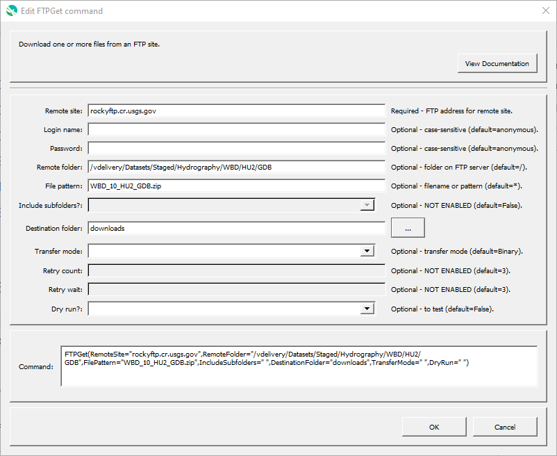

# GeoProcessor / Command / FTPGet #

*   [Overview](#overview)
*   [Command Editor](#command-editor)
*   [Command Syntax](#command-syntax)
*   [Examples](#examples)
*   [Troubleshooting](#troubleshooting)
*   [See Also](#see-also)

-------------------------

## Overview ##

The `FTPGet` command retrieves one or more files from a remote system using file transfer protocol (FTP).
The retrieval is not recursive to child folders.

## Command Editor ##

The following dialog is used to edit the command and illustrates the command syntax.

**<p style="text-align: center;">

</p>**

**<p style="text-align: center;">
`FTPGet` Command Editor (<a href="../FTPGet.png">see full-size image</a>)
</p>**

## Command Syntax ##

The command syntax is as follows:

```text
FTPGet(Parameter="Value",...)
```
**<p style="text-align: center;">
Command Parameters
</p>**

|**Parameter**&nbsp;&nbsp;&nbsp;&nbsp;&nbsp;&nbsp;&nbsp;&nbsp;&nbsp;&nbsp;&nbsp;&nbsp;&nbsp;&nbsp;&nbsp;&nbsp;&nbsp;&nbsp;&nbsp; | **Description** | **Default**&nbsp;&nbsp;&nbsp;&nbsp;&nbsp;&nbsp;&nbsp;&nbsp;&nbsp;&nbsp;&nbsp;&nbsp;&nbsp;&nbsp;&nbsp;&nbsp; |
| --------------|-----------------|----------------- |
|`RemoteSite`<br>**required**|The address of the remote site, for example: `ftp.acme.com`<br>Global properties can be used with the `${Property}` syntax.|None – must be specified.|
|`Login`|The FTP login to use.|`anonymous`|
|`Password`|The FTP password to use.|`anonymous`|
|`RemoteFolder`|The folder on the remote site, for example: `/outgoing/data`<br>Global properties can be used with the `${Property}` syntax.|Root folder (`/`).|
|`FilePattern`|The pattern to use to determine which files should be transferred.  Use the specific file name if retrieving a single file.  Simple patterns are used, where `*` is a wildcard.  Global properties can be used with the `${Property}` syntax.|Retrieve all files in the `RemoteFolder`.|
| `IncludeSubfolders` | Whether to retrieve folders and files in subfolders:  `False` or `True`. | `False` |
|`DestinationFolder`<br>**required**|The folder to receive the files, can be relative to the working directory.  Global properties can be used with the `${Property}` syntax.|None – must be specified.|
|`TransferMode`|The transfer mode:<ul><li>`ASCII` – for text files</li><li>`Binary` – for binary files</li></ul>|`Binary`|
|`RetryCount`|The number of times to retry the login if it fails (e.g., due to busy site).|3|
|`RetryWait`|The amount of time to wait between retries, seconds.|3|
|`DryRun`| Whether to do a dry run without actually downloading files: `False` or `True`.| `False` |

## Examples ##

See the [automated tests](https://github.com/OpenWaterFoundation/owf-app-geoprocessor-python-test/tree/main/test/commands/FTPGet).

## Troubleshooting ##

## See Also ##

*   [`ListFiles`](../ListFiles/ListFiles.md) command
*   [`UnzipFile`](../UnzipFile/UnzipFile.md) command
*   [`WebGet`](../WebGet/WebGet.md) command
