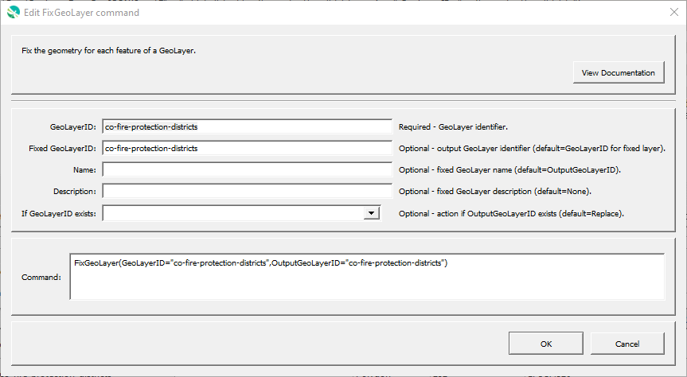

# GeoProcessor / Command / FixGeoLayer #

*   [Overview](#overview)
*   [Command Editor](#command-editor)
*   [Command Syntax](#command-syntax)
*   [Examples](#examples)
*   [Troubleshooting](#troubleshooting)
*   [See Also](#see-also)

-------------------------

## Overview ##

The `FixGeoLayer` command fixes the layer geometry using the QGIS `native:fixgeometries` algorithm.

## Command Editor ##

The following dialog is used to edit the command and illustrates the command syntax.

**<p style="text-align: center;">

</p>**

**<p style="text-align: center;">
`FixGeoLayer` Command Editor (<a href="../FixGeoLayer.png">see full-size image</a>)
</p>**

## Command Syntax ##

The command syntax is as follows:

```text
FixGeoLayer(Parameter="Value",...)
```
**<p style="text-align: center;">
Command Parameters
</p>**

|**Parameter**&nbsp;&nbsp;&nbsp;&nbsp;&nbsp;&nbsp;&nbsp;&nbsp;&nbsp;&nbsp;&nbsp;&nbsp;&nbsp;&nbsp;&nbsp;&nbsp;&nbsp;&nbsp;&nbsp;&nbsp;&nbsp; | **Description** | **Default**&nbsp;&nbsp;&nbsp;&nbsp;&nbsp;&nbsp;&nbsp;&nbsp;&nbsp;&nbsp; |
| --------------|-----------------|----------------- |
| `GeoLayerID` | A GeoLayer identifier. [Formatting characters](../../introduction/introduction.md#geolayer-property-format-specifiers) and [`${Property}` syntax](../../introduction/introduction.md#geoprocessor-properties-property) is recognized. Refer to [documentation](../../best-practices/geolayer-identifiers.md) for best practices on naming GeoLayer identifiers.| The GeoJSON filename without the leading path and without the file extension. (Formatting character `%f`)|
| `Name` | Name of the output GeoLayer. | `NewGeoLayerID` |
| `Description` | Description for the output GeoLayer. | |
| `IfGeoLayerIDExists` | The action that occurs if the `GeoLayerID` already exists within the GeoProcessor:<ul><li>`Replace` - The existing GeoLayer within the GeoProcessor is replaced with the new GeoLayer. No warning is logged.</li><li>`ReplaceAndWarn` - The existing GeoLayer within the GeoProcessor is replaced with the new GeoLayer. A warning is logged.</li><li>`Warn` - The new GeoLayer is not created. A warning is logged.</li><li>`Fail` - The new GeoLayer is not created. A fail message is logged.</li></ul> | `Replace` | 

## Examples ##

See the [automated tests](https://github.com/OpenWaterFoundation/owf-app-geoprocessor-python-test/tree/main/test/commands/FixGeoLayer).

## Troubleshooting ##

## See Also ##

*   [QGIS Fix Geometries (`gqis:fixgeometries`)](https://docs.qgis.org/latest/en/docs/user_manual/processing_algs/qgis/vectorgeometry.html#fix-geometries) algorithm
