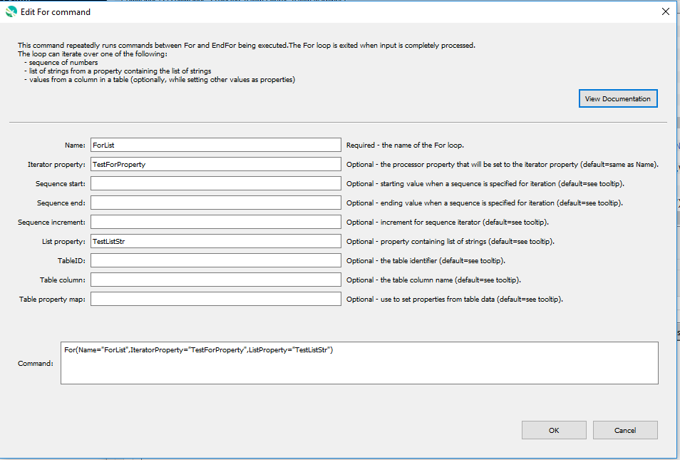

# GeoProcessor / Command / For #

* [Overview](#overview)
* [Command Editor](#command-editor)
* [Command Syntax](#command-syntax)
* [Examples](#examples)
* [Troubleshooting](#troubleshooting)
* [See Also](#see-also)

-------------------------

## Overview ##

The `For` command iterates through a block of commands between `For` and matching `EndFor`
commands. A processor property is set to the value of the iteration property and can be used by other
commands that support properties, using the `${Property}` notation.
`For` commands can iterate over:

* a list of supplied values (specify using `ListProperty` parameter)
* a sequence of integers or floating-point double precision numbers specified with start (`SequenceStart` parameter),
end (`SequenceEnd` parameter), and increment (`SequenceIncrement` parameter)
* values from a [Table](../../introduction/introduction.md#table) column 

`For` commands can be nested. Status messages for the run mode are accumulated in each command.
A limitation of using `For` with properties is that the command when edited may show GeoLayer
identifiers and other command parameters as `${Property}` values, rather than actual data, because the
values get expanded at run-time. This provides increased processing power but errors may not be evident
until commands are run.

## Command Editor ##

The following dialog is used to edit the command and illustrates the command syntax.



**<p style="text-align: center;">
`For` Command Editor (<a href="../For.png">see full-size image</a>)
</p>**

## Command Syntax ##

The command syntax is as follows:

```text
For(Parameter="Value",...)
```
**<p style="text-align: center;">
Command Parameters
</p>**

| **Parameter**&nbsp;&nbsp;&nbsp;&nbsp;&nbsp;&nbsp;&nbsp;&nbsp;&nbsp;&nbsp;&nbsp;&nbsp;&nbsp;&nbsp;&nbsp;&nbsp;&nbsp;&nbsp;&nbsp;&nbsp;&nbsp; | **Description** | **Default**&nbsp;&nbsp;&nbsp;&nbsp;&nbsp;&nbsp;&nbsp;&nbsp;&nbsp;&nbsp;&nbsp;&nbsp;&nbsp;&nbsp;&nbsp;&nbsp;&nbsp; |
| --------------|-----------------|----------------- |
| `Name` <br> ***required***| The name of the for loop, which will be matched with the name of an `EndFor` command to indicate the block of commands in the loop. | None - must be specified. |
| `IteratorProperty` | The processor property that will be set to the iterator property. The object type will depend on that used to provide the iteration property list. For example, if a sequence of integers is being iterated, the property will contain an integer. | Same as `Name`.|
||If iterating over a **LIST** ...|
| `ListProperty` | Specify if the list is iterating over a property that contains a list of strings. | Specify this or `Sequence*` parameters. |
||If iterating over a **SEQUENCE** ...|
| `SequenceStart` | Starting value when a sequence is specified for iteration, an integer or floating-point number (with decimal). | No default if sequence is used. |
| `SequenceEnd` | Ending value when a sequence is specified for iteration, an integer or floating-point number (with decimal). | No default if sequence is used. |
| `SequenceIncrement` | Increment for sequence iterator. | `1` or `1.0` depending on type for `SequenceStart`. |
||If iterating over a **TABLE** ...|
| `TableID`|The table identifier, when specifying the iterator as a column from a table. [`${Property}` syntax](../../introduction/introduction.md#geoprocessor-properties-property) is recognized.|No default if table is used. |
| `TableColumn`|The table column name, when specifying the iterator as a column from a table. [`${Property}` syntax](../../introduction/introduction.md#geoprocessor-properties-property) is recognized.|No default if table is used. |
| `TablePropertyMap`|Specify the names of column names and corresponding processor property names to set. This allows other commands to access the values of those properties using [`${Property}` syntax](../../introduction/introduction.md#geoprocessor-properties-property). <br><br> Specify using format: <br> `ColumnName1:PropertyName1,ColumnName2:PropertyName2`|None - only the iterator column value will be set as a property using `IteratorProperty`.|


## Examples ##

See the [automated tests](https://github.com/OpenWaterFoundation/owf-app-geoprocessor-python-test/tree/master/test/commands/For).

### Example to process data for a list of counties ###

This simple example illustrates how to process a list of GeoLayers corresponding to counties:

* The list of counties is specified as a property `CountyList`.
Other commands can also be used to create a list.
* The `For` command uses this property via its `ListProperty="CountyList"` parameter.
* The `For` command `IteratorProperty="County"` parameter indicates which property will be used
to iterate through the list items.
The property value is set to the values in the list for each iteration.
* Other commands can then use the syntax `${County}` to dynamically fill filenames, etc.
In this example the county name is used in GeoLayer filenames.

```text
SetProperty(PropertyName="CountyList",PropertyType="str",PropertyValues="Adams,Washington,Jefferson")
For(Name="Counties",IteratorProperty="County",ListProperty="CountyList")
  # Process a file for each county
  ReadGeoLayerFromGeoJSON(SpatialDataFile="${County}-census.geojson",GeoLayerID=${County}-census-population")
EndFor(Name="Counties")
```

## Troubleshooting ##

## See Also ##

* [`EndFor`](../EndFor/EndFor.md) command
* [`ListFiles`](../ListFiles/ListFiles.md) command
* [`SetProperty`](../SetProperty/SetProperty.md) command (can be used to set list of strings for iteration)
