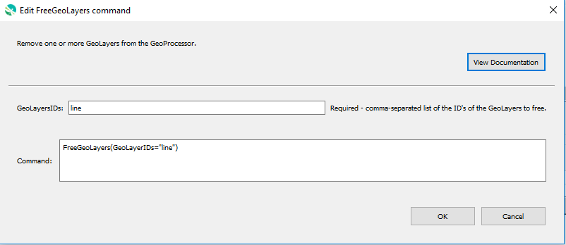

# GeoProcessor / Command / FreeGeoLayers #

*   [Overview](#overview)
*   [Command Editor](#command-editor)
*   [Command Syntax](#command-syntax)
*   [Examples](#examples)
*   [Troubleshooting](#troubleshooting)
*   [See Also](#see-also)

-------------------------

## Overview ##

The `FreeGeoLayers` command removes one or more [GeoLayers](../../introduction/introduction.md#geolayer) from the GeoProcessor. 

*   This command is used to save processing time and memory. 

## Command Editor ##

The following dialog is used to edit the command and illustrates the command syntax.

**<p style="text-align: center;">

</p>**

**<p style="text-align: center;">
`FreeGeoLayers` Command Editor (<a href="../FreeGeoLayers.png">see full-size image</a>)
</p>**

## Command Syntax ##

The command syntax is as follows:

```text
FreeGeoLayers(Parameter="Value",...)
```
**<p style="text-align: center;">
Command Parameters
</p>**

|**Parameter**&nbsp;&nbsp;&nbsp;&nbsp;&nbsp;&nbsp;&nbsp;&nbsp;&nbsp;&nbsp;&nbsp;&nbsp;&nbsp;&nbsp;&nbsp;&nbsp;&nbsp;&nbsp;&nbsp;&nbsp;| **Description** | **Default**&nbsp;&nbsp;&nbsp;&nbsp;&nbsp;&nbsp;&nbsp;&nbsp;&nbsp;&nbsp; |
| --------------|-----------------|----------------- |
| `GeoLayerIDs` <br> **required**| A comma-separated list of the IDs of the GeoLayers to free. <br><br> Can also be `*` where all GeoLayers registered within the GeoProcessor are removed.| None - must be specified. |

## Examples ##

See the [automated tests](https://github.com/OpenWaterFoundation/owf-app-geoprocessor-python-test/tree/main/test/commands/FreeGeoLayers).

The following GeoLayer data are used in the example.
The example assume that the GeoLayers have already been read
into the GeoProcessor with the [ReadGeoLayerFromGeoJSON](../ReadGeoLayerFromGeoJSON/ReadGeoLayerFromGeoJSON.md) command.

**<p style="text-align: left;">
Example GeoLayer Data
</p>**

|GeoLayer ID|
| ---- | 
| ExampleGeoLayer1 |
| ExampleGeoLayer2 | 
| ExampleGeoLayer3 |

### Example 1: Free GeoLayers ###

```
FreeGeoLayers(GeoLayerIDs = "ExampleGeoLayer2, ExampleGeoLayer3")
```

After running the command, the following GeoLayer IDs are registered within the GeoProcessor. 

|GeoLayer ID|
| ---- |
| ExampleGeoLayer1  |

## Troubleshooting ##

## See Also ##
