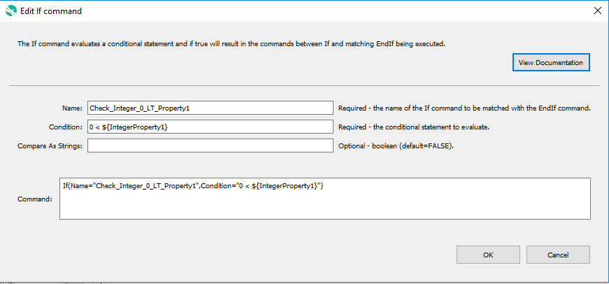

# GeoProcessor / Command / If #

*   [Overview](#overview)
*   [Command Editor](#command-editor)
*   [Command Syntax](#command-syntax)
*   [Examples](#examples)
*   [Troubleshooting](#troubleshooting)
*   [See Also](#see-also)

-------------------------

## Overview ##

The `If` command evaluates a conditional statement and if true will result in the commands between
`If` and matching `EndIf` being executed. Matching `Name` parameter for the `If` and `EndIf`
commands defines a block of commands. Currently, there is no “else if” or “else” syntax and nested
`If` commands must be used to evaluate complex conditions. The syntax for the conditional statement
is restricted to a simple comparison:

```
Value1 operator Value2
```

The values can be integers, floating point numbers, Boolean values, strings, or processor properties
specified with `${Property}` that
evaluate to primitive types. The operator is one of the following (more functionality will be added in the
future). For Booleans, False is less than True. For strings, A is less than Z, etc.

*   `<`
*   `<=`
*   `>`
*   `>=`
*   `==` (use this to test equality – do not use a single equal sign)
*   `!=`
*   `contains` (only for string comparison)
*   `!contains` (only for string comparison)

All nested `If` commands must evaluate to true to execute the commands within the deepest level of
nesting. Some commands set a property that
can be used for checks, for example to see if the number of features in a GeoLayer is nonzero.
It is helpful to use the [`Message`](../Message/Message.md) command to print a message to the log file and help control whether
a warning or failure status should occur as the result of the `If`.
The [`SetProperty`](../SetProperty/SetProperty.md) command can also be used to set a property to indicate
the result of evaluating an `If` block.

Future enhancements to the `If` command may include:

*   Test whether a property is defined (or not).
*   Test whether a GeoLayerID is available.
*   Compare GeoLayer properties with other properties and values.

## Command Editor ##

The following dialog is used to edit the command and illustrates the command syntax.

**<p style="text-align: center;">

</p>**

**<p style="text-align: center;">
`If` Command Editor (<a href="../If.png">see full-size image</a>)
</p>**

## Command Syntax ##

The command syntax is as follows:

```text
If(Parameter="Value",...)
```
**<p style="text-align: center;">
Command Parameters
</p>**

| **Parameter**&nbsp;&nbsp;&nbsp;&nbsp;&nbsp;&nbsp;&nbsp;&nbsp;&nbsp;&nbsp;&nbsp;&nbsp;&nbsp;&nbsp;&nbsp;&nbsp;&nbsp;&nbsp;&nbsp;&nbsp;&nbsp; | **Description** | **Default**&nbsp;&nbsp;&nbsp;&nbsp;&nbsp;&nbsp;&nbsp;&nbsp;&nbsp;&nbsp;&nbsp;&nbsp;&nbsp;&nbsp;&nbsp;&nbsp;&nbsp; |
| --------------|-----------------|----------------- |
| `Name`<br>**required** | The name of the `If` command, which will be matched with the name of an `EndIf` command to indicate the block of commands in the if condition. | None - must be specified. |
| `Condition`<br>**required** | The conditional statement to evaluate. | None - must be specified. |
| `CompareAsStrings` | If `True`, the comparison will be done as strings even if the values could be treated as numbers or Booleans. | `False` |

## Examples ##

See the [automated tests](https://github.com/OpenWaterFoundation/owf-app-geoprocessor-python-test/tree/main/test/commands/If).

### Example to Check Number Against Property ###

```text
# Some previous command will have set an error count
If(Name="ExampleIf",Condition="${ErrorCount} > 1")
  Message(Message="Have ${ErrorCount} errors.  Stopping.")
  Exit()
EndIf(Name="ExampleIf")
```

## Troubleshooting ##

## See Also ##

*   [`EndIf`](../EndIf/EndIf.md) command
*   [`SetProperty`](../SetProperty/SetProperty.md) command
