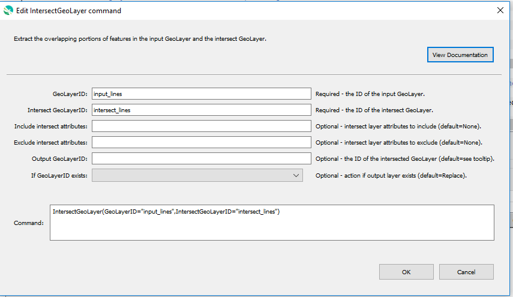

# GeoProcessor / Command / IntersectGeoLayer #

* [Overview](#overview)
* [Command Editor](#command-editor)
* [Command Syntax](#command-syntax)
* [Examples](#examples)
* [Troubleshooting](#troubleshooting)
* [See Also](#see-also)

-------------------------

## Overview ##

The `IntersectGeoLayer` command extracts the overlapping portions of features in the input GeoLayer and the intersect GeoLayer.
Features from the input GeoLayer are assigned the attributes of the overlapping features from both the input GeoLayer and the intersect GeoLayer. 

* The output intersected GeoLayer retains the geometry type of the input GeoLayer.
For example, if the input GeoLayer is a `POINT` and the intersect GeoLayer is a `POLYGON`, the output GeoLayer will be a `POINT`. 
* Features from the input GeoLayer that intersect with the intersect GeoLayer are
retained in the output GeoLayer. For example, the points within a polygon.
* Features from the input GeoLayer that intersect multiple features of the intersect GeoLayer are clipped by the intersect features.
Consequently, the output will have 2+ features that correspond to parts of the original input feature.
* Only GeoLayers with certain geometry type can be intersected. See the table below. 

| |The input GeoLayer geometry is <br>`POINT`|The input GeoLayer geometry is <br>`LINE`|The input GeoLayer geometry is <br>`POLGON`|
|:-:|:-:|:-:|:-:|
|The intersect GeoLayer is <br>`POINT`|<span style="color:green">Supported</span>. <br>The output GeoLayer contains the intersecting points.|<span style="color:red">Not Supported</span>. <br>The intersecting points cannot be written to line geometry.|<span style="color:red">Not Supported</span>. <br>The intersecting points cannot be written to polygon geometry.|
|The intersect GeoLayer is <br>`LINE`|<span style="color:green">Supported</span>. <br>The output GeoLayer contains the points intersecting the lines.|<span style="color:green">Supported</span>. <br>The output GeoLayer contains the intersecting lines. (The point intersections are not included.)|<span style="color:red">Not Supported</span>.  <br> The intersecting lines cannot be written to polygon geometry.|
|The intersect GeoLayer is <br>`POLYGON`|<span style="color:green">Supported</span>. <br>The output GeoLayer contains the points intersecting the polygons.|<span style="color:green">Supported</span>. <br>The output GeoLayer contains the lines intersecting the polygons.|<span style="color:green">Supported</span>. <br>The output GeoLayer contains the intersecting polygons.|

## Command Editor ##

The following dialog is used to edit the command and illustrates the command syntax.

**<p style="text-align: center;">

</p>**

**<p style="text-align: center;">
`IntersectGeoLayer` Command Editor (<a href="../IntersectGeoLayer.png">see full-size image</a>)
</p>**

## Command Syntax ##

The command syntax is as follows:

```text
IntersectGeoLayer(Parameter="Value",...)
```
**<p style="text-align: center;">
Command Parameters
</p>**

| **Parameter**&nbsp;&nbsp;&nbsp;&nbsp;&nbsp;&nbsp;&nbsp;&nbsp;&nbsp;&nbsp;&nbsp;&nbsp;&nbsp;&nbsp;&nbsp;&nbsp;&nbsp;&nbsp;&nbsp;&nbsp;&nbsp;&nbsp;&nbsp;&nbsp;&nbsp;&nbsp;&nbsp;&nbsp;&nbsp;&nbsp;&nbsp;&nbsp;&nbsp;&nbsp;&nbsp;&nbsp;&nbsp;&nbsp;&nbsp;&nbsp;&nbsp; | **Description** | **Default**&nbsp;&nbsp;&nbsp;&nbsp;&nbsp;&nbsp;&nbsp;&nbsp;&nbsp;&nbsp;&nbsp;&nbsp;&nbsp;&nbsp;&nbsp;&nbsp;&nbsp;&nbsp;&nbsp;&nbsp;&nbsp;&nbsp;&nbsp;&nbsp;&nbsp;&nbsp;&nbsp;&nbsp;&nbsp;|
| --------------|-----------------|----------------- |
|`GeoLayerID` <br> **required**| The ID of the input GeoLayer that will be intersected.| None - must be specified. |
|`IntersectGeoLayerID`<br> **required**| The ID of the intersect GeoLayer.| None - must be specified. |
| `IncludeIntersectAttributes` |  A comma-separated list of the [glob-style patterns](https://en.wikipedia.org/wiki/Glob_(programming)) filtering which attributes from the intersect GeoLayer to include in the output GeoLayer. <br><br> See [Determining which Attributes to Copy](#determining-which-attributes-to-copy).|All attributes are included.|
| `ExcludeIntersectAttributes` | A comma-separated list of the [glob-style patterns](https://en.wikipedia.org/wiki/Glob_(programming)) filtering which attributes from the intersect Geolayer to exclude in the output GeoLayer. <br><br> See [Determining which Attributes to Copy](#determining-which-attributes-to-copy).|No attributes are excluded.|  
|`OutputGeoLayerID`|The ID of the intersected GeoLayer. | `GeoLayerID` `_intersectedBy_` `IntersectGeoLayerID` |
|`IfGeoLayerIDExists`|The action that occurs if the `OutputGeoLayerID` already exists within the GeoProcessor:<ul><li>`Replace` - The existing GeoLayer within the GeoProcessor is replaced with the new GeoLayer. No warning is logged.</li><li>`ReplaceAndWarn` - The existing GeoLayer within the GeoProcessor is replaced with the new GeoLayer. A warning is logged.</li><li>`Warn` - The new GeoLayer is not created. A warning is logged.</li><li>`Fail` - The new GeoLayer is not created. A fail message is logged.</li></ul> | `Replace` | 

### Determining Which Attributes to Copy

* The `IncludeIntersectAttributes` parameter is always processed first. The`ExcludeIntersectAttributes` parameter is always processed second. 
	+ The `IncludeIntersectAttributes` selects all of the GeoLayer's attributes that follow the given patterns.
	By default (`*`) all of the GeoLayer's attributes are included. 
	+ The `ExcludeIntersectAttributes` removes all of the attributes previously
	selected from the `IncludeIntersectAttributes` parameter that follow the given patterns. 

## Examples ##

See the [automated tests](https://github.com/OpenWaterFoundation/owf-app-geoprocessor-python-test/tree/master/test/commands/IntersectGeoLayer).

The following example GeoLayer data is from the automated tests.
The examples assume that the GeoLayers have already been read into
the GeoProcessor with the [`ReadGeoLayerFromGeoJSON`](../ReadGeoLayerFromGeoJSON/ReadGeoLayerFromGeoJSON.md) command.

**<p style="text-align: left;">
Example GeoLayer Data
</p>**

|GeoLayer ID&nbsp;&nbsp;&nbsp;&nbsp;&nbsp;&nbsp;&nbsp;&nbsp;&nbsp;&nbsp;&nbsp;&nbsp;&nbsp;&nbsp;&nbsp;&nbsp;&nbsp;&nbsp;&nbsp;&nbsp;&nbsp;&nbsp;&nbsp;&nbsp;&nbsp;&nbsp;&nbsp;&nbsp;&nbsp;&nbsp;&nbsp;&nbsp;&nbsp;&nbsp;&nbsp;&nbsp;&nbsp;&nbsp;&nbsp;&nbsp;&nbsp;&nbsp;&nbsp;&nbsp;|Attributes|Number of Features|
| ---- |  :-----: |: --:|
| `input_points` | `id`|7|
| `input_lines` | `id`|3|
| `polygon-co-counties`	|`low`, `lowmod`, `LMMI`, `lowmoduniv`, `state`, `county`, `geoid`, `cnane`, `cname_long`|4|

### Example 1: Intersect a `POINT` GeoLayer with a `POLGYON` GeoLayer###

```
IntersectGeoLayer(GeoLayerID = "input_points", IntersectGeoLayerID = "countyBoundary-CDOT-Park-4326", OutputGeoLayerID = "intersected_points")
```

After running the command, the following GeoLayer IDs are registered within the GeoProcessor. 

|GeoLayer ID&nbsp;&nbsp;&nbsp;&nbsp;&nbsp;&nbsp;&nbsp;&nbsp;&nbsp;&nbsp;&nbsp;&nbsp;&nbsp;&nbsp;&nbsp;&nbsp;&nbsp;&nbsp;&nbsp;&nbsp;&nbsp;&nbsp;&nbsp;&nbsp;&nbsp;&nbsp;&nbsp;&nbsp;&nbsp;&nbsp;&nbsp;&nbsp;&nbsp;&nbsp;&nbsp;&nbsp;&nbsp;&nbsp;&nbsp;&nbsp;&nbsp;&nbsp;&nbsp;&nbsp;|Attributes|Number of Features|
| ---- |  :-----: |: --:|
| `input_points` | `id`|7|
| `polygon-co-counties`	|`low`, `lowmod`, `LMMI`, `lowmoduniv`, `state`, `county`, `geoid`, `cnane`, `cname_long`|4|
| `intersected_points`|`id`, `low`, `lowmod`, `LMMI`, `lowmoduniv`, `state`, `county`, `geoid`, `cnane`, `cname_long`|5|

|The `input_points` GeoLayer (represented by red stars) and the `polygon-co-counties` GeoLayer (displayed in light blue).|
|-|
||

|The `intersected_points` GeoLayer (represented by red stars) and the `polygon-co-counties` GeoLayer (displayed in light blue). Note that point features outside of the polygon features are excluded.|
|-|
||

### Example 2: Use the `IncludeIntersectAttributes` Parameter ###

It can be useful to limit the attributes from the intersect GeoLayer to be included in the output GeoLayer. The `IncludeIntersectAttributes` and `ExcludeIntersectAttributes` parameters allow the user to specify which attributes from the intersect GeoLayer to include in the output GeoLayer.

```
IntersectGeoLayer(GeoLayerID = "input_lines", IntersectGeoLayerID = "countyBoundary-CDOT-Park-4326", OutputGeoLayerID = "intersected_lines", IncludeIntersectAttributes="county, state")
```
After running the command, the following GeoLayer IDs are registered within the GeoProcessor. 

|GeoLayer ID&nbsp;&nbsp;&nbsp;&nbsp;&nbsp;&nbsp;&nbsp;&nbsp;&nbsp;&nbsp;&nbsp;&nbsp;&nbsp;&nbsp;&nbsp;&nbsp;&nbsp;&nbsp;&nbsp;&nbsp;&nbsp;&nbsp;&nbsp;&nbsp;&nbsp;&nbsp;&nbsp;&nbsp;&nbsp;&nbsp;&nbsp;&nbsp;&nbsp;&nbsp;&nbsp;&nbsp;&nbsp;&nbsp;&nbsp;&nbsp;&nbsp;&nbsp;&nbsp;&nbsp;|Attributes|Number of Features|
| ---- |  :-----: |: --:|
| `input_lines` | `id`|3|
| `polygon-co-counties`	|`low`, `lowmod`, `LMMI`, `lowmoduniv`, `state`, `county`, `geoid`, `cnane`, `cname_long`|4|
| `intersected_lines`|`id`, `state`, `county`|5|

|The `input_lines` GeoLayer (displayed in red) and the `polygon-co-counties` GeoLayer (displayed in light blue).|
|-|
||

|The `intersected_lines` GeoLayer (represented in various colors to display the created features) and the `polygon-co-counties` GeoLayer (displayed in light blue). Note that each line crossing polygon boundaries have been split into two features. |
|-|
||

## Troubleshooting ##

## See Also ##

* The QGIS [`qgis:intersection`](https://docs.qgis.org/latest/en/docs/user_manual/processing_algs/qgis/vector_overlay_tools.html#intersection) processing algorithm is used to process the layer
