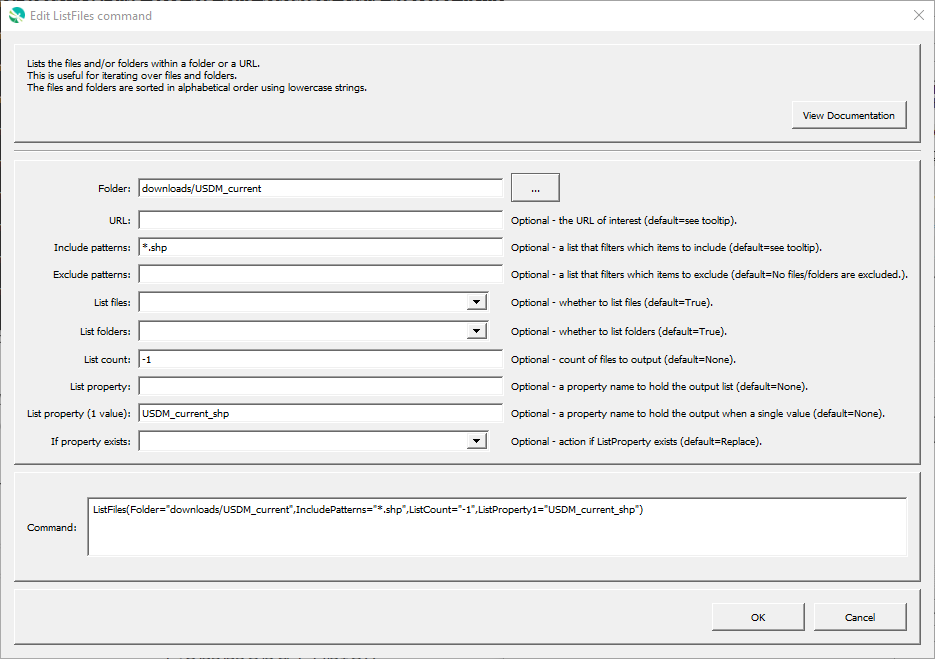

# GeoProcessor / Command / ListFiles #

* [Overview](#overview)
* [Command Editor](#command-editor)
* [Command Syntax](#command-syntax)
* [Examples](#examples)
* [Troubleshooting](#troubleshooting)
* [See Also](#see-also)

-------------------------

## Overview ##

The `ListFiles` command lists the files and folders within a folder or a URL. 

* Can specify to list only files, only folders or  both files and folders. 
* Output is a list assigned to a [GeoProcessor property](../../introduction/introduction.md#geoprocessor-properties-property). Requires a property name. 
* Can specify [glob-style patterns](https://en.wikipedia.org/wiki/Glob_(programming)) to include or exclude items within the output list.

## Command Editor ##

The following dialog is used to edit the command and illustrates the command syntax.

**<p style="text-align: center;">

</p>**

**<p style="text-align: center;">
`ListFiles` Command Editor (<a href="../ListFiles.png">see full-size image</a>)
</p>**

## Command Syntax ##

The command syntax is as follows:

```text
ListFiles(Parameter="Value",...)
```
**<p style="text-align: center;">
Command Parameters
</p>**

|**Parameter**&nbsp;&nbsp;&nbsp;&nbsp;&nbsp;&nbsp;&nbsp;&nbsp;&nbsp;&nbsp;&nbsp;&nbsp;&nbsp;&nbsp;&nbsp;&nbsp;&nbsp;&nbsp;| **Description** | **Default**&nbsp;&nbsp;&nbsp;&nbsp;&nbsp;&nbsp;&nbsp;&nbsp;&nbsp;&nbsp;&nbsp;&nbsp;&nbsp;&nbsp;&nbsp;&nbsp; |
| --------------|-----------------|----------------- |
|`Folder` <br> *see Default*|The path of the folder of interest (relative or absolute). | **Required** if `URL` parameter is not specified. |
|`URL` <br> *see Default*| The URL of interest. | **Required** if `Folder` parameter is not specified. |
|`ListProperty`<br> **required**|A [property](../../introduction/introduction.md#geoprocessor-properties-property) name to hold the output list.|None - must be specified.|
|`IncludePatterns`|A list of comma-separated [glob-style patterns](https://en.wikipedia.org/wiki/Glob_(programming)) that filter which items to include in the output list. |`*` - all files/folders are included.|
|`ExcludePatterns`|A list of comma-separated [glob-style patterns](https://en.wikipedia.org/wiki/Glob_(programming)) that filter which items to exclude in the output list.| No files/folders are excluded.|
|`ListFiles`|Indicates whether files are listed:<ul><li>`True` - files will be listed.</li></li>`False` - files will not be listed.</li></ul>|`True`|
-`ListFolders`|Indicates whether folders are listed:<ul><li>`True`, folders will be listed.</li><li>`False` - folders will not be listed.</li></ul>|`True`|
|`IfPropertyExists`<br>|The action that occurs if the `ListProperty` is already an existing property:<ul><li>`Replace` - The existing property value is replaced with the output list. No warning is logged.</li><li>`ReplaceAndWarn` - The existing property value is replaced with the output list. A warning is logged.</li><li>`Warn` - The existing property keeps its original value. A warning is logged.</li><li>`Fail` - The existing property keeps its original value. A fail message is logged.</li></ul> | `Replace` | 

## Examples ##

See the [automated tests](https://github.com/OpenWaterFoundation/owf-app-geoprocessor-python-test/tree/master/test/commands/ListFiles).

## Troubleshooting ##

## See Also ##

* The source content of the URL is read using the Python [urllib2](https://docs.python.org/2/library/urllib2.html) library.
