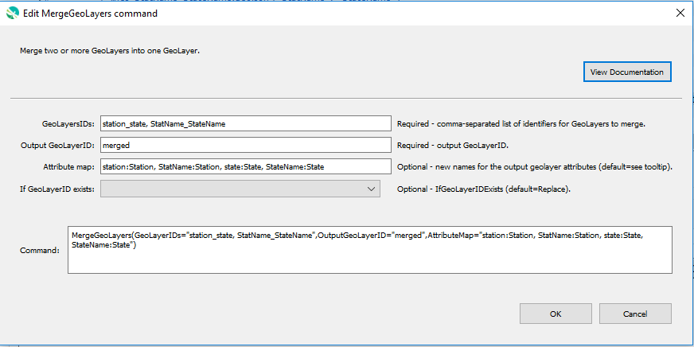

# GeoProcessor / Command / MergeGeoLayers #

*   [Overview](#overview)
*   [Command Editor](#command-editor)
*   [Command Syntax](#command-syntax)
*   [Attribute Map](#attribute-map)
*   [Examples](#examples)
*   [Troubleshooting](#troubleshooting)
*   [See Also](#see-also)

-------------------------

## Overview ##

The `MergeGeoLayers` command merges two or more [GeoLayers](../../introduction/introduction.md#geolayer) into one GeoLayer. 

*   The attributes of the input GeoLayers are retained within the output GeoLayer.
*   The features of the input GeoLayers are retained within the output GeoLayer.
*   The input GeoLayers must be the same geometry (`POINT`, `LINE` or `POLYGON`).
*   The input GeoLayers must be projected in the same coordinate reference system.
*   The attribute names of the output GeoLayer can be specified. See `AttributeMap` parameter. 
*   The value `0` will be assigned as the attribute value to features in the output GeoLayer attribute table that do not have attribute values. 

**<p style="text-align: center;">

</p>**

## Command Editor ##

The following dialog is used to edit the command and illustrates the command syntax.

**<p style="text-align: center;">

</p>**

**<p style="text-align: center;">
`MergeGeoLayers` Command Editor (<a href="../MergeGeoLayers.png">see full-size image</a>)
</p>**

## Command Syntax ##

The command syntax is as follows:

```text
MergeGeoLayers(Parameter="Value",...)
```
**<p style="text-align: center;">
Command Parameters
</p>**

|**Parameter**&nbsp;&nbsp;&nbsp;&nbsp;&nbsp;&nbsp;&nbsp;&nbsp;&nbsp;&nbsp;&nbsp;&nbsp;&nbsp;&nbsp;&nbsp;&nbsp;&nbsp;&nbsp;&nbsp;&nbsp;&nbsp; | **Description** | **Default**&nbsp;&nbsp;&nbsp;&nbsp;&nbsp;&nbsp;&nbsp;&nbsp;&nbsp;&nbsp; |
| --------------|-----------------|----------------- |
|`GeoLayerIDs` <br> **required**| A comma-separated list of the identifiers of the GeoLayers to merge. <br><br> *GeoLayerID1, GeoLayerID2, ...* <br> <br>Can also be `*` where all GeoLayers registered within the GeoProcessor are merged. [`${Property}` syntax](../../introduction/introduction.md#geoprocessor-properties-property) is recognized.| None - must be specified. |
|`OutputGeoLayerID` <br> **required**| A GeoLayer identifier for the output GeoLayer. Refer to [documentation](../../best-practices/geolayer-identifiers.md) for best practices on naming GeoLayer identifiers.|None - must be specified. |
|`AttributeMap` | Specify new names for the output geolayer attributes. <br><br> *OriginalAttributeName1:MergedAttributeName1, OriginalAttributeName2:MergedAttributeName2* <br><br> See the [Attribute Map](#attribute-map) section for more information.|Empty attribute map. <br><br>All attributes in the input GeoLayers are retained within the output GeoLayer.|
|`IfGeoLayerIDExists`|The action that occurs if the `OutputGeoLayerID` already exists within the GeoProcessor:<ul><li>`Replace` - The existing GeoLayer within the GeoProcessor is replaced with the new GeoLayer. No warning is logged.</li></li>`ReplaceAndWarn` - The existing GeoLayer within the GeoProcessor is replaced with the new GeoLayer. A warning is logged.</li><li>`Warn` - The existing GeoLayer is not changed. A warning is logged.</li><li>`Fail` - The existing GeoLayer is not changed. A fail message is logged.</li></ul> | `Replace` | 

## Attribute Map ##

The `MergeGeoLayers` command merges multiple GeoLayers into one GeoLayer. 

*   The input attribute tables are merged into one output attribute table. 
*   By default, if the attribute tables from the input GeoLayers are different,
    the attribute table of the output GeoLayer will contain the attributes from
    **ALL** input layers. See [Example 1](#example-1-merge-without-an-attribute-map). 

There are times, however, when attributes with *different* names from *different* input GeoLayers should be converged. 

*   This can be accomplished with the `AttributeMap` parameter. 
*   In [Example 2](#example-1-merge-with-an-attribute-map),
    the high schools attribute (`high_sch`) from `ExampleGeoLayer1` and the elementary schools
    attribute (`elem_sch`) from `ExampleGeoLayer2` both contain names of schools. 
    +   When merging the input GeoLayers, it is possible to `"map"` the high schools and elementary schools attributes together.
        The output is a single attribute called `Schools` containing the information from both the
        `high_sch` attribute and the `elem_sch` attribute.

### How to Build an Attribute Map ###

*   An attribute map is a comma-separated list of key-value pairs.

```

AttributeMap = "KEY1:VALUE1, KEY2:VALUE2"
```

*   Each `KEY` is an attribute from one of the `INPUT` GeoLayers. 
*   Each `VALUE` is a new name that the `KEY` attribute will be renamed to in the the `OUTPUT` `MERGED` GeoLayer.
*   If an attribute from an `INPUT` GeoLayer is not listed as a `KEY` in the attribute map,
    the attribute name will be retained in the `OUTPUT MERGED` GeoLayer.
*   More than one key-value pairs can have the `SAME` `VALUE`.

## Examples ##

See the [automated tests](https://github.com/OpenWaterFoundation/owf-app-geoprocessor-python-test/tree/main/test/commands/MergeGeoLayers).

The following GeoLayer data are used in the examples.
The examples assume that the `ExampleGeoLayer1` and `ExampleGeoLayer2` GeoLayers have *already* been read
into the GeoProcessor with the [ReadGeoLayerFromGeoJSON](../ReadGeoLayerFromGeoJSON/ReadGeoLayerFromGeoJSON.md) command.

**<p style="text-align: left;">
Example GeoLayer Data
</p>**

|GeoLayer ID|
| ---- |
| ExampleGeoLayer1| 
| ExampleGeoLayer2|

**<p style="text-align: left;">
Attribute Table of `ExampleGeoLayer1`
</p>**

|id|high_sch|Mascot|
|--|--|--|
|1|Gunn|Colts|
|2|Hill|Bears|
|3|Dasher|Gators|

**<p style="text-align: left;">
Attribute Table of `ExampleGeoLayer2`
</p>**

|`id`|`elem_sch`|`mascot`|
|--|--|--|
|1|Woodrow|Bulldogs|
|2|Eastern|Rams|
|3|River Mill|Eagles|

### Example 1: Merge Without an Attribute Map ###

```
MergeGeoLayers(GeoLayerIDs = "ExampleGeoLayer1, ExampleGeoLayer2", OutputGeoLayerID = "MergedOutput")
```

After running the command, the following the following GeoLayer IDs are registered within the GeoProcessor. 

|GeoLayer ID|
| ---- |
| ExampleGeoLayer1| 
| ExampleGeoLayer2|
| MergedOutput|

**<p style="text-align: left;">
Attribute Table of `MergedOutput`
</p>**

|`id`|`high_sch`|`Mascot`|`elem_sch`|`mascot`|
|--|--|--|--|--|
|1|Gunn|Colts|0|0|
|2|Hill|Bears|0|0|
|3|Dasher|Gators|0|0|
|1|0|0|Woodrow|Bulldogs|
|2|0|0|Eastern|Rams|
|3|0|0|River Mill|Eagles|

### Example 2:  Merge With an Attribute Map ###

```
MergeGeoLayers(GeoLayerIDs = "ExampleGeoLayer1, ExampleGeoLayer2", OutputGeoLayerID = "MergedOutput", AttributeMap = "id:ID, high_sch:School, elem_sch:School, mascot:Mascot")
```

After running the command, the following the following GeoLayer IDs are registered within the GeoProcessor. 

|GeoLayer ID|
| ---- |
| ExampleGeoLayer1| 
| ExampleGeoLayer2|
| MergedOutput|

**<p style="text-align: left;">
Attribute Table of `MergedOutput`
</p>**

|ID|Schools|Mascot|
|--|--|--|
|1|Gunn|Colts|
|2|Hill|Bears|
|3|Dasher|Gators|
|1|Woodrow|Bulldogs|
|2|Eastern|Rams|
|3|River Mill|Eagles|

## Troubleshooting ##

## See Also ##

*   This command uses the QGIS [`qgis:mergevectorlayers`](https://docs.qgis.org/latest/en/docs/user_manual/processing_algs/qgis/vectorgeneral.html#merge-vector-layers) processing algorithm
