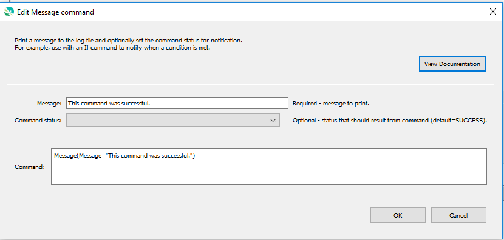

# GeoProcessor / Command / Message #

* [Overview](#overview)
* [Command Editor](#command-editor)
* [Command Syntax](#command-syntax)
* [Examples](#examples)
* [Troubleshooting](#troubleshooting)
* [See Also](#see-also)

-------------------------

## Overview ##

The `Message` command prints a status message to the log file.  Optionally, the
`CommandStatus` parameter can be used to control the status level for the command, for example to
generate a warning or failure status for the command.  This command is useful for troubleshooting
processing. See also the [`If`](../If/If.md) command, which can be used to check for a condition and by using
`Message` print a message to warn the user.

## Command Editor ##

The following dialog is used to edit the command and illustrates the command syntax.



**<p style="text-align: center;">
`Message` Command Editor (<a href="../Message.png">see full-size image</a>)
</p>**

## Command Syntax ##

The command syntax is as follows:

```text
Message(Parameter="Value",...)
```
**<p style="text-align: center;">
Command Parameters
</p>**

| **Parameter**&nbsp;&nbsp;&nbsp;&nbsp;&nbsp;&nbsp;&nbsp;&nbsp;&nbsp;&nbsp;&nbsp;&nbsp;&nbsp;&nbsp;&nbsp;&nbsp;&nbsp;&nbsp;&nbsp;&nbsp;&nbsp;&nbsp;&nbsp;&nbsp;&nbsp;&nbsp; | **Description** | **Default**&nbsp;&nbsp;&nbsp;&nbsp;&nbsp;&nbsp;&nbsp;&nbsp;&nbsp;&nbsp; |
| --------------|-----------------|----------------- |
| `Message` | The message to print.  Can be specified using `${Property}`. | None - must be specified. |
| `CommandStatus` | Indicate the status that should result from running the command:  `SUCCESS`, `WARNING`, `FAILURE` | `SUCCESS` |


## Examples ##

See the [automated tests](https://github.com/OpenWaterFoundation/owf-app-geoprocessor-python-test/tree/master/test/commands/Message).

## Troubleshooting ##

## See Also ##

* [StartLog](../StartLog/StartLog.md) command - controls log file where messages are written
