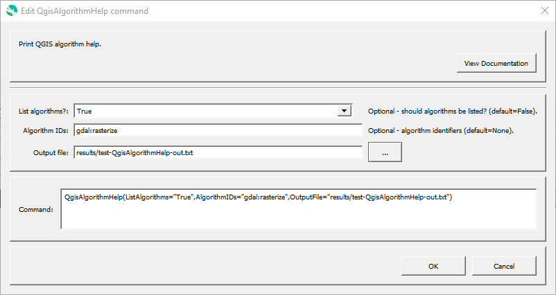

# GeoProcessor / Command / QgisAlgorithmHelp #

* [Overview](#overview)
* [Command Editor](#command-editor)
* [Command Syntax](#command-syntax)
* [Examples](#examples)
* [Troubleshooting](#troubleshooting)
* [See Also](#see-also)

-------------------------

## Overview ##

The `QgisAlgorithmHelp` command prints QGIS algorithm help.
This is helpful for software developers and to understand the details of algorithms used in commands.
The algorithm list can be output to a file.
However, algorithm help output is currently only printed to the console.

## Command Editor ##

The following dialog is used to edit the command and illustrates the command syntax.

**<p style="text-align: center;">

</p>**

**<p style="text-align: center;">
`QgisAlgorithmHelp` Command Editor (<a href="../QgisAlgorithmHelp.png">see full-size image</a>)
</p>**

## Command Syntax ##

The command syntax is as follows:

```text
QgisAlgorithmHelp(Parameter="Value",...)
```
**<p style="text-align: center;">
Command Parameters
</p>**

| **Parameter**&nbsp;&nbsp;&nbsp;&nbsp;&nbsp;&nbsp;&nbsp;&nbsp;&nbsp;&nbsp;&nbsp;&nbsp;&nbsp;&nbsp;&nbsp;&nbsp;&nbsp;&nbsp;&nbsp;&nbsp;&nbsp;&nbsp;&nbsp;&nbsp;&nbsp;&nbsp; | **Description** | **Default**&nbsp;&nbsp;&nbsp;&nbsp;&nbsp;&nbsp;&nbsp;&nbsp;&nbsp;&nbsp; |
| --------------|-----------------|----------------- |
| `ListAlgorithms` | Whether to list QGIS algorithms:<ul><li>`False` - don't list available algorithms</li><li>`True` - list available algorithms</li></ul> | `False` |
| `AlgorithmIDs` | A list of algorithm identifiers from the algorithm list, separated by commas. | |
| `OutputFile` | Output file.  Currently only the algorithm list is output to to the file. | Standard output (console). |

## Examples ##

See the [automated tests](https://github.com/OpenWaterFoundation/owf-app-geoprocessor-python-test/tree/master/test/commands/QgisAlgorithmHelp).

## Troubleshooting ##

## See Also ##

* [QGIS 3.10 algorithm documentation](https://docs.qgis.org/3.10/en/docs/user_manual/processing_algs/index.html)
