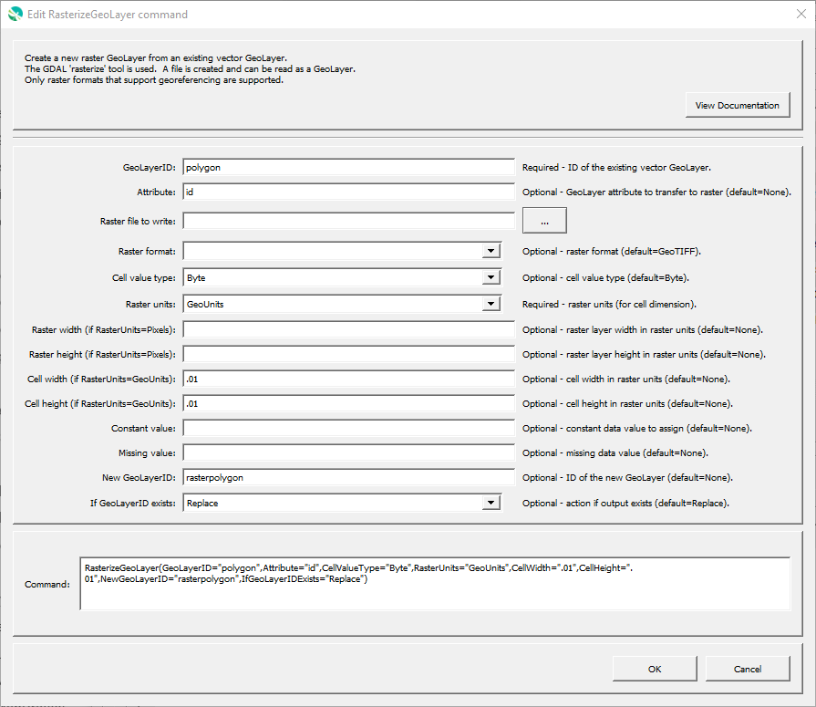
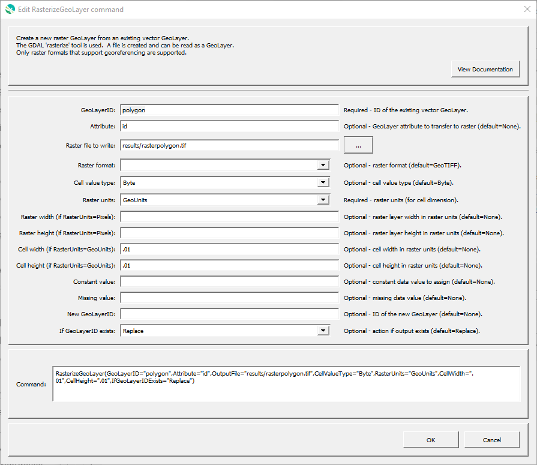

# GeoProcessor / Command / RasterizeGeoLayer #

* [Overview](#overview)
* [Command Editor](#command-editor)
* [Command Syntax](#command-syntax)
* [Examples](#examples)
* [Troubleshooting](#troubleshooting)
* [See Also](#see-also)

-------------------------

## Overview ##

The `RasterizeGeoLayer` command creates a new raster GeoLayer from a vector GeoLayer
using the `gdal:rasterize` algorithm.
See the [latest QGIS rasterize](https://docs.qgis.org/latest/en/docs/user_manual/processing_algs/gdal/vectorconversion.html#rasterize-overwrite-with-attribute) documentation.
The resulting raster layer is written to an output file specified by the `OutputFile` parameter or, if not specified,
a temporary file with timestamped filename to ensure uniqueness.
The [GeoTIFF](../../spatial-data-format-ref/GeoTIFF/GeoTIFF.md) format is used for filenames specified with `tif` extension and is the default format.
The rasterize output file is read as the raster GeoLayer if the `GeoLayerID` parameter is specified or can be read with the
[`ReadRasterGeoLayerFromFile`](../ReadRasterGeoLayerFromFile/ReadRasterGeoLayerFromFile.md) command.

The rasterization occurs using one of the following approaches:

1. `RasterUnits=GeoUnits`:
	* output units will be the units of the input vector layer, for example degrees if geographic coordinates
	* specify `CellWidth` and `CellHeight` parameters as the cell dimensions,
	where the values will be in the input layer's geographic units (e.g., degrees)
2. `RasterUnits=Pixel`:
	* output units will be pixels, such as for an image
	* specify `RasterWidth` and `RasterHeight` parameters as the total width and height of the image, in pixels

The underlying software may retain a lock on the file.
The `RasterizeGeoLayer` command attempts to remove the output file before running (to ensure that output is current)
and will warn if unsuccessful.  This typically means that another program is using the file.
**This issue should be fixed by the user because otherwise the old output may mistakenly be assumed to be current output**.

The `RasterizeGeoLayer` command also attempts to delete temporary files after reading (to avoid filling up the disk).
If unsuccessful, typically because underlying software has a lock on the file,
a warning will be logged to the log file and the file will remain.
The file is added to the list of files to be removed, which will be processed when the GeoProcessor is next started.

## Command Editor ##

The following dialog is used to edit the command and illustrates the command syntax
when using an automatically-generated temporary filename and reading into a GeoLayer.

**<p style="text-align: center;">

</p>**

**<p style="text-align: center;">
`RasterizeGeoLayer-GeoLayerID` Command Editor when Reading a GeoLayer (<a href="../RasterizeGeoLayer-GeoLayerID.png">see full-size image</a>)
</p>**

The following illustrates the command syntax
when specifying the output file and **not** reading a GeoLayer.
A [`ReadRasterLayerFromFile`](../ReadRasterGeoLayerFromFile/ReadRasterGeoLayerFromFile.md) command can be used to read the file.

**<p style="text-align: center;">

</p>**

**<p style="text-align: center;">
`RasterizeGeoLayer-OutputFile` Command Editor when Not Reading a GeoLayer (<a href="../RasterizeGeoLayer-OutputFile.png">see full-size image</a>)
</p>**

## Command Syntax ##

The command syntax is as follows:

```text
RasterizeGeoLayer(Parameter="Value",...)
```
**<p style="text-align: center;">
Command Parameters
</p>**

|**Parameter**&nbsp;&nbsp;&nbsp;&nbsp;&nbsp;&nbsp;&nbsp;&nbsp;&nbsp;&nbsp;&nbsp;&nbsp;&nbsp;&nbsp;&nbsp;&nbsp;&nbsp;&nbsp;&nbsp;&nbsp;&nbsp;&nbsp;&nbsp;&nbsp;&nbsp;&nbsp;&nbsp;&nbsp;&nbsp; | **Description** | **Default**&nbsp;&nbsp;&nbsp;&nbsp;&nbsp;&nbsp;&nbsp;&nbsp;&nbsp;&nbsp;&nbsp;&nbsp;&nbsp;&nbsp;&nbsp;&nbsp; |
| --------------|-----------------|----------------- |
| `GeoLayerID`<br>**required** | The vector GeoLayer identifier.  [`${Property}` syntax](../../introduction/introduction.md#geoprocessor-properties-property) is recognized. | None - must be specified. |
| `Attribute` | The attribute name that indicates values to be assigned in the raster layer. | `Attribute` or `ConstantValue` must be specified. |
| `OutputFile` | The output raster file (relative or absolute path). [`${Property}` syntax](../../introduction/introduction.md#geoprocessor-properties-property) is recognized. | Write to a temporary file. |
| `RasterFormat` | Format of the raster file that is created during processing:<ul><li>`GeoTIFF`</li></ul> | `GeoTIFF` |
| `CellValueType` | Type for the cell values:<ul><li>`Byte` - byte</li><li>`Integer16` - 16-bit integer</li><li>`Integer32` - 32-bit integer</li><li>`Float32` - 32-bit floating point number</li><li>`Float64` - 64-bit floating point number</ul> | `Byte` |
| `RasterUnits` | Data units for raster layer:<ul><li>`GeoUnits` - geographic units defined by the coordinate system (used for rasters with data)</li><li>`Pixels` - pixels (used for images)</li></ul> | None - must be specified. |
| `RasterWidth` | If `RasterUnits=Pixels`, the width of the image in pixels. | |
| `RasterHeight` | If `RasterUnits=Pixels`, the height of the image in pixels. | |
| `CellWidth` | If `RasterUnits=GeoUnits`, the width of a cell in raster units. | |
| `CellHeight` | If `RasterUnits=GeoUnits`, the height of a cell in raster units. | |
| `ConstantValue` | Constant value to assign to the raster rather than using `Attribute` value. | |
| `MissingValue` | Value to use for missing or "no data" value.  This indicates in the raster layer the attribute value that is used for missing values. | |
| `NewGeoLayerID` | GeoLayer identifier for the new raster layer. [Formatting characters](../../introduction/introduction.md#geolayer-property-format-specifiers) and [`${Property}` syntax](../../introduction/introduction.md#geoprocessor-properties-property) is recognized. Refer to [GeoLayerID](../../best-practices/geolayer-identifiers.md) documentation for best practices on GeoLayer identifiers. | Create the raster layer file but don't read the layer. |
| `IfGeoLayerIDExists` | The action that occurs if the `GeoLayerID` already exists within the GeoProcessor:<ul><li>`Replace` - The existing GeoLayer within the GeoProcessor is replaced with the new GeoLayer. No warning is logged.</li><li>`ReplaceAndWarn` - The existing GeoLayer within the GeoProcessor is replaced with the new GeoLayer. A warning is logged.</li><li>`Warn` - The new GeoLayer is not created. A warning is logged.</li><li>`Fail` - The new GeoLayer is not created. A fail message is logged.</li></ul> | `Replace` | 

## Examples ##

See the [automated tests](https://github.com/OpenWaterFoundation/owf-app-geoprocessor-python-test/tree/master/test/commands/RasterizeGeoLayer).

## Troubleshooting ##

## See Also ##

* This command uses the QGIS [`gdal:rasterize`](https://docs.qgis.org/latest/en/docs/user_manual/processing_algs/gdal/vectorconversion.html#rasterize-vector-to-raster) processing algorithm
* [`ReadRasterGeoLayerFromFile`](../ReadRasterGeoLayerFromFile/ReadRasterGeoLayerFromFile.md) command
