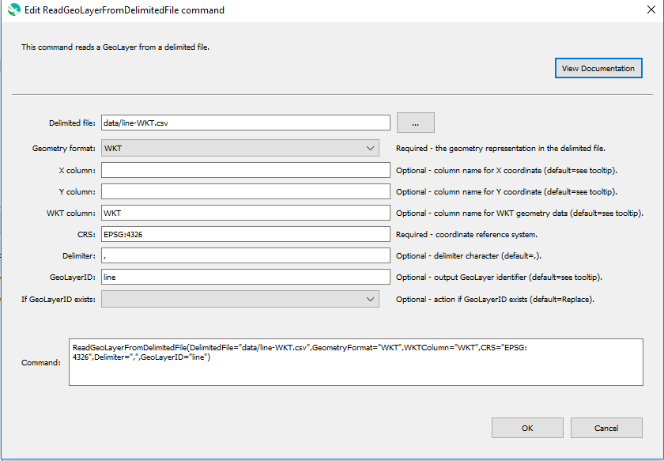

# GeoProcessor / Command / ReadGeoLayerFromDelimitedFile #

* [Overview](#overview)
* [Command Editor](#command-editor)
* [Command Syntax](#command-syntax)
* [Examples](#examples)
* [Troubleshooting](#troubleshooting)
* [See Also](#see-also)

-------------------------

## Overview ##

The `ReadGeoLayerFromDelimitedFile` command reads a [GeoLayer](../../introduction/introduction.md#geolayer)
from a [delimited file](https://en.wikipedia.org/wiki/Delimiter-separated_values). 

* The coordinate reference system of the geometry within the delimited file must be correctly defined.
* The attributes of the delimited file are retained within the attribute table of the GeoLayer.
* `POINT`, `LINE` and `POLYGON` data can be read from a delimited file.
To read `LINE` and `POLYGON` data,
the delimited file must have a column specifying the geometry in [well-known text](https://en.wikipedia.org/wiki/Well-known_text).

## Command Editor ##

The following dialog is used to edit the command and illustrates the command syntax.

**<p style="text-align: center;">

</p>**

**<p style="text-align: center;">
`ReadGeoLayerFromDelimitedFile` Command Editor (<a href="../ReadGeoLayerFromDelimitedFile.png">see full-size image</a>)
</p>**

## Command Syntax ##

The command syntax is as follows:

```text
ReadGeoLayerFromDelimitedFile(Parameter="Value",...)
```
**<p style="text-align: center;">
Command Parameters
</p>**

|**Parameter**&nbsp;&nbsp;&nbsp;&nbsp;&nbsp;&nbsp;&nbsp;&nbsp;&nbsp;&nbsp;&nbsp;&nbsp;&nbsp;&nbsp;&nbsp;&nbsp;&nbsp;&nbsp;&nbsp;&nbsp;&nbsp; | **Description** | **Default**&nbsp;&nbsp;&nbsp;&nbsp;&nbsp;&nbsp;&nbsp;&nbsp;&nbsp;&nbsp; |
| --------------|-----------------|----------------- |
| `DelimitedFile`<br>**required** | The delimited file to read (relative or absolute path). [`${Property}` syntax](../../introduction/introduction.md#geoprocessor-properties-property) is recognized.| None - must be specified. |
| `CRS`<br>**required** | The [coordinate reference system](https://en.wikipedia.org/wiki/Spatial_reference_system) of the geometry in the delimited file. <br><br>[EPSG or ESRI code format](http://spatialreference.org/ref/epsg/) required (e.g. [`EPSG:4326`](http://spatialreference.org/ref/epsg/4326/), [`EPSG:26913`](http://spatialreference.org/ref/epsg/nad83-utm-zone-13n/), [`ESRI:102003`](http://spatialreference.org/ref/esri/usa-contiguous-albers-equal-area-conic/)).|None - must be specified. |
| `GeometryFormat`<br>**required** | The geometry representation used within the delimited file. Must be one of the following options:<ul><li>`XY` - The geometry is stored in two columns of the delimited file. One column holds the `X` coordinates and the other column holds the `Y` coordinates.</li><li>`WKT` - The geometry is stored in one column of the delimited file. The geometry is in [Well Known Text](https://en.wikipedia.org/wiki/Well-known_text) representation.</li></ul>|None - must be specified. |
| `XColumn`<br>*see Default* | The name of the column in the delimited file that holds the `X` coordinate data.|If `GeometryFormat` is `XY`, this parameter is **required**. Otherwise, this parameter is ignored. |
| `YColumn`<br>*see Default* | The name of the column in the delimited file that holds the `Y` coordinate data.|If `GeometryFormat` is `XY`, this parameter is **required**. Otherwise, this parameter is ignored. |
| `WKTColumn`<br>*see Default* | The name of the column in the delimited file that holds the `WKT` geometry data.|If `GeometryFormat` is `WKT`, this parameter is **required**. Otherwise, this parameter is ignored. |
| `Delimiter` | The delimiter used to separate the columns of the delimited file.<br><br> Must enter the actual character instead of spelling the character. For example, `,` is correct but `COMMA` is not correct.|`,`|
| `GeoLayerID` | A GeoLayer identifier. <br><br>[Formatting characters](../../introduction/introduction.md#geolayer-property-format-specifiers) are recognized. Refer to [documentation](../../best-practices/geolayer-identifiers.md) for best practices on naming GeoLayer identifiers.| The delimited filename without the leading path and without the file extension (equivalent to formatting character `%f`). |
| `Properties` | Additional properties to assign to the GeoLayer, using format: `prop1:value1,prop2:'string with space'`.  Can use `${Property}` notation.  | No additional properties are assigned. |
| `IfGeoLayerIDExists` | The action that occurs if the `GeoLayerID` already exists within the GeoProcessor:<ul><li>`Replace` - The existing GeoLayer within the GeoProcessor is replaced with the new GeoLayer. No warning is logged.</li><li>`ReplaceAndWarn` - The existing GeoLayer within the GeoProcessor is replaced with the new GeoLayer. A warning is logged.</li><li>`Warn` - The new GeoLayer is not created. A warning is logged.</li><li>`Fail` - The new GeoLayer is not created. A fail message is logged.</li></ul> | `Replace` | 

## Examples ##

See the [automated tests](https://github.com/OpenWaterFoundation/owf-app-geoprocessor-python-test/tree/master/test/commands/ReadGeoLayerFromDelimitedFile).

## Troubleshooting ##

## See Also ##

* The GeoLayer is read using the [GDAL CSV driver](https://gdal.org/drivers/vector/csv.html#vector-csv).
* [`WriteGeoLayerToDelimitedFile`](../WriteGeoLayerToDelimitedFile/WriteGeoLayerToDelimitedFile.md) command
