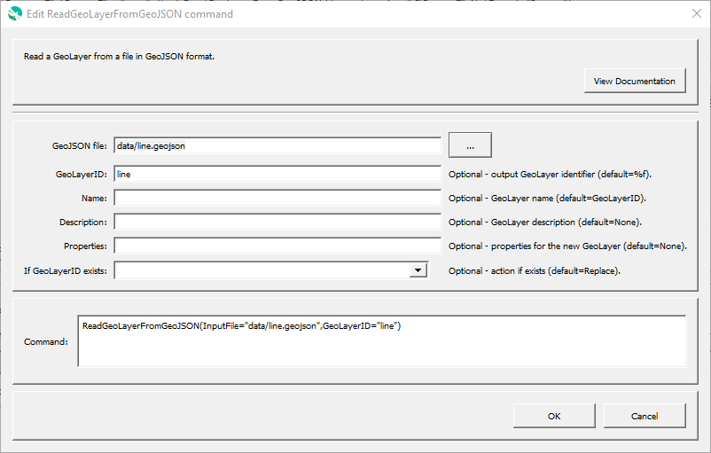

# GeoProcessor / Command / ReadGeoLayerFromGeoJSON #

*   [Overview](#overview)
*   [Command Editor](#command-editor)
*   [Command Syntax](#command-syntax)
*   [Examples](#examples)
*   [Troubleshooting](#troubleshooting)
*   [See Also](#see-also)

-------------------------

## Overview ##

The `ReadGeoLayerFromGeoJSON` command reads a [GeoLayer](../../introduction/introduction.md#geolayer)
from a file or URL in [GeoJSON format](../../spatial-data-format-ref/GeoJSON/GeoJSON.md). 

The command is able to read original (2008) GeoJSON specification and
latest [RFC 7946 specification](https://tools.ietf.org/html/rfc7946).
Therefore, the command can be used with
[`WriteGeoLayerToGeoJSON`](../WriteGeoLayerToGeoJSON/WriteGeoLayerToGeoJSON.md)
command to convert a GeoJSON file from old to new specification.

## Command Editor ##

The following dialog is used to edit the command and illustrates the command syntax.

**<p style="text-align: center;">

</p>**

**<p style="text-align: center;">
`ReadGeoLayerFromGeoJSON` Command Editor (<a href="../ReadGeoLayerFromGeoJSON.png">see full-size image</a>)
</p>**

## Command Syntax ##

The command syntax is as follows:

```text
ReadGeoLayerFromGeoJSON(Parameter="Value",...)
```
**<p style="text-align: center;">
Command Parameters
</p>**

|**Parameter**&nbsp;&nbsp;&nbsp;&nbsp;&nbsp;&nbsp;&nbsp;&nbsp;&nbsp;&nbsp;&nbsp;&nbsp;&nbsp;&nbsp;&nbsp;&nbsp;&nbsp;&nbsp;&nbsp;&nbsp;&nbsp; | **Description** | **Default**&nbsp;&nbsp;&nbsp;&nbsp;&nbsp;&nbsp;&nbsp;&nbsp;&nbsp;&nbsp; |
| --------------|-----------------|----------------- |
| `InputFile`<br>**required**| The GeoJSON file or URL to read (relative or absolute path). [`${Property}` syntax](../../introduction/introduction.md#geoprocessor-properties-property) is recognized.| None - must be specified. |
| `GeoLayerID` | A GeoLayer identifier. [Formatting characters](../../introduction/introduction.md#geolayer-property-format-specifiers) and [`${Property}` syntax](../../introduction/introduction.md#geoprocessor-properties-property) is recognized. Refer to [documentation](../../best-practices/geolayer-identifiers.md) for best practices on naming GeoLayer identifiers.| The GeoJSON filename without the leading path and without the file extension. (Formatting character `%f`)|
| `Name` | Name of the output GeoLayer. | `NewGeoLayerID` |
| `Description` | Description for the output GeoLayer. | |
| `Properties` | Additional properties to assign to the GeoLayer, using format: `prop1:value1,prop2:'string with space'`.  Can use `${Property}` notation.  | No additional properties are assigned. |
| `IfGeoLayerIDExists` | The action that occurs if the `GeoLayerID` already exists within the GeoProcessor:<ul><li>`Replace` - The existing GeoLayer within the GeoProcessor is replaced with the new GeoLayer. No warning is logged.</li><li>`ReplaceAndWarn` - The existing GeoLayer within the GeoProcessor is replaced with the new GeoLayer. A warning is logged.</li><li>`Warn` - The new GeoLayer is not created. A warning is logged.</li><li>`Fail` - The new GeoLayer is not created. A fail message is logged.</li></ul> | `Replace` | 

## Examples ##

See the [automated tests](https://github.com/OpenWaterFoundation/owf-app-geoprocessor-python-test/tree/main/test/commands/ReadGeoLayerFromGeoJSON).

### Example 1: Read a GeoLayer from a GeoJSON File ###

```
ReadGeoLayerFromGeoJSON(InputFile="ExampleFile1.geojson")
```

After running the command, the following GeoLayer IDs are registered within the GeoProcessor. 

|Registered GeoLayer IDs|
|------|
|ExampleFile1|

### Example 2: Assign a Unique GeoLayer ID###

```
ReadGeoLayerFromGeoJSON(InputFile="ExampleFile1.geojson",GeoLayerID="StateBoundary")
```

After running the command, the following GeoLayer IDs are registered within the GeoProcessor. 

|Registered GeoLayer IDs|
|------|
|StateBoundary|

## Troubleshooting ##

## See Also ##

*   The GeoLayers are read using the [GDAL GeoJSON driver](https://gdal.org/drivers/vector/geojson.html#vector-geojson)
*   [`WriteGeoLayerToGeoJSON`](../WriteGeoLayerToGeoJSON/WriteGeoLayerToGeoJSON.md) command
