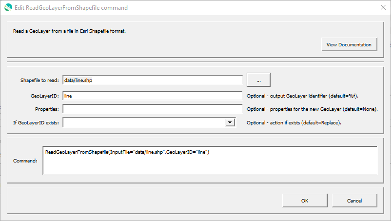

# GeoProcessor / Command / ReadGeoLayerFromShapefile #

* [Overview](#overview)
* [Command Editor](#command-editor)
* [Command Syntax](#command-syntax)
* [Examples](#examples)
* [Troubleshooting](#troubleshooting)
* [See Also](#see-also)

-------------------------

## Overview ##

The `ReadGeoLayerFromShapefile` command reads a [GeoLayer](../../introduction/introduction.md#geolayer)
from a file in [Esri Shapefile format](../../spatial-data-format-ref/EsriShapefile/EsriShapefile.md). 

* The coordinate reference system of the shapefile is retained within the GeoLayer.
* The attributes of the shapefile are retained within the GeoLayer.

## Command Editor ##

The following dialog is used to edit the command and illustrates the command syntax.

**<p style="text-align: center;">

</p>**

**<p style="text-align: center;">
`ReadGeoLayerFromShapefile` Command Editor (<a href="../ReadGeoLayerFromShapefile.png">see full-size image</a>)
</p>**

## Command Syntax ##

The command syntax is as follows:

```text
ReadGeoLayerFromShapefile(Parameter="Value",...)
```
**<p style="text-align: center;">
Command Parameters
</p>**

|**Parameter**&nbsp;&nbsp;&nbsp;&nbsp;&nbsp;&nbsp;&nbsp;&nbsp;&nbsp;&nbsp;&nbsp;&nbsp;&nbsp;&nbsp;&nbsp;&nbsp;&nbsp;&nbsp;&nbsp;&nbsp;&nbsp; | **Description** | **Default**&nbsp;&nbsp;&nbsp;&nbsp;&nbsp;&nbsp;&nbsp;&nbsp;&nbsp;&nbsp; |
| --------------|-----------------|----------------- |
| `SpatialDataFile` <br>**required**| The Esri Shapefile to read (relative or absolute path; must end in `.shp`). [`${Property}` syntax](../../introduction/introduction.md#geoprocessor-properties-property) is recognized.| None - must be specified. |
| `GeoLayerID`| A GeoLayer identifier. [Formatting characters](../../introduction/introduction.md#geolayer-property-format-specifiers) and [`${Property}` syntax](../../introduction/introduction.md#geoprocessor-properties-property) are recognized. Refer to [documentation](../../best-practices/geolayer-identifiers.md) for best practices on naming GeoLayer identifiers.| The shapefile filename without the leading path and without the file extension. (Formatting character `%f`)|
|`IfGeoLayerIDExists`|The action that occurs if the `GeoLayerID` already exists within the GeoProcessor:<ul><li>`Replace` - The existing GeoLayer within the GeoProcessor is replaced with the new GeoLayer. No warning is logged.</li><li>`ReplaceAndWarn` - The existing GeoLayer within the GeoProcessor is replaced with the new GeoLayer. A warning is logged.</li><li>`Warn` - The new GeoLayer is not created. A warning is logged.</li><li>`Fail` - The new GeoLayer is not created. A fail message is logged.</li></ul> | `Replace` | 

## Examples ##

See the [automated tests](https://github.com/OpenWaterFoundation/owf-app-geoprocessor-python-test/tree/master/test/commands/ReadGeoLayerFromShapefile).

The following folder, `ExampleFolder`, and its contents are used for the examples. 
The `ExampleFolder` is not an actual existing folder.
It is used in this documentation to explain how the [`ReadGeoLayerFromShapefile`](../ReadGeoLayerFromShapefile/ReadGeoLayerFromShapefile.md)
command interacts with similar, existing folders on your local machine.

**<p style="text-align: left;">
ExampleFolder
</p>**

|Filename|File Type|
| ---- | ----|
| ExampleFile1.shp     | Shapefile	|
| ExampleFile1.shx		| Shapefile component file|
| ExampleFile1.dbf		| Shapefile component file |
| ExampleFile1.prj 		| Shapefile component file |

### Example 1: Read a GeoLayer from a Shapefile ###

```
ReadGeoLayerFromShapefile(SpatialDataFile = "ExampleFolder/ExampleFile1.shp")
```

After running the command, the following GeoLayer IDs are registered within the GeoProcessor. 

|Registered GeoLayer IDs|
|------|
|ExampleFile1|

### Example 2: Assign a Unique GeoLayer ID  ###

```
ReadGeoLayerFromShapefile(SpatialDataFile = "ExampleFolder/ExampleFile1.shp", GeoLayerID = "StateBoundary")
```

After running the command, the following GeoLayer IDs are registered within the GeoProcessor. 

|Registered GeoLayer IDs|
|------|
|StateBoundary|

### Example 3: Invalid SpatialDataFile Value ###

```
ReadGeoLayerFromShapefile(SpatialDataFile = "ExampleFolder/ExampleFile1.shx",GeoLayerID = "StateBoundary")
```

After running the command, no GeoLayerIDs are registered within the GeoProcessor because the `SpatialDataFile` directs to a `.shx` file rather than a `.shp` file. 

|Registered GeoLayer IDs|
|------|
||

## Troubleshooting ##

## See Also ##

* The GeoLayers are read using the [`QGIS QgsVectorLayer Class`](https://qgis.org/api/classQgsVectorLayer.html).
See [documentation](https://docs.qgis.org/2.14/en/docs/pyqgis_developer_cookbook/loadlayer.html#vector-layers)
for examples on utilizing the `QgsVectorLayer` class in the PyQGIS environment.
* [`WriteGeoLayerToShapefile`](../WriteGeoLayerToShapefile/WriteGeoLayerToShapefile.md) command
