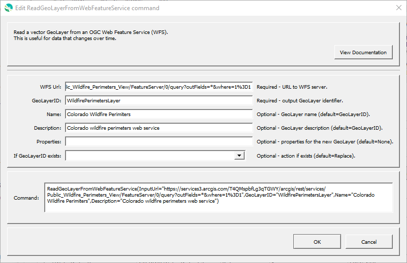

# GeoProcessor / Command / ReadGeoLayerFromWebFeatureService #

* [Overview](#overview)
* [Command Editor](#command-editor)
* [Command Syntax](#command-syntax)
* [Examples](#examples)
* [Troubleshooting](#troubleshooting)
* [See Also](#see-also)

-------------------------

## Overview ##

The `ReadGeoLayerFromWebFeatureService` command reads a [GeoLayer](../../introduction/introduction.md#geolayer)
from a [Web Feature Service](https://en.wikipedia.org/wiki/Web_Feature_Service).

This command is currently only used to make the GeoProcessor aware of a WFS layer to allow creating maps.
The URL for the WFS is used in the map configuration file.

## Command Editor ##

The following dialog is used to edit the command and illustrates the command syntax.

**<p style="text-align: center;">

</p>**

**<p style="text-align: center;">
`ReadGeoLayerFromWebFeatureService` Command Editor (<a href="../ReadGeoLayerFromWebFeatureService.png">see full-size image</a>)
</p>**

## Command Syntax ##

The command syntax is as follows:

```text
ReadGeoLayerFromWebFeatureService(Parameter="Value",...)
```
**<p style="text-align: center;">
Command Parameters
</p>**

|**Parameter**&nbsp;&nbsp;&nbsp;&nbsp;&nbsp;&nbsp;&nbsp;&nbsp;&nbsp;&nbsp;&nbsp;&nbsp;&nbsp;&nbsp;&nbsp;&nbsp;&nbsp;&nbsp;&nbsp;&nbsp;&nbsp; | **Description** | **Default**&nbsp;&nbsp;&nbsp;&nbsp;&nbsp;&nbsp;&nbsp;&nbsp;&nbsp;&nbsp; |
| --------------|-----------------|----------------- |
| `InputUrl`<br>**required**| The Web Feature Service (WFS) URL to read. [`${Property}` syntax](../../introduction/introduction.md#geoprocessor-properties-property) is recognized.| None - must be specified. |
| `GeoLayerID` | A GeoLayer identifier. [`${Property}` syntax](../../introduction/introduction.md#geoprocessor-properties-property) is recognized. Refer to [documentation](../../best-practices/geolayer-identifiers.md) for best practices on naming GeoLayer identifiers.| None - must be specified. |
| `Name` | Name of the output GeoLayer. | `GeoLayerID` |
| `Description` | Description for the output GeoLayer. | |
| `Properties` | Additional properties to assign to the GeoLayer, using format: `prop1:value1,prop2:'string with space'`.  Can use `${Property}` notation.  | No additional properties are assigned. |
| `IfGeoLayerIDExists` | The action that occurs if the `GeoLayerID` already exists within the GeoProcessor:<ul><li>`Replace` - The existing GeoLayer within the GeoProcessor is replaced with the new GeoLayer. No warning is logged.</li><li>`ReplaceAndWarn` - The existing GeoLayer within the GeoProcessor is replaced with the new GeoLayer. A warning is logged.</li><li>`Warn` - The new GeoLayer is not created. A warning is logged.</li><li>`Fail` - The new GeoLayer is not created. A fail message is logged.</li></ul> | `Replace` | 

## Examples ##

See the [automated tests](https://github.com/OpenWaterFoundation/owf-app-geoprocessor-python-test/tree/master/test/commands/ReadGeoLayerFromWebFeatureService).

## Troubleshooting ##

## See Also ##

* [`ReadRasterGeoLayerFromTileMapService`](../ReadRasterGeoLayerFromTileMapService/ReadRasterGeoLayerFromTileMapService.md) command
* [`ReadRasterGeoLayerFromWebMapService`](../ReadRasterGeoLayerFromWebMapService/ReadRasterGeoLayerFromWebMapService.md) command
