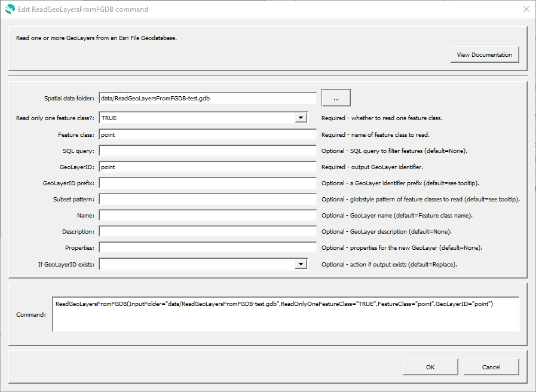

# GeoProcessor / Command / ReadGeoLayersFromFGDB #

* [Overview](#overview)
* [Command Editor](#command-editor)
* [Command Syntax](#command-syntax)
* [Examples](#examples)
* [Troubleshooting](#troubleshooting)
* [See Also](#see-also)

-------------------------

## Overview ##

The `ReadGeoLayersFromFGDB` command reads one or more [GeoLayer(s)](../../introduction/introduction.md#geolayer)
from an [Esri File Geodatabase](../../spatial-data-format-ref/EsriFileGeodatabase/EsriFileGeodatabase.md).

## Command Editor ##

The following dialog is used to edit the command and illustrates the command syntax.

**<p style="text-align: center;">

</p>**

**<p style="text-align: center;">
`ReadGeoLayersFromFGDB` Command Editor (<a href="../ReadGeoLayersFromFGDB.png">see full-size image</a>)
</p>**

## Command Syntax ##

The command syntax is as follows:

```text
ReadGeoLayerFromFGDB(Parameter="Value",...)
```
**<p style="text-align: center;">
Command Parameters
</p>**

| **Parameter**&nbsp;&nbsp;&nbsp;&nbsp;&nbsp;&nbsp;&nbsp;&nbsp;&nbsp;&nbsp;&nbsp;&nbsp;&nbsp;&nbsp;&nbsp;&nbsp;&nbsp;&nbsp;&nbsp;&nbsp;&nbsp;&nbsp;&nbsp;&nbsp;&nbsp;&nbsp;&nbsp;&nbsp;&nbsp;&nbsp;&nbsp;&nbsp; | **Description** &nbsp;&nbsp;&nbsp;&nbsp;&nbsp;&nbsp;&nbsp;&nbsp;&nbsp;&nbsp;&nbsp;&nbsp;&nbsp;&nbsp;&nbsp;&nbsp;&nbsp;&nbsp;&nbsp;&nbsp;| **Default** |
| --------------|-----------------|----------------- |
| `InputFolder`<br>**required** | The file geodatabase to read (must end in `.gdb`). | None - must be specified. |
| `ReadOnlyOneFeatureClass`<br>**required** | Boolean <br><br> If `TRUE`, only **one** feature class will be read as a GeoLayer. Must specify a valid feature class name. <br> If `FALSE`, **one or more** feature classes will be read as GeoLayers. Can specify the `Subset_Pattern` to select which feature classes to read.|
| `IfGeoLayerIDExists` | The action that occurs if the `GeoLayerID` already exists within the GeoProcessor:<ul><li>`Replace` - The existing GeoLayer within the GeoProcessor is replaced with the new GeoLayer. No warning is logged.</li><li>`ReplaceAndWarn` - The existing GeoLayer within the GeoProcessor is replaced with the new GeoLayer. A warning is logged.</li><li>`Warn` - The new GeoLayer is not created. A warning is logged.</li><li>`Fail` - The new GeoLayer is not created. A fail message is logged.</li></ul>| `Replace` |
||**IF** `ReadOnlyOneFeatureClass` **is TRUE ...**||
| `Feature Class` <br>**required** | The name of the feature class within the file geodatabase to read. [`${Property}` syntax](../../introduction/introduction.md#geoprocessor-properties-property) is recognized.| None - must be specified. |
| `Query` | An SQL-like string to filter the features read from the geodatabase. | |
| `GeoLayerID`  <br>**required** | A GeoLayer identifier. [Formatting characters](../../introduction/introduction.md#geolayer-property-format-specifiers) and [`${Property}` syntax](../../introduction/introduction.md#geoprocessor-properties-property) are recognized. Refer to [documentation](../../best-practices/geolayer-identifiers.md) for best practices on naming GeoLayer identifiers.| None - must be specified. |
||**IF** `ReadOnlyOneFeatureClass` **is FALSE ...**||
| `GeoLayerID_prefix` | A GeoLayer identifier prefix. <br><br> GeoLayers read from a file geodatabase have an identifier in the `GeoLayerID_prefix_FeatureClass` format.| No prefix is used. The GeoLayerID is the name of the feature class. |
| `Subset_Pattern` | The [glob-style](https://en.wikipedia.org/wiki/Glob_(programming)) pattern (e.g., `CO_*` or `*_[MC]O`) of feature classes to read from the file geodatabase.| No pattern is used. All feature classes within the file geodatabase are read. |
| `Name` | Name of the output GeoLayer. | Feature class name. |
| `Description` | Description for the output GeoLayer. | |
| `Properties` | Additional properties to assign to the GeoLayer, using format: `prop1:value1,prop2:'string with space'`.  Can use `${Property}` notation.  | No additional properties are assigned. |

## Examples ##

The following folder, `ExampleFolder`, and its contents are used for the examples. 
The `ExampleFolder` is not an actual existing folder.
It is used in this documentation to explain how the `ReadGeoLayersFromFGDB`
command interacts with similar, existing folders on the computer.

**<p style="text-align: left;">
ExampleFolder
</p>**

|Filename|File Type|
| ---- | ----|
| ExampleFileGDB.gdb | Esri File Geodatabase |

**<p style="text-align: left;">
ExampleFileGDB.gdb
</p>**

|Feature Class|
| ---- |
|ExampleFeatureClass1|
|ExampleFeatureClass2|
|ExampleFeatureClass3|

### Example 1: Read All Feature Classes from a File Geodatabase ###

See the [automated tests](https://github.com/OpenWaterFoundation/owf-app-geoprocessor-python-test/tree/master/test/commands/ReadGeoLayersFromFGDB).

```
ReadGeoLayersFromFGDB(InputFolder="ExampleFolder/ExampleFileGDB.gdb")
```

After running the command, the following GeoLayer IDs are registered within the GeoProcessor. 

|Registered GeoLayer IDs|
|------|
|ExampleFeatureClass1|
|ExampleFeatureClass2|
|ExampleFeatureClass3|

### Example 2: Add a Prefix to the GeoLayer IDs ###

```
ReadGeoLayersFromFGDB(InputFolder="ExampleFolder/ExampleFileGDB.gdb",GeoLayerID_Prefix="StateData")
```

After running the command, the following GeoLayer IDs are registered within the GeoProcessor. Each of the registered GeoLayer IDs include the `StateData` prefix.

|Registered GeoLayer IDs|
|------|
|StateData_ExampleFeatureClass1|
|StateData_ExampleFeatureClass2|
|StateData_ExampleFeatureClass3|

### Example 3: Read a Subset of Feature Classes From a File Geodatabase ###

```
ReadGeoLayersFromFGDB(InputFolder="ExampleFolder/ExampleFileGDB.gdb",Subset_Pattern="*3")
```

After running the command, the following GeoLayer IDs are registered within the GeoProcessor.
`ExampleFeatureClass1` and `ExampleFeatureClass2` are not included in the registered GeoLayer IDs
becasue the `Subset_Pattern` parameter only includes feature classes that end in `3`. 

|Registered GeoLayer IDs|
|------|
|ExampleFeatureClass3|

## Troubleshooting ##

## See Also ##

* The GeoLayers are read using the [GDAL ESRI File Geodatabase (OpenFileGDB) driver`](https://gdal.org/drivers/vector/openfilegdb.html#vector-openfilegdb)
