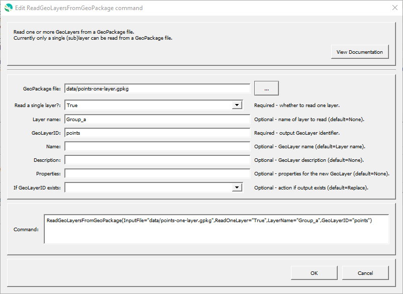

# GeoProcessor / Command / ReadGeoLayersFromGeoPackage #

* [Overview](#overview)
* [Command Editor](#command-editor)
* [Command Syntax](#command-syntax)
* [Examples](#examples)
* [Troubleshooting](#troubleshooting)
* [See Also](#see-also)

-------------------------

## Overview ##

The `ReadGeoLayersFromGeoPackage` command reads one or more [GeoLayer(s)](../../introduction/introduction.md#geolayer)
from a [GeoPackage file](../../spatial-data-format-ref/GeoPackage/GeoPackage.md).

Currently the command is limited to reading a single GeoLayer.
Additional functionality will be added in the future.

## Command Editor ##

The following dialog is used to edit the command and illustrates the command syntax.

**<p style="text-align: center;">

</p>**

**<p style="text-align: center;">
`ReadGeoLayersFromGeoPackage` Command Editor (<a href="../ReadGeoLayersFromGeoPackage.png">see full-size image</a>)
</p>**

## Command Syntax ##

The command syntax is as follows:

```text
ReadGeoLayerFromFGDB(Parameter="Value",...)
```
**<p style="text-align: center;">
Command Parameters
</p>**

| **Parameter**&nbsp;&nbsp;&nbsp;&nbsp;&nbsp;&nbsp;&nbsp;&nbsp;&nbsp;&nbsp;&nbsp;&nbsp;&nbsp;&nbsp;&nbsp;&nbsp;&nbsp;&nbsp;&nbsp;&nbsp;&nbsp;&nbsp;&nbsp;&nbsp;&nbsp;&nbsp;&nbsp;&nbsp;&nbsp;&nbsp;&nbsp;&nbsp; | **Description** &nbsp;&nbsp;&nbsp;&nbsp;&nbsp;&nbsp;&nbsp;&nbsp;&nbsp;&nbsp;&nbsp;&nbsp;&nbsp;&nbsp;&nbsp;&nbsp;&nbsp;&nbsp;&nbsp;&nbsp;| **Default** |
| --------------|-----------------|----------------- |
| `InputFile`<br>**required** | The GeoPackage file to read. | None - must be specified. |
| `ReadOneLayer`<br>**required** | Whether to read one layer from the file:<ul><li>`True` - only **one** layer will be read as a GeoLayer.</li><li>`False` - **one or more** layers will be read as GeoLayers. |
| `LayerName` | Layer name to read. | |
| `GeoLayerID`<br>**required** | A GeoLayer identifier. [Formatting characters](../../introduction/introduction.md#geolayer-property-format-specifiers) and [`${Property}` syntax](../../introduction/introduction.md#geoprocessor-properties-property) are recognized. Refer to [documentation](../../best-practices/geolayer-identifiers.md) for best practices on naming GeoLayer identifiers. | None - must be specified. |
| `Name` | Name for the output GeoLayer(s). |
| `Description` | Description for the output GeoLayer(s). |
| `Properties` | Properties for the output GeoLayer(s). |
| `IfGeoLayerIDExists` | The action that occurs if the `GeoLayerID` already exists within the GeoProcessor:<ul><li>`Replace` - The existing GeoLayer within the GeoProcessor is replaced with the new GeoLayer. No warning is logged.</li><li>`ReplaceAndWarn` - The existing GeoLayer within the GeoProcessor is replaced with the new GeoLayer. A warning is logged.</li><li>`Warn` - The new GeoLayer is not created. A warning is logged.</li><li>`Fail` - The new GeoLayer is not created. A fail message is logged.</li></ul>| `Replace` |

## Examples ##

See the [automated tests](https://github.com/OpenWaterFoundation/owf-app-geoprocessor-python-test/tree/master/test/commands/ReadGeoLayersFromGeoPackage).

## Troubleshooting ##

## See Also ##

* GeoLayers are read usin the [GDAL GeoPackage driver](https://gdal.org/drivers/vector/gpkg.html#vector-gpkg).
* [GeoPackage](../../spatial-data-format-ref/GeoPackage/GeoPackage.md) format
