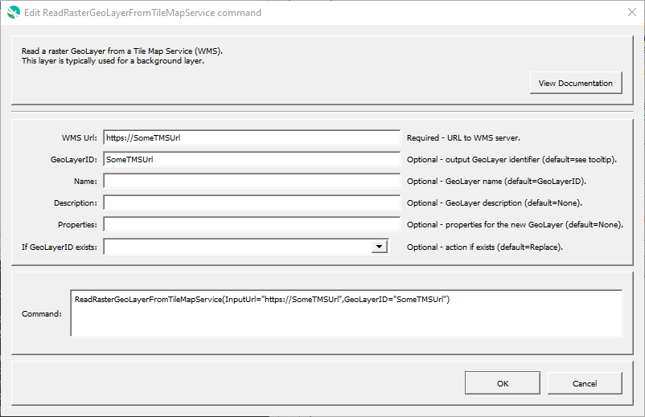

# GeoProcessor / Command / ReadRasterGeoLayerFromTileMapService #

*   [Overview](#overview)
*   [Command Editor](#command-editor)
*   [Command Syntax](#command-syntax)
    +   [Tile Map Service URLs](#tile-map-service-urls)
*   [Examples](#examples)
*   [Troubleshooting](#troubleshooting)
*   [See Also](#see-also)

-------------------------

## Overview ##

The `ReadRasterGeoLayerFromTileMapService` command reads a [GeoLayer](../../introduction/introduction.md#geolayer)
from a [Tile Map Service](https://en.wikipedia.org/wiki/Tile_Map_Service) (TMS).

This command is currently only used to make the GeoProcessor aware of a TMS layer to allow creating maps.
The URL for the TMS is used in the map configuration file.

## Command Editor ##

The following dialog is used to edit the command and illustrates the command syntax.

**<p style="text-align: center;">

</p>**

**<p style="text-align: center;">
`ReadRasterGeoLayerFromTileMapService` Command Editor (<a href="../ReadRasterGeoLayerFromTileMapService.png">see full-size image</a>)
</p>**

## Command Syntax ##

The command syntax is as follows:

```text
ReadRasterGeoLayerFromTileMapService(Parameter="Value",...)
```
**<p style="text-align: center;">
Command Parameters
</p>**

|**Parameter**&nbsp;&nbsp;&nbsp;&nbsp;&nbsp;&nbsp;&nbsp;&nbsp;&nbsp;&nbsp;&nbsp;&nbsp;&nbsp;&nbsp;&nbsp;&nbsp;&nbsp;&nbsp;&nbsp;&nbsp;&nbsp; | **Description** | **Default**&nbsp;&nbsp;&nbsp;&nbsp;&nbsp;&nbsp;&nbsp;&nbsp;&nbsp;&nbsp; |
| --------------|-----------------|----------------- |
| `InputUrl`<br>**required**| The Tile Map Service (WMS) URL to read. [`${Property}` syntax](../../introduction/introduction.md#geoprocessor-properties-property) is recognized.  See the table below for useful tile service URLs. | None - must be specified. |
| `GeoLayerID` | A GeoLayer identifier. [Formatting characters](../../introduction/introduction.md#geolayer-property-format-specifiers) and [`${Property}` syntax](../../introduction/introduction.md#geoprocessor-properties-property) is recognized. Refer to [documentation](../../best-practices/geolayer-identifiers.md) for best practices on naming GeoLayer identifiers.| None - must be specified. |
| `Name` | Name of the output GeoLayer. | `GeoLayerID` |
| `Description` | Description for the output GeoLayer. | |
| `Properties` | Additional properties to assign to the GeoLayer, using format: `prop1:value1,prop2:'string with space'`.  Can use `${Property}` notation.  | No additional properties are assigned. |
| `IfGeoLayerIDExists` | The action that occurs if the `GeoLayerID` already exists within the GeoProcessor:<ul><li>`Replace` - The existing GeoLayer within the GeoProcessor is replaced with the new GeoLayer. No warning is logged.</li><li>`ReplaceAndWarn` - The existing GeoLayer within the GeoProcessor is replaced with the new GeoLayer. A warning is logged.</li><li>`Warn` - The new GeoLayer is not created. A warning is logged.</li><li>`Fail` - The new GeoLayer is not created. A fail message is logged.</li></ul> | `Replace` | 

### Tile Map Service URLs ###

The following are useful tile map services.
The GeoLayer `sourcePath` in a [GeoMapProject]( ../../appendix-geomapproject/geomapproject.md)
file will be set to the `InputUrl` command parameter value.

**<p style="text-align: center;">
Useful Tile Map Services
</p>**

| **Provider** | **Layer Type** | **`sourcePath` URL (enabled links allow preview)** |
| -- | -- | -- |
| Esri | DarkGray | [https://services.arcgisonline.com/ArcGIS/rest/services/Canvas/World_Dark_Gray_Base/MapServer/tile/{z}/{y}/{x}](https://services.arcgisonline.com/ArcGIS/rest/services/Canvas/World_Dark_Gray_Base/MapServer/tile/{z}/{y}/{x}) |
| Esri | Gray | [https://services.arcgisonline.com/ArcGIS/rest/services/Canvas/World_Light_Gray_Base/MapServer/tile/{z}/{y}/{x}](https://services.arcgisonline.com/ArcGIS/rest/services/Canvas/World_Light_Gray_Base/MapServer/tile/{z}/{y}/{x}) |
| Esri | Imagery | [https://services.arcgisonline.com/ArcGIS/rest/services/World_Imagery/MapServer/tile/{z}/{y}/{x}](https://services.arcgisonline.com/ArcGIS/rest/services/World_Imagery/MapServer/tile/{z}/{y}/{x}) |
| Esri | ImageryClarity | [https://clarity.maptiles.arcgis.com/arcgis/rest/services/World_Imagery/MapServer/tile/{z}/{y}/{x}](https://clarity.maptiles.arcgis.com/arcgis/rest/services/World_Imagery/MapServer/tile/{z}/{y}/{x}) |
| Esri | ImageryFirefly | [https://fly.maptiles.arcgis.com/arcgis/rest/services/World_Imagery_Firefly/MapServer/tile/{z}/{y}/{x}](https://fly.maptiles.arcgis.com/arcgis/rest/services/World_Imagery_Firefly/MapServer/tile/{z}/{y}/{x}) |
| Esri | NationalGeographic | [https://services.arcgisonline.com/ArcGIS/rest/services/NatGeo_World_Map/MapServer/tile/{z}/{y}/{x}](https://services.arcgisonline.com/ArcGIS/rest/services/NatGeo_World_Map/MapServer/tile/{z}/{y}/{x}) |
| Esri | Oceans | [https://services.arcgisonline.com/arcgis/rest/services/Ocean/World_Ocean_Base/MapServer/tile/{z}/{y}/{x}](https://services.arcgisonline.com/arcgis/rest/services/Ocean/World_Ocean_Base/MapServer/tile/{z}/{y}/{x}) |
| Esri | ShadedRelief | [https://services.arcgisonline.com/ArcGIS/rest/services/World_Shaded_Relief/MapServer/tile/{z}/{y}/{x}](https://services.arcgisonline.com/ArcGIS/rest/services/World_Shaded_Relief/MapServer/tile/{z}/{y}/{x}) |
| Esri | Streets | [https://services.arcgisonline.com/ArcGIS/rest/services/World_Street_Map/MapServer/tile/{z}/{y}/{x}](https://services.arcgisonline.com/ArcGIS/rest/services/World_Street_Map/MapServer/tile/{z}/{y}/{x}) |
| Esri | Terrain | [https://services.arcgisonline.com/ArcGIS/rest/services/World_Terrain_Base/MapServer/tile/{z}/{y}/{x}](https://services.arcgisonline.com/ArcGIS/rest/services/World_Terrain_Base/MapServer/tile/{z}/{y}/{x}) |
| Esri | Topographic | [https://services.arcgisonline.com/ArcGIS/rest/services/World_Topo_Map/MapServer/tile/{z}/{y}/{x}](https://services.arcgisonline.com/ArcGIS/rest/services/World_Topo_Map/MapServer/tile/{z}/{y}/{x}]) |
| Google | Hybrid (Streets + Satellite)  | http://mt0.google.com/vt/lyrs=s,h&x={x}&y={y}&z={z} |
| Google | Satellite | http://mt0.google.com/vt/lyrs=s&x={x}&y={y}&z={z} |
| Google | Streets | http://mt0.google.com/vt/lyrs=m&x={x}&y={y}&z={z} |
| Google | Terrain | http://mt0.google.com/vt/lyrs=p&x={x}&y={y}&z={z} |
| USGS | Topo | https://basemap.nationalmap.gov/ArcGIS/rest/services/USGSTopo/MapServer/tile/{z}/{y}/{x} |

## Examples ##

See the [automated tests](https://github.com/OpenWaterFoundation/owf-app-geoprocessor-python-test/tree/main/test/commands/ReadRasterGeoLayerFromTileMapService).

## Troubleshooting ##

## See Also ##

*   [`ReadRasterGeoLayerFromWebMapService`](../ReadRasterGeoLayerFromWebMapService/ReadRasterGeoLayerFromWebMapService.md) command
