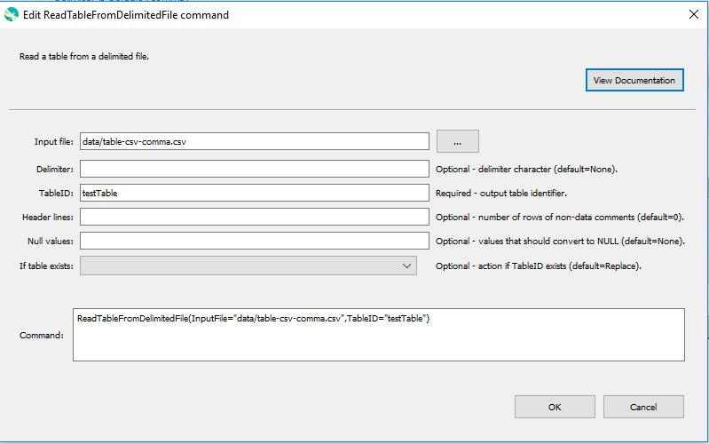

# GeoProcessor / Command / ReadTableFromDelimitedFile #

*   [Overview](#overview)
*   [Command Editor](#command-editor)
*   [Command Syntax](#command-syntax)
*   [Examples](#examples)
*   [Troubleshooting](#troubleshooting)
*   [See Also](#see-also)

-------------------------

## Overview ##

The `ReadTableFromDelimitedFile` command reads a [Table](../../introduction/introduction.md#table)
from a [delimited file](https://en.wikipedia.org/wiki/Delimiter-separated_values).

*   All rows and columns from the delimited file are read into the Table.
*   Use the `Delimiter` parameter to specify the delimiter of the delimited file. 
*   Use the `HeaderLines` parameter to specify the number of initial lines representing non-data comments. 
*   Use the `NullValues` parameter to specify the string values within the delimited file that should
    be converted to `NULL` values. The Python `None` will be used internally.

## Command Editor ##

The following dialog is used to edit the command and illustrates the command syntax.

**<p style="text-align: center;">

</p>**

**<p style="text-align: center;">
`ReadTableFromDelimitedFile` Command Editor (<a href="../ReadTableFromDelimitedFile.png">see full-size image</a>)
</p>**

## Command Syntax ##

The command syntax is as follows:

```text
ReadTableFromDelimitedFile(Parameter="Value",...)
```
**<p style="text-align: center;">
Command Parameters
</p>**

|**Parameter**&nbsp;&nbsp;&nbsp;&nbsp;&nbsp;&nbsp;&nbsp;&nbsp;&nbsp;&nbsp;&nbsp;&nbsp;&nbsp;&nbsp;&nbsp;&nbsp;&nbsp;&nbsp;&nbsp;&nbsp;&nbsp;&nbsp;&nbsp;&nbsp;&nbsp;&nbsp;&nbsp;&nbsp; | **Description** | **Default**&nbsp;&nbsp;&nbsp;&nbsp;&nbsp;&nbsp;&nbsp;&nbsp;&nbsp;&nbsp;&nbsp;&nbsp;&nbsp;&nbsp;&nbsp;&nbsp;&nbsp;&nbsp;&nbsp;&nbsp;&nbsp;&nbsp;&nbsp;&nbsp;&nbsp;&nbsp;&nbsp;&nbsp;&nbsp;&nbsp;&nbsp;&nbsp;&nbsp;&nbsp;&nbsp;&nbsp;&nbsp;&nbsp;&nbsp;&nbsp; |
| --------------|-----------------|----------------- |
|`InputFile` <br>**required**| The delimited file (relative or absolute path) to read. [`${Property}` syntax](../../introduction/introduction.md#geoprocessor-properties-property) is recognized. | None - must be specified. |
|`Delimiter` | The delimiter character of the input delimited file.|`,` (*comma*)|
|`TableID` <br> **required**| A Table identifier. Refer to [documentation](../../best-practices/table-identifiers.md) for best practices on naming Table identifiers.|None - must be specified. |
|`SkipLines` | Indicates the number of lines in the file to skip, which otherwise would interfere with reading row data. Individual row numbers and ranges can be specified, for example: 1,5-6,17 | No lines re skipped. |
|`HeaderLines` | **Proposed but not yet implemented.** Indicate the rows that include header information, which should be used for column names. Currently this should only be one row, although a range may be fully supported in the future. If the column names are not found in the file, use the `ColumnNames` parameter. | First non-comment data line is used for column names unless `ColumnNames` is provided. |
|`ColumnNames` | Column names, separated by commas. Use this parameter when column names are not provided in the data file with the `HeaderLinees` parameter (or `HeaderLines` default behavior). | |
|`FloatColumns` | List of comma-separated column names for columns that should be treated as containing floating-point values. Can be specified using `${Property}`. | Automatically determine column types from data. |
|`IntegerColumns` | List of comma-separated column names for columns that should be treated as containing integer values. Can be specified using `${Property}`. | Automatically determine column types from data. |
|`TextColumns` | List of comma-separated column names for columns that should be treated as containing text values. Can be specified using `${Property}`. | Automatically determine column types from data. |
|`Top` | Specify the number of data rows to read, useful when prototyping an analysis process. | Process all rows. |
|`RowCountProperty` | The name of the property to set to the number of rows read, useful for looping and error-checks. | Don't set property. |
|`IfTableIDExists` |The action that occurs if the `TableID` already exists within the GeoProcessor.<ul><li>`Replace` - The existing Table within the GeoProcessor is replaced with the new Table. No warning is logged.</li><li>`ReplaceAndWarn` - The existing Table within the GeoProcessor is replaced with the new Table. A warning is logged.</li><li>`Warn` - The new Table is not created. A warning is logged.</li><li>`Fail` - The new Table is not created. A fail message is logged.</li></ul> | `Replace` | 

## Examples ##

See the [automated tests](https://github.com/OpenWaterFoundation/owf-app-geoprocessor-python-test/tree/main/test/commands/ReadTableFromDelimitedFile).

## Troubleshooting ##

## See Also ##

*   [`WriteTableToDelimitedFile`](../WriteTableToDelimitedFile/WriteTableToDelimitedFile.md) command
