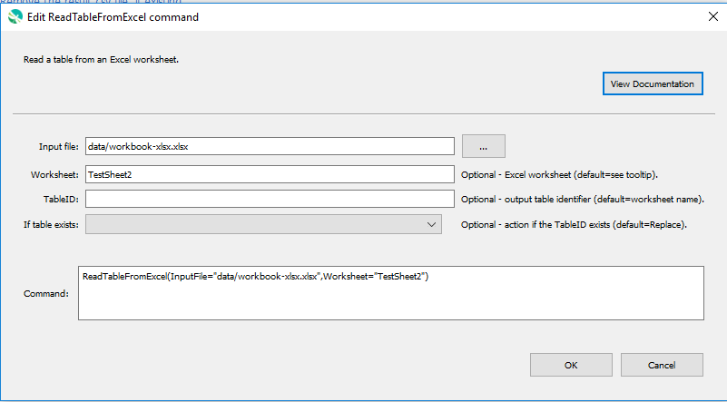

# GeoProcessor / Command / ReadTableFromExcel #

* [Overview](#overview)
* [Command Editor](#command-editor)
* [Command Syntax](#command-syntax)
* [Examples](#examples)
* [Troubleshooting](#troubleshooting)
* [See Also](#see-also)

-------------------------

## Overview ##

The `ReadTableFromExcel` command reads a [Table](../../introduction/introduction.md#table) from an Excel file. 

* The Excel worksheet to read can be specified. 
* All rows and columns from the Excel worksheet are read into the Table. 

## Command Editor ##

The following dialog is used to edit the command and illustrates the command syntax.



**<p style="text-align: center;">
`ReadTableFromExcel` Command Editor (<a href="../ReadTableFromExcel.png">see full-size image</a>)
</p>**

## Command Syntax ##

The command syntax is as follows:

```text
ReadTableFromExcel(Parameter="Value",...)
```
**<p style="text-align: center;">
Command Parameters
</p>**

|**Parameter**&nbsp;&nbsp;&nbsp;&nbsp;&nbsp;&nbsp;&nbsp;&nbsp;&nbsp;&nbsp;&nbsp;&nbsp;&nbsp;&nbsp;&nbsp;&nbsp;&nbsp;&nbsp;&nbsp;&nbsp;&nbsp; | **Description** | **Default**&nbsp;&nbsp;&nbsp;&nbsp;&nbsp;&nbsp;&nbsp;&nbsp;&nbsp;&nbsp; |
| --------------|-----------------|----------------- |
| `InputFile` <br>  **_required_**| The Excel workbook file (`.xls` or `.xlsx`) with the Excel worksheet to read (relative or absolute path). [`${Property}` syntax](../../introduction/introduction.md#geoprocessor-properties-property) is recognized.| None - must be specified. |
| `Worksheet` <br> *optional*| The name of the Excel worksheet within the Excel workbook to read.|The first worksheet in the Excel workbook.|
| `TableID` <br> *optional*| A Table identifier. Refer to [documentation](../../best-practices/table-identifiers.md) for best practices for naming Table identifiers.|The `Worksheet`.|
|`IfTableIDExists`<br> *optional*|The action that occurs if the `TableID` already exists within the GeoProcessor. <br><br> `Replace` : The existing Table within the GeoProcessor is overwritten with the new Table. No warning is logged.<br><br> `ReplaceAndWarn`: The existing Table within the GeoProcessor is overwritten with the new Table. A warning is logged. <br><br> `Warn` : The new Table is not created. A warning is logged. <br><br> `Fail` : The new Table is not created. A fail message is logged. | `Replace` | 


## Examples ##

See the [automated tests](https://github.com/OpenWaterFoundation/owf-app-geoprocessor-python-test/tree/master/test/commands/ReadTableFromExcel).

The following folder, `ExampleFolder`[^1], and its contents are used for the examples. 

[^1]: *The `ExampleFolder` is not an actual existing folder. It is used in this documentation to explain how the `ReadTableFromExcel` command interacts with similar, existing folders on your local machine.*

**<p style="text-align: left;">
ExampleFolder
</p>**

|Filename|File Type|
| ---- |---|
| ExampleFile1.xlsx |Excel Workbook|

**<p style="text-align: left;">
ExampleFile1 Excel Workbook
</p>**

|Sheet Name|
| ---- |
|Clients  |
|Products |


### Example 1: Read a Table from the first Worksheet of an Excel File ###

```
ReadTableFromExcel(InputFile = "ExampleFolder/ExampleFile1.xlsx")
```

After running the command, the following Table IDs are registered within the GeoProcessor. 

|Registered Table IDs|
|------|
|Clients|

### Example 2: Assign a Unique Table ID###

```
ReadTableFromExcel(InputFile = "ExampleFolder/ExampleFile1.geojson", TableID = "Client-Table")
```

After running the command, the following Table IDs are registered within the GeoProcessor. 

|Registered Table IDs|
|------|
|Client-Table|

### Example 3: Read a Table from a Specific Worksheet of an Excel File ###

```
ReadTableFromExcel(InputFile = "ExampleFolder/ExampleFile1.geojson", Worksheet="Products")
```

After running the command, the following Table IDs are registered within the GeoProcessor. 

|Registered Table IDs|
|------|
|Products|

## Troubleshooting ##

## See Also ##

- The Tables are read using the [`Pandas Python library`](https://pandas.pydata.org/). 
- See parallel GeoProcessor command [WriteTableToExcel](../WriteTableToExcel/WriteTableToExcel.md)
