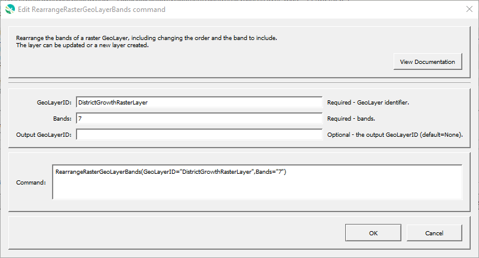

# GeoProcessor / Command / RearrangeRasterGeoLayerBands #

* [Overview](#overview)
* [Command Editor](#command-editor)
* [Command Syntax](#command-syntax)
* [Examples](#examples)
* [Troubleshooting](#troubleshooting)
* [See Also](#see-also)

-------------------------

## Overview ##

The `RearrangeRasterGeoLayerBands` command rearranges the bands of a raster GeoLayer,
including changing the order and the bands to include.
The GeoLayer can be updated or a new layer can be created.

## Command Editor ##

The following dialog is used to edit the command and illustrates the command syntax.

**<p style="text-align: center;">

</p>**

**<p style="text-align: center;">
`RearrangeRasterGeoLayerBands` Command Editor (<a href="../RearrangeRasterGeoLayerBands.png">see full-size image</a>)
</p>**

## Command Syntax ##

The command syntax is as follows:

```text
RearrangeRasterGeoLayerBands(Parameter="Value",...)
```
**<p style="text-align: center;">
Command Parameters
</p>**

|**Parameter**&nbsp;&nbsp;&nbsp;&nbsp;&nbsp;&nbsp;&nbsp;&nbsp;&nbsp;&nbsp;&nbsp;&nbsp;&nbsp;&nbsp;&nbsp;&nbsp;&nbsp;&nbsp;&nbsp;&nbsp;&nbsp; | **Description** | **Default**&nbsp;&nbsp;&nbsp;&nbsp;&nbsp;&nbsp;&nbsp;&nbsp;&nbsp;&nbsp; |
| --------------|-----------------|----------------- |
| `GeoLayerID`<br>**required**| The identifier of the input GeoLayer. [`${Property}` syntax](../../introduction/introduction.md#geoprocessor-properties-property) is recognized.| None - must be specified. |
| `Bands`<br>**required**| A list of bands to include in output, separated by commas. | None - must be specified. |
| `OutputGeoLayerID` | The identifier of the output GeoLayer. [`${Property}` syntax](../../introduction/introduction.md#geoprocessor-properties-property) is recognized.| Original GeoLayer will be updated.  |

## Examples ##

See the [automated tests](https://github.com/OpenWaterFoundation/owf-app-geoprocessor-python-test/tree/master/test/commands/RearrangeRasterGeoLayerBands).

## Troubleshooting ##

## See Also ##

* The QGIS [`gdal:rearrange_bands`](https://docs.qgis.org/latest/en/docs/user_manual/processing_algs/gdal/rasterconversion.html#rearrange-bands) processing algorithm is used to process the layer
* [`WriteRasterGeoLayerToFile`](../WriteRasterGeoLayerToFile/WriteRasterGeoLayerToFile.md) command
