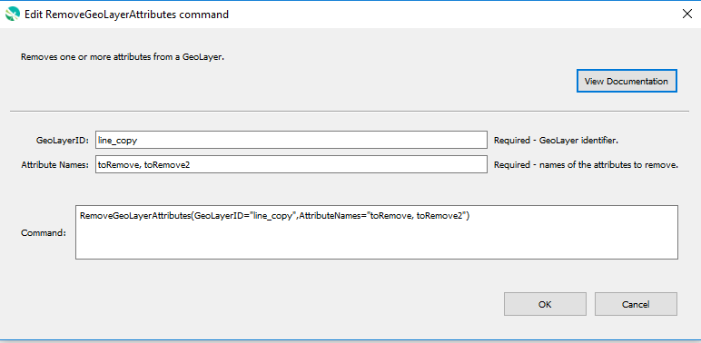

# GeoProcessor / Command / RemoveGeoLayerAttributes #

*   [Overview](#overview)
*   [Command Editor](#command-editor)
*   [Command Syntax](#command-syntax)
*   [Examples](#examples)
*   [Troubleshooting](#troubleshooting)
*   [See Also](#see-also)

-------------------------

## Overview ##

The `RemoveGeoLayerAttributes` command removes one or more attributes from a GeoLayer.

## Command Editor ##

The following dialog is used to edit the command and illustrates the command syntax.

**<p style="text-align: center;">

</p>**

**<p style="text-align: center;">
`RemoveGeoLayerAttributes` Command Editor (<a href="../RemoveGeoLayerAttributes.png">see full-size image</a>)
</p>**

## Command Syntax ##

The command syntax is as follows:

```text
RemoveGeoLayerAttributes(Parameter="Value",...)
```
**<p style="text-align: center;">
Command Parameters
</p>**

| **Parameter**&nbsp;&nbsp;&nbsp;&nbsp;&nbsp;&nbsp;&nbsp;&nbsp;&nbsp;&nbsp;&nbsp;&nbsp;&nbsp;&nbsp;&nbsp;&nbsp;&nbsp;&nbsp;&nbsp;&nbsp;&nbsp;&nbsp;&nbsp;&nbsp;&nbsp;&nbsp; | **Description** | **Default**&nbsp;&nbsp;&nbsp;&nbsp;&nbsp;&nbsp;&nbsp;&nbsp;&nbsp;&nbsp;&nbsp;&nbsp;&nbsp;&nbsp;&nbsp;&nbsp;&nbsp;&nbsp; |
| --------------|-----------------|----------------- |
| `GeoLayerID` <br> **required** | The ID of the GeoLayer with the attribute to be removed. | None - must be specified. |
| `AttributeNames` <br> **required** | The names of the attributes to be removed. Separated by commas. Case-specific.| None - must be specified. |

## Examples ##

See the [automated tests](https://github.com/OpenWaterFoundation/owf-app-geoprocessor-python-test/tree/main/test/commands/RemoveGeoLayerAttributes).

The following GeoLayer data is used in the example. 
The example assumes that the `ExampleGeoLayer` GeoLayer has already been read into the
GeoProcessor with the [`ReadGeoLayerFromGeoJSON`](../ReadGeoLayerFromGeoJSON/ReadGeoLayerFromGeoJSON.md) command.

**<p style="text-align: left;">
Example GeoLayer Data
</p>**

|GeoLayerID|
| ---- |
|ExampleGeoLayer|

**<p style="text-align: left;">
ExampleGeoLayer's Attribute Table
</p>**

|id|school|mascot|students|faculty|
|----|----|-----|-----|-----|
|1|Hill|Bulldogs|546|42|
|2|Bright|Gators|304|24|
|3|Gunn|Colts|567|43|

### Example 1: Remove Attributes###

```
RemoveGeoLayerAttributes(GeoLayerID="ExampleGeoLayer", AttributeNames="mascot, students")
```

After running the command, the ExampleGeoLayer has the following attribute table.

|id|school|faculty|
|----|----|-----|
|1|Hill|42|
|2|Bright|24|
|3|Gunn|43|

## Troubleshooting ##

## See Also ##

*   GeoLayer attributes are removed using the [`QGIS QGSVectorDataProvider Class`](https://qgis.org/api/classQgsVectorDataProvider.html).
    See [documentation](https://docs.qgis.org/latest/en/docs/pyqgis_developer_cookbook/vector.html#adding-and-removing-fields)
    for examples on utilizing the `QgsVectorDataProvider` class in the PyQGIS environment.
*   [`AddGeoLayerAttribute`](../AddGeoLayerAttribute/AddGeoLayerAttribute.md) command
