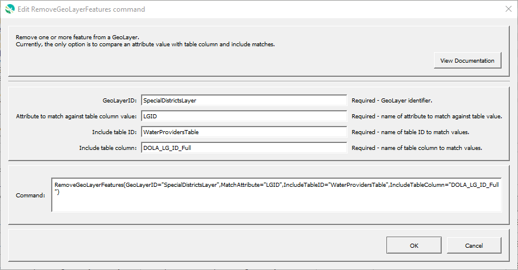

# GeoProcessor / Command / RemoveGeoLayerFeatures #

*   [Overview](#overview)
*   [Command Editor](#command-editor)
*   [Command Syntax](#command-syntax)
*   [Examples](#examples)
*   [Troubleshooting](#troubleshooting)
*   [See Also](#see-also)

-------------------------

## Overview ##

The `RemoveGeoLayerFeatures` command removes one or more features from a GeoLayer.
Currently this command only allows checking an attribute value against values in a table column.
For example, the command can be used to remove features from a layer where
a table contains a subset of the full list of features.

In the future it will allow an expression to be used to match features.

## Command Editor ##

The following dialog is used to edit the command and illustrates the command syntax.

**<p style="text-align: center;">

</p>**

**<p style="text-align: center;">
`RemoveGeoLayerFeatures` Command Editor (<a href="../RemoveGeoLayerFeatures.png">see full-size image</a>)
</p>**

## Command Syntax ##

The command syntax is as follows:

```text
RemoveGeoLayerFeatures(Parameter="Value",...)
```
**<p style="text-align: center;">
Command Parameters
</p>**

| **Parameter**&nbsp;&nbsp;&nbsp;&nbsp;&nbsp;&nbsp;&nbsp;&nbsp;&nbsp;&nbsp;&nbsp;&nbsp;&nbsp;&nbsp;&nbsp;&nbsp;&nbsp;&nbsp;&nbsp;&nbsp;&nbsp;&nbsp;&nbsp;&nbsp;&nbsp;&nbsp; | **Description** | **Default**&nbsp;&nbsp;&nbsp;&nbsp;&nbsp;&nbsp;&nbsp;&nbsp;&nbsp;&nbsp;&nbsp;&nbsp;&nbsp;&nbsp;&nbsp;&nbsp;&nbsp;&nbsp; |
| --------------|-----------------|----------------- |
| `GeoLayerID` <br> **required** | The ID of the GeoLayer to be processed. | None - must be specified. |
| `MatchAttribute` <br> **required** | The name of an attribute to be matched. | None - must be specified. |
| `IncludeTableID` <br> **required** | The name the table containing values to match. | None - must be specified. |
| `IncludeTableColumn` <br> **required** | The name the column containing values to match. | None - must be specified. |

## Examples ##

See the [automated tests](https://github.com/OpenWaterFoundation/owf-app-geoprocessor-python-test/tree/main/test/commands/RemoveGeoLayerFeatures).

## Troubleshooting ##

## See Also ##

*   [`RemoveGeoLayerAttributes`](../RemoveGeoLayerAttributes/RemoveGeoLayerAttributes.md) command
