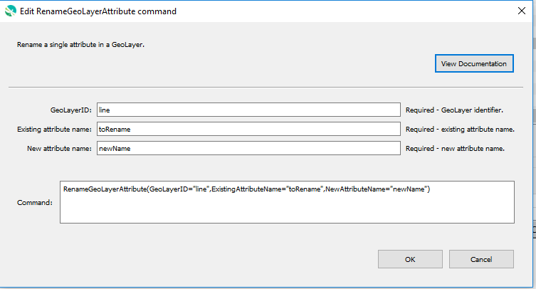

# GeoProcessor / Command / RenameGeoLayerAttribute #

* [Overview](#overview)
* [Command Editor](#command-editor)
* [Command Syntax](#command-syntax)
* [Examples](#examples)
* [Troubleshooting](#troubleshooting)
* [See Also](#see-also)

-------------------------

## Overview ##

The `RenameGeoLayerAttribute` command renames a single attribute in a GeoLayer.

* The new attribute name cannot be the same as an existing attribute name within the GeoLayer. 
* It is highly recommended that the new attribute name is 10 characters or less. See [Esri Shapefile limitations](../../spatial-data-format-ref/EsriShapefile/EsriShapefile.md#limitations).

## Command Editor ##

The following dialog is used to edit the command and illustrates the command syntax.



**<p style="text-align: center;">
`RenameGeoLayerAttribute` Command Editor (<a href="../RenameGeoLayerAttribute.png">see full-size image</a>)
</p>**

## Command Syntax ##

The command syntax is as follows:

```text
RenameGeoLayerAttribute(Parameter="Value",...)
```
**<p style="text-align: center;">
Command Parameters
</p>**

| **Parameter**&nbsp;&nbsp;&nbsp;&nbsp;&nbsp;&nbsp;&nbsp;&nbsp;&nbsp;&nbsp;&nbsp;&nbsp;&nbsp;&nbsp;&nbsp;&nbsp;&nbsp;&nbsp;&nbsp;&nbsp;&nbsp;&nbsp;&nbsp;&nbsp;&nbsp;&nbsp; | **Description** | **Default**&nbsp;&nbsp;&nbsp;&nbsp;&nbsp;&nbsp;&nbsp;&nbsp;&nbsp;&nbsp;&nbsp;&nbsp;&nbsp;&nbsp;&nbsp;&nbsp;&nbsp;&nbsp; |
| --------------|-----------------|----------------- |
| `GeoLayerID` <br> **_required_** | The ID of the GeoLayer with the attribute to be renamed. | None - must be specified. |
| `ExistingAttributeName` <br> **_required_** | The name of the existing attribute to be renamed. Case-specific.| None - must be specified. |
| `NewAttributeName` <br> **_required_** | The new attribute name. Highly recommended to be 10 or less characters. Case-specific.| None - must be specified. |


## Examples ##

See the [automated tests](https://github.com/OpenWaterFoundation/owf-app-geoprocessor-python-test/tree/master/test/commands/RenameGeoLayerAttribute).

The following GeoLayer data is used in the example[^2]. 
[^2]: The example assumes that the `ExampleGeoLayer` GeoLayer has *already* been read into the GeoProcessor with the [ReadGeoLayerFromGeoJSON](../ReadGeoLayerFromGeoJSON/ReadGeoLayerFromGeoJSON.md) command.

**<p style="text-align: left;">
Example GeoLayer Data
</p>**

|GeoLayerID|
| ---- |
|ExampleGeoLayer|

**<p style="text-align: left;">
ExampleGeoLayer's Attribute Table
</p>**

|id|school|mascot|students|faculty|
|----|----|-----|-----|-----|
|1|Hill|Bulldogs|546|42|
|2|Bright|Gators|304|24|
|3|Gunn|Colts|567|43|

### Example 1: Rename an Attribute###

```
RenameGeoLayerAttribute(GeoLayerID="ExampleGeoLayer", ExistingAttributeName="students", NewAttributeName="studentPop")
```

After running the command, the ExampleGeoLayer has the following attribute table.

|id|school|mascot|studentPop|faculty|
|----|----|-----|-----|-----|
|1|Hill|Bulldogs|546|42|
|2|Bright|Gators|304|24|
|3|Gunn|Colts|567|43|

## Troubleshooting ##

## See Also ##

- GeoLayer attributes are renamed using the [`QGIS QGSVectorDataProvider Class`](https://qgis.org/api/classQgsVectorDataProvider.html).
