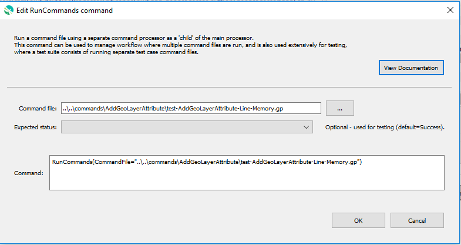

# GeoProcessor / Command / RunCommands #

* [Overview](#overview)
* [Command Editor](#command-editor)
* [Command Syntax](#command-syntax)
* [Examples](#examples)
* [Troubleshooting](#troubleshooting)
* [See Also](#see-also)

-------------------------

## Overview ##

The `RunCommands` command runs a command file using a separate command processor as a “child” of the main processor.
This command can be used to manage workflow where multiple commands files are run,
and is also used extensively for testing, where a test suite consists of running separate test case command files.

* Command files that are run can themselves include `RunCommands` commands.
  Each command file that is run has knowledge if its initial working directory and
  relative paths referenced in the command file are relative to this directory.
  This allows a master command file to reside in a different location than the individual command files that are being run.
  The current working directory is reset to that of the command file being run.
* Datastores from the parent command processor are by default passed to the child command processor,
  which allows database connections can be opened once and shared.
  (Database Datastores are a feature that will be enabled in the future.)
* Currently the properties from the parent command file are NOT applied to the
  initial conditions when running the command file.
  Therefore, global properties like input and output period are reset to defaults before running the command file.
  A future enhancement may implement a command parameter to indicate whether to share the properties with the parent processor.
  The output from the command is also not added to the parent processor.
  Again, a future enhancement may be to append output so that one final set of output is generated.
* There is currently no special handling of log files; consequently,
  if the main command file opens a log file and then a command file is run that opens a new log file,
  the main log file will be closed.
  More options to hand off logging from one file to another may be implemented in the future.

## Command Editor ##

The following dialog is used to edit the command and illustrates the command syntax.

**<p style="text-align: center;">

</p>**

**<p style="text-align: center;">
`RunCommands` Command Editor (<a href="../RunCommands.png">see full-size image</a>)
</p>**

## Command Syntax ##

The command syntax is as follows:

```text
RunCommands(Parameter="Value",...)
```
**<p style="text-align: center;">
Command Parameters
</p>**

| **Parameter**&nbsp;&nbsp;&nbsp;&nbsp;&nbsp;&nbsp;&nbsp;&nbsp;&nbsp;&nbsp;&nbsp;&nbsp;&nbsp;&nbsp;&nbsp;&nbsp;&nbsp;&nbsp;&nbsp;&nbsp;&nbsp;&nbsp;&nbsp;&nbsp;&nbsp;&nbsp; | **Description** | **Default**&nbsp;&nbsp;&nbsp;&nbsp;&nbsp;&nbsp;&nbsp;&nbsp;&nbsp;&nbsp; |
| --------------|-----------------|----------------- |
| `CommandFile` | The command file to run. A path relative to the master command file can be specified.  Can use `${Property}`. | None - must be specified. |
| `ExpectedStatus` | Used for testing – indicates the expected status from the command, one of:<ul><li>`Unknown`</li><li>`Success`</li><li>`Warning`</li><li>`Failure`</li></ul><br> If this parameter is NOT used, the command log messages from commands that are run will be appended to the `RunCommands` command log.  However, using this parameter will not append those messages – this is used in automated testing to allow a successful test even when there are warning and failure messages. | `Success` |

## Examples ##

* See the [automated tests](https://github.com/OpenWaterFoundation/owf-app-geoprocessor-python-test/tree/master/test/commands/RunCommands).

## Troubleshooting ##

## See Also ##

* [`CreateRegressionTestCommandFile`](../CreateRegressionTestCommandFile/CreateRegressionTestCommandFile.md) command
* [`RunProgram`](../RunProgram/RunProgram.md) command
* [`StartRegressionTestResultsReport`](../StartRegressionTestResultsReport/StartRegressionTestResultsReport.md) command
* [`WriteCommandSummaryToFile`](../WriteCommandSummaryToFile/WriteCommandSummaryToFile.md) command
