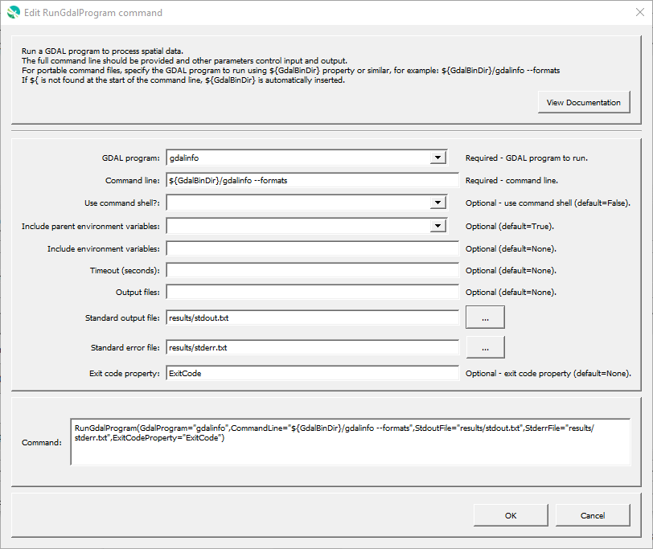

# GeoProcessor / Command / RunGdalProgram #

* [Overview](#overview)
* [Command Editor](#command-editor)
* [Command Syntax](#command-syntax)
* [Examples](#examples)
* [Troubleshooting](#troubleshooting)
* [See Also](#see-also)

-------------------------

## Overview ##

The `RunGdalProgram` command runs a command line GDAL program to process raster data layer(s).
The GeoProcessor runs the program and waits until the program is finished before processing additional commands.
The GeoProcessor command will indicate a failure if the exit status from the program being run is non-zero.
This command is useful for running an external program that performs processing that the GeoProcessor cannot.
It is also useful to use the GeoProcessor’s testing features to implement quality control checks for software tools.

The GeoProcessor internally maintains a working folder (directory) that is used to convert relative paths to absolute paths to locate files.
The working folder is by default the location of the last command file that was opened.
However, the external program may assume that the working folder is the location from which GeoProcessor software was started
(or the installation location if started from a menu).
Therefore, it may be necessary to run the GeoProcessor in batch mode from the directory where the external
software’s data files exist, use absolute paths to files, or use the `${WorkingDir}` property in the command line.

Limitations of the command are as follows and will be addressed in future software updates:

* There is currently no way to handle double quotes in the command line.
* The command line must not exceed the length allowed by the operating system.

The following is the list of supported GDAL programs, with links to documentation.

**<p style="text-align: center;">
GDAL Programs
</p>**

| **GDAL Program** | **Description** |
| -- | -- |
| [`gdaladdo`](http://gdal.org/programs/gdaladdo.html) | Builds or rebuilds overview images. |
| [`gdalbuildvrt`](http://gdal.org/programs/gdalbuildvrt.html) | Builds a VRT from a list of datasets. |
| [`gdal_calc.py`](http://gdal.org/programs/gdal_calc.html) | Command line raster calculator with numpy syntax. |
| [`gdalcompare`](http://gdal.org/programs/gdalcompare.html) | Compare two images. |
| [`gdal-config`](http://gdal.org/programs/gdal-config.html) | Determines various information about a GDAL installation. |
| [`gdal_contour`](http://gdal.org/programs/gdal_contour.html) | Builds vector contour lines from a raster elevation model. |
| [`gdaldem`](http://gdal.org/programs/gdaldem.html) | Tools to analyze and visualize DEMs. |
| [`gdal_edit`](http://gdal.org/programs/gdal_edit.html) | Edit in place various information of an existing GDAL dataset. |
| [`gdal_fillnodata`](http://gdal.org/programs/gdal_fillnodata.html) | Fill raster regions by interpolation from edges. |
| [`gdal_grid`](http://gdal.org/programs/gdal_grid.html) | Creates regular grid from the scattered data. |
| [`gdalinfo`](http://gdal.org/programs/gdalinfo.html) | Lists information about a raster dataset. |
| [`gdallocationinfo`](http://gdal.org/programs/gdallocationinfo.html) | Raster query tool. |
| [`gdalmanage`](http://gdal.org/programs/gdalmanage.html) | Identify, delete, rename and copy raster data files. |
| [`gdalmdiminfo`](http://gdal.org/programs/gdalmdiminfo.html) | Reports structure and content of a multidimensional dataset. |
| [`gdalmdimtranslate`](http://gdal.org/programs/gdalmdimtranslate.html) | Converts multidimensional data between different formats, and perform subsetting. |
| [`gdal_merge`](http://gdal.org/programs/gdal_merge.html) | Mosaics a set of images. |
| [`gdalmove`](http://gdal.org/programs/gdalmove.html) | Transform georeferencing of raster file in place. |
| [`gdal_pansharpen.py`](http://gdal.org/programs/gdal_pansharpen.html) | Perform a pansharpen operation. |
| [`gdal_polygonize`](http://gdal.org/programs/gdal_polygonize.html) | Produces a polygon feature layer from a raster. |
| [`gdal_proximity`](http://gdal.org/programs/gdal_proximity.html) | Produces a raster proximity map. |
| [`gdal_rasterize`](http://gdal.org/programs/gdal_rasterize.html) | Burns vector geometries into a raster. |
| [`gdal_retile`](http://gdal.org/programs/gdal_retile.html) | Retiles a set of tiles and/or build tiled pyramid levels. |
| [`gdal_sieve`](http://gdal.org/programs/gdal_sieve.html) | Removes small raster polygons. |
| [`gdalsrsinfo`](http://gdal.org/programs/gdalsrsinfo.html) | Lists info about a given SRS in number of formats (WKT, PROJ.4, etc.) |
| [`gdaltindex`](http://gdal.org/programs/gdaltindex.html) | Builds a shapefile as a raster tileindex. |
| [`gdaltransform`](http://gdal.org/programs/gdaltransform.html) | Transforms coordinates. |
| [`gdal_translate`](http://gdal.org/programs/gdal_translate.html) | Converts raster data between different formats. |
| [`gdal_viewshed`](http://gdal.org/programs/gdal_viewshed.html) | Compute a visibility mask for a raster. |
| [`gdalwarp`](http://gdal.org/programs/gdalwarp.html) | Image reprojection and warping utility. |
| [`gdal2tiles`](http://gdal.org/programs/gdal2tiles.html) | Generates directory with TMS tiles, KMLs and simple web viewers. |
| [`nearblack`](http://gdal.org/programs/nearblack.html) | Convert nearly black/white borders to black. |
| [`pct2rgb`](http://gdal.org/programs/pct2rgb.html) | Convert an 8bit paletted image to 24bit RGB. |
| [`rgb2pct`](http://gdal.org/programs/rgb2pct.html) | Convert a 24bit RGB image to 8bit paletted. |

## Command Editor ##

The following dialog is used to edit the command and illustrates the command syntax
when running a program directly (no command shell):

**<p style="text-align: center;">

</p>**

**<p style="text-align: center;">
`RunGdalProgram` Command Editor (<a href="../RunGdalProgram.png">see full-size image</a>)
</p>**

## Command Syntax ##

The command syntax is as follows:

```text
RunGdalProgram(Parameter="Value",...)
```
**<p style="text-align: center;">
Command Parameters
</p>**

| **Parameter**&nbsp;&nbsp;&nbsp;&nbsp;&nbsp;&nbsp;&nbsp;&nbsp;&nbsp;&nbsp;&nbsp;&nbsp;&nbsp;&nbsp;&nbsp;&nbsp;&nbsp;&nbsp;&nbsp;&nbsp;&nbsp;&nbsp;&nbsp;&nbsp;&nbsp;&nbsp; | **Description** | **Default**&nbsp;&nbsp;&nbsp;&nbsp;&nbsp;&nbsp;&nbsp;&nbsp;&nbsp;&nbsp; |
| --------------|-----------------|----------------- |
| `GdalProgram`<br>**required** | The name of the GDAL command line program to run.  This is used to provide other information in the command editor. | None - must be specified. |
| `CommandLine`<br>**required** | The full command line with arguments arguments.  If the program executable is found in the `PATH` environment variable, then only the program name needs to be specified.  For portability, it is recommended that the command starts with `${GdalBinDir}`, which is the path to the folder containing GDAL executable programs. If the command contains redirection or pipe characters, run using a command shell.<br><br>The `${WorkingDir}` property can be used in the command line to indicate the working directory (command file location) when specifying file names.  Other `${Property}` names can also be used. | None - must be specified. |
| `UseCommandShell` | If specified as `True`, the program will be run using a command shell.  A command shell is needed if the program is a script (batch file), a shell command, or uses `>`, `|`, etc. | `False`. |
| `IncludeParentEnvVars` | Indicate whether the parent environment variables should be passed to the program run environment:<ul><li>`True` - include all parent environment variables</li><li>`False` - ignore all parent environment variable</li></ul>  See the `IncludeEnvVars` and `ExcludeEnvVars` parameters to add and remove environment variables for the program run environment. | `True`. |
| `IncludeEnvVars` | Specify environment variables to be defined for the program run environment, using format `EnvVarName1=EnvVarValue1;EnvVarName2=EnvVarValue2;...`. | |
| `ExcludeEnvVars` | Specify environment variables to be removed from the program run environment, using format `EnvVarName1,EnvVarName2,...`.  This parameter is processed after the parameters that define environment variables in the run environment. | |
| `Timeout` | Timeout in seconds. | No timeout. |
| `OutputFiles` | Names of output files, separated by commas, to list in ***Results***.  Can use ${Property} notation. | |
| `StdoutFile` | File to capture standard output:<ul><li>Path to output file - to output to the specified file</li><li>`DEVNULL` - redirect to `/dev/null` (absorb)</li><li>`logfile` - append to the log file</li></ul> | Output to terminal window. |
| `StderrFile` | File to capture standard error:<ul><li>Path to output file - to output to the specified file</li><li>`DEVNULL` - redirect to `/dev/null` (absorb)</li><li>`STDOUT` - append to standard output</li><li>`logfile` - append to the log file</li></ul> | Output to terminal window. |
| `ExitCodeProperty` | Property name to set to the GDAL program exit code. | |

## Examples ##

* See the [automated tests](https://github.com/OpenWaterFoundation/owf-app-geoprocessor-python-test/tree/master/test/commands/RunGdalProgram).

## Troubleshooting ##

## See Also ##

* [`RunOgrProgram`](../RunOgrProgram/RunOgrProgram.md) command
* [`RunProgram`](../RunProgram/RunProgram.md) command
